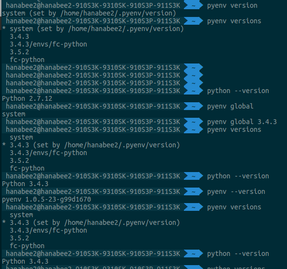
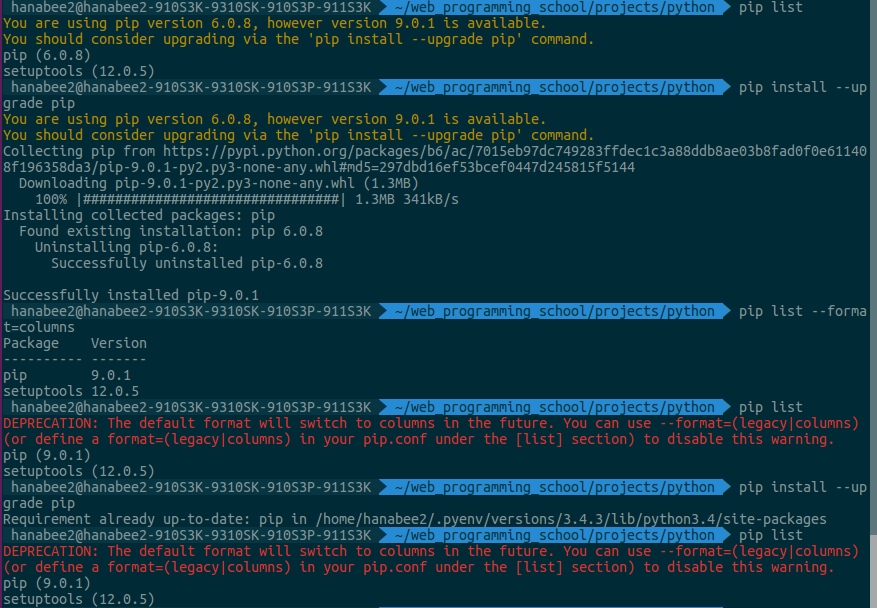
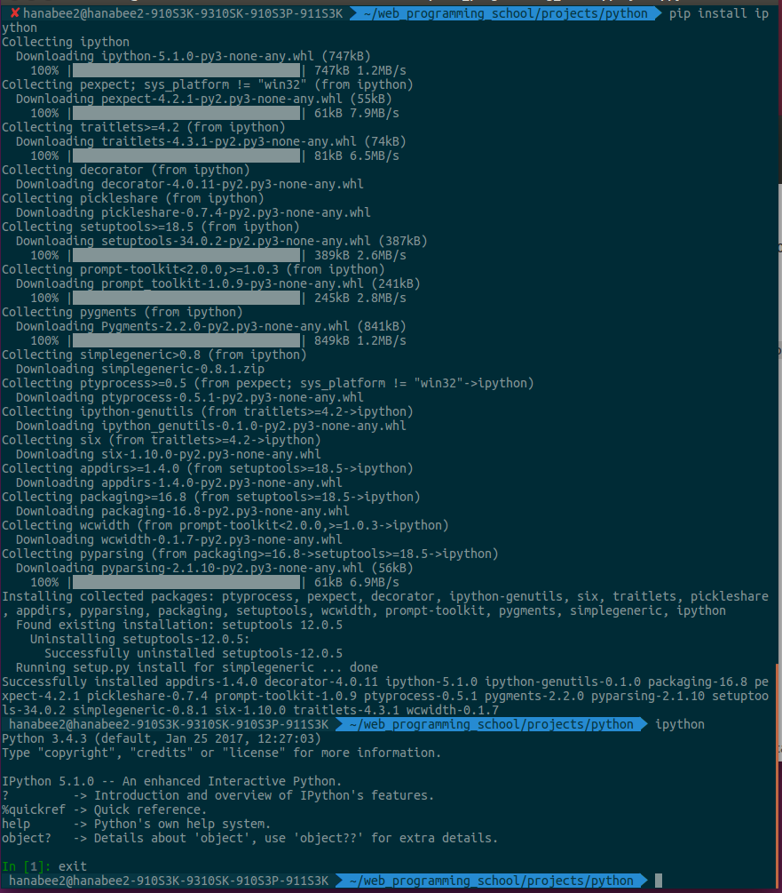

#pyenv, virtualenv, iPython 설치 및 설정(Ubuntu용)
**Reference** : <https://github.com/LeeHanYeong/Fastcampus-WPS-4th/blob/master/Python/01.%20pyenv,%20virtualenv,%20iPython%20%EC%84%A4%EC%B9%98%20%EB%B0%8F%20%EC%84%A4%EC%A0%95.md>


###pyenv
pyenv는 프로젝트별로 파이썬 버전을 따로 관리할 수 있도록 도와주는 라이브러리.
여러 프로젝트를 동시에 진행하다보면, 어떤 프로젝트에서는 2.7을, 어떤 프로젝트에서는 3.4를 사용하는 식으로 다양한 버전의 사용할 수도 있고, 각각에 설치된 라이브러리간 충돌이 일어날 수도 있다.  

###virtualenv
virtualenv는 파이썬 개발환경을 프로젝트별로 분리해서 관리할 수 있게 해주는 라이브러리.  
위의 pyenv와 다른 점은, **pyenv는 파이썬의 버전**을 관리해주는 것이며, **virtualenv는 파이썬 패키지 설치 환경**을 따로 관리해준다.  

###pyenv-virtualenv
위의 pyenv 제작자가, pyenv를 사용할 경우, 쉽게 virtualenv를 사용할 수 있도록 만든 라이브러리.  

###pyenv 설치
- Ubuntu  
<https://github.com/yyuu/pyenv-installer>
```
$ curl -L https://raw.githubusercontent.com/yyuu/pyenv-installer/master/bin/pyenv-installer | bash  
```
###vim 설치
```
$ sudo apt-get install vim  
```

### z-shell 변경
<http://theyearlyprophet.com/love-your-terminal.html>
```
bash와 비슷하게 동작하는 셸로, 사용성이 좋다고 함.  
```
- Ubuntu 환경에서 다음과 같이 설치한다.
```
$ sudo apt-get install zsh
$ curl -L http://install.ohmyz.sh | sh
$ chsh -s `which zsh`
```
### pyenv 설정
- 설치 후 pyenv관련 설정을 rc 파일에서 추가.   
- vim ~/.zshrc에서 하기 내용 추가  
```
export PATH="$HOME/.pyenv/bin:$PATH"
eval "$(pyenv init -)"
eval "$(pyenv virtualenv-init -)"
```
- pyenv 기본 루트폴더는 ~/.pyenv
- pyenv설정을 shell의 설정파일에 기록 후,  
 변경 내용을 반영되게 하기 위해 터미널을 재시작하거나 $ source ~/.zshrc  

### python 설치 전 필요 패키지 설치
<https://github.com/yyuu/pyenv/wiki/Common-build-problems>

### pyenv를 사용해서 파이썬 3.4.3 버전 설치
```
$ pyenv  
usage를 알려줌.  
```
```
$ pyenv versions
>	내가 설치한 python 버전들을 보여줌.  
```
```
$ pyenv install --list  
>	pyenv로 설치 가능한 리스트들을 보여줌.  
$ pyenv install 3.4.3  
```
$ pyenv versions으로 결과확인.
```
3.4.3
3.5.2
```

- 가상환경 생성
```
pyenv virtualenv <version> <env name>  
```
>	$ pyenv virtualenv 3.4.3 fc-python 입력  

#### 사용할 폴더로 이동
```
cd projects  
mkdir python  
cd python  
```
### local에 가상환경 지정
```
작업 폴더로 이동 후,
$ pyenv local fc-python 입력.
```
  
상기 command 입력하고 난 후, 
$ pyenv versions 확인해 보면 하기 그림과 같은 결과가 나옴.  
```
$ pyenv global
```
>	global하게 적용되어 있는 버전확인.
```
$ pyenv global 3.4.3
```
>	python 버전 설정을 3.4.3으로 global하게 적용시키겠다는 의미.
```
$ python --version으로 결과 확인해 보면,
```
>Python 3.4.3으로 변경되어 있는 것을 확인할 수 있다.  


### iPython
기존 파이썬 shell보다 다양한 기능을 사용할 수 있도록 해주는 shell 제공.  
$ pip list
현재 설치된 list들을 보여줌.

```
$ pip install ipython  
커맨드 라인에서 ipython 실행  
```



