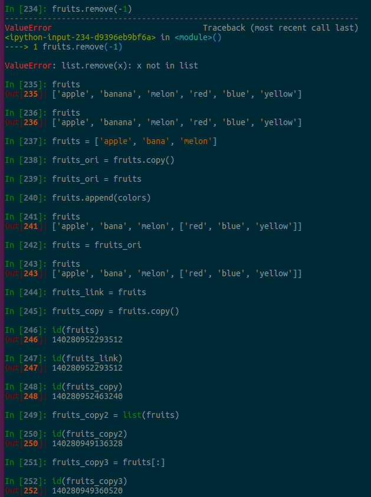
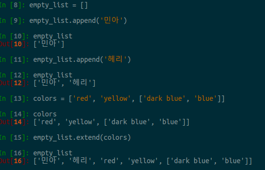
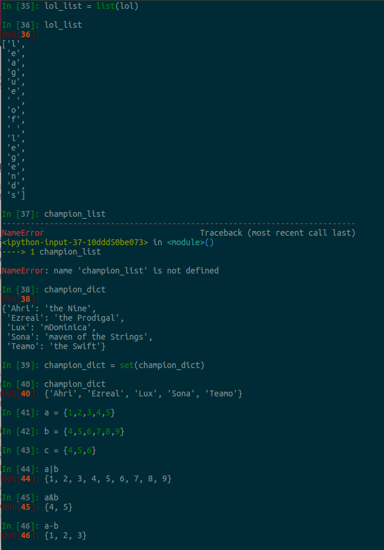
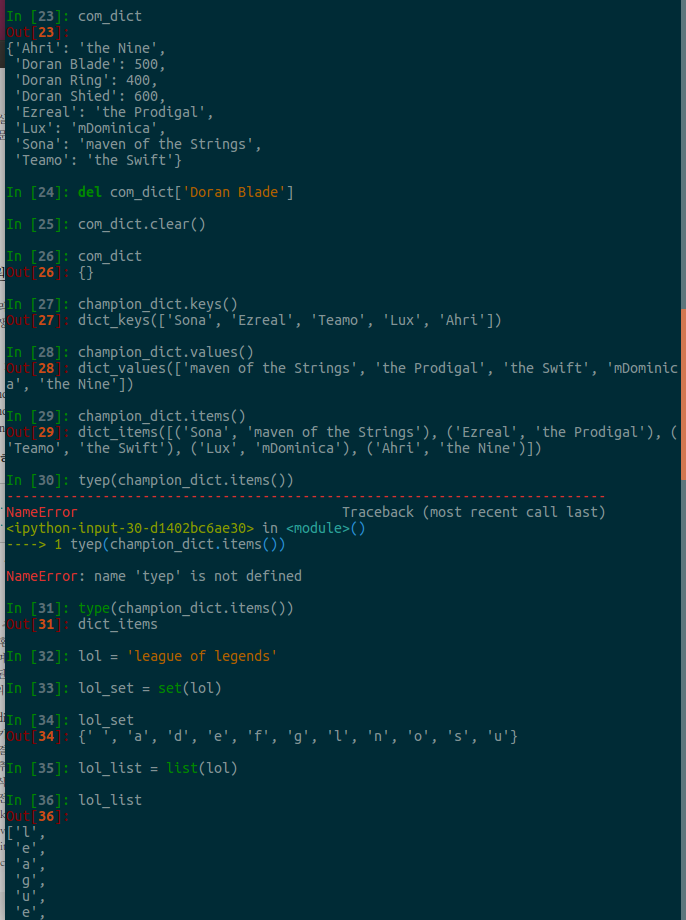
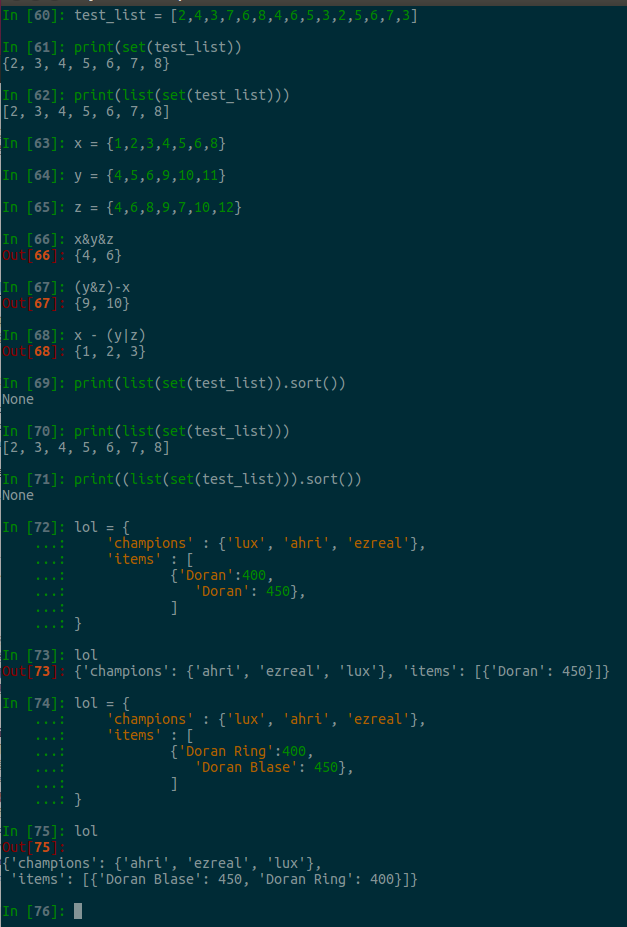

#ipython 실습
ipython 실행은 
```
$ ipython 입력
```

###변수
파이썬은 모든것(정수, 문자열, 함수 등)이 객체(Object)로 이루어져 있다.  
객체는 데이터의 형태를 결정해주는 타입으로, 파이썬에서는 객체의 타입을 바꿀 수 없다.  
```
id(변수)
- 주소 값을 나타냄
```
  
위의 그림과 같이 fruits와 fruits_link가 가리키는 주소 값은 같다.  
하지만, fruits로부터 copy된 fruits_ori는 같은 리스트 객체들을 갖고 있지만,
다른 값을 갖고 있는 것을 알 수 있다.  

큰 수의 메모리 주소는 서로 다름.
a=89273
b=89273
id(a)와 id(b) 값이 서로 다름.

근데, 작은 수(자주 사용한다고 판단되는 경우)는 id값이 고정되서 나옴.
미리 자주사용되는 값(?)들은 ram에 할당을 해서 그런 것 같음.


###변수의 타입 확인
- 내장함수 type사용.  
- 클래스(class)는 객체의 타입(정의)을 나타낸다.  
- class와 type은 거의 같은 의미로 사용됨.  

###변수의 입출력
- 입력은 내장함수 input 사용.  
```
var = input()  
```
- 출력은 내장함수 print 사용.  
```
print(var)  
```

### 숫자
형변환은 내장 함수사용. int <-> float  
```
>>> int(35.5)  
35  
>>> float(35)  
35.0  
```
###문자열
\는 특수문자 출력하고 싶을 때, 사용.  
그럼, \를 출력하고 싶으면,  \\ 두번 사용함.  
줄바꿈은 '\n'  
(''')세 개의 작은 따옴표는 여러 줄의 문자열 표현시 사용  

작은 따옴표(')와 큰 따옴표(") 모두 지원.  
작은 따옴표 사이에 큰 따옴표 사용 가능.  

빈 문자열은 초기화용으로 사용한다.  
empty_string = ''  

### 문자열 형변환
- 내장함수 str을 사용  
str(147) : integer를 str으로 형변환 시킴.  

- 문자열은 변경이 불가능.  
- 참조만 가능함.  
- 인덱싱은 좌측에서 0부터 시작, 오른쪽은 -1부터 시작.  

### 문자열 더하기
```
>>> str1 = '안녕'
>>> str2 = '하세요'
>>> str3 = str1 + str2
>>> print(str3)
>>> 안녕하세요
```
### Index 연산
맨 첫 객체는 왼쪽부터 시작하며, 0부터 시작함.  
맨 오른쪽 index는 -1부터 시작.  
```
>>> str = '안녕하세요'
>>> str[0]
'안'
>>> str[-1]
'요'
```
**단, Indexing을 통해 문자열의 내용을 변경할 수 없다.**

### 슬라이스 연산
1. [:]  
2. [start:]  
3. [:end]  
4. [start:end]  
5. [start:end:step]   

### 문자열 나누기(split)
- 문자열의 내장함수 split을 사용.  
**split** 함수에 인자로 주어진 구분자를 기준으로 하나의 문자열을 **리스트 형태**로 반환해준다.  

###문자열 결함(join)
split와 반대 기능.  

###문자열 포맷
1. old-style(%)
>	예) sting % data
 		'%s' % 42
 		'%d x %d : %d' % (3,4,12)
정렬
```
%[정렬기준(-,없음)][전체글자수].[문자길이 또는 소수점 이후 문자길이][변환타입]  
>>> d = 37  
>>> f = 3.14  
>>> s = 'Fastcampus'  
>>> '%d %f %s' % (d, f, s)  
'37 3.140000 Fastcampus'  
>>> '%10d %10f %10s' % (d, f, s)  
'        37   3.140000 Fastcampus'  
>>> '%14d %14f %14s' % (d, f, s)  
'            37       3.140000     Fastcampus'  
>>> '%-14d %-14f %-14s' % (d, f, s)  
'37             3.140000       Fastcampus    '  
>>> '%-14.3d %-14.3f %-14.3s' % (d, f, s)  
'037            3.140          Fas           '  
```
```
% 다음의 숫자는 자리수를 의미.  
기본적으론 오른쪽 정렬.  
 숫자 앞의 '-'는 왼쪽 정렬을 의미.  
 소수점 숫자의 의미는 문자길이.  
``` 
 
2. new-style({}.foramt())  

```
형태 : {}.format(변수)

 '{},{},{}'.format(d,f,s)
 '{정수},{실수},{문자}'.format(정수=d, 실수=f, 문자=s)

dict = {
     ...: '정수변수': 723,
     ...: '실수변수': 143.2,
     ...: '문자열변수':'파이썬'
     ...: }

> '{0[정수변수]} {0[실수변수]} {0[문자열변수]} {1}'.format(dict, 'WPS')
'723 143.2 파이썬 WPS'
>{정수변수:d} {:f} {:s}'.format(d,s,정수변수=d)
'37 37.000000 fastcampus'
```

###시퀀스 타입
시퀀스 타입에는 리스트, 튜플, 문자열이 있다.  
시퀀스 타입은 인덱스 연산을 통해 접근이 가능.  

1. **리스트**
생성방법은 두가지
	1. 빈리스트로 생성.  
	```
	 empty_list = []  
	 ``` 
	2. list 함수 사용.  
	```
	empty_list2 = list()  
	```

##### extend 와 append의 차이점은?
```
extend : 추가 항목별로 인덱스 하나씩 리스트에 추가함(리스트 병합).   
append : 리스트 인덱스 한 곳에 전부 삽입(리스트 항목 추가).  
```
  

####**정렬하기**
```
1. sort : list를 정렬.  
2. sorted : list의 형태로 반환.  
```

## Tuple
- 리스트와 달리, 변경/삭제가 불가.  
- tuple <-> list 상호 변환 가능.  

-생성 방법
```
empty_tuple = ()
```

### Set
```
set은 중복된 값이 존재할 수 없다.
형 변환시, 문자열, list, tuple, dict을 set으로 변환시킬 수 있으며,  
중복된 값이 사라짐.  
dict의 경우는 key 만 남음.  
```  

  

### Dictionary
key-value 형태를 갖는 자료구조.  
- 생성 방법
1. 빈 dict 생성.  
``` 
empty_dict = {}  
```
2. dict 함수 이용.  
```
empty_dict2 = dict()  
```
- 형변환
> dict 함수를 사용하여, list/tuple을 dictionary로 변환 가능.  

- 키값은 변경 불가.  
- 결합 : update()  
- 추가/변경/삭제 가능  
- 삭제 : del  
- 전체 항목 삭제 : clear  
- .keys(): 모든 key 값  
- .values() : 모든 value 값   
- .items() : 모든 key-value 얻기(tuple로 변환)  
- .copy() : 복사  
  

#### Dictionary 실습
1. 6가지 색상의 영어 키, 한글 값을 갖는 딕셔너리(colors)를 생성한다. (red, green, blue, yellow, black, white)
2. colors에서 blue키의 값을 출력한다.
3. colors를 셋(Set)으로 만들어 colors_set변수에 할당한다.
4. colors_set에 `purple`이 존재하는지 확인한다.
5. `[2,4,3,7,6,8,4,6,5,3,2,5,6,7,3]`에서 중복된 값을 없애고, 오름차순으로 정렬한 `list`를 반환한다.
6. 2차원 딕셔너리인 `lol`을 만든다.
	- `lol`딕셔너리의 `champions`키에 셋(Set)을 이용해 `lux`, `ahri`, `ezreal`을 할당하고,
	- `lol`딕셔너리의 `items`키에 아래의 각 항목들을 딕셔너리를 이용해 리스트로 할당한다.
		- Key: Doran Ring, Value: 400
		- Key: Doran Blade, Value: 450
7. `x = {1,2,3,4,5,6,8}`, `y={4,5,6,9,10,11}`, `z={4,6,8,9,7,10,12}`일 때,
	- x,y,z의 교집합에 해당하는 숫자는?  
	- y,z의 교집합이며 x에는 속하지 않는 숫자는?  
	- x에만 속하고 y,z에는 속하지 않는 숫자는?  
  
 
  


