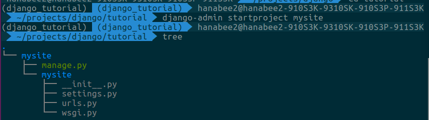
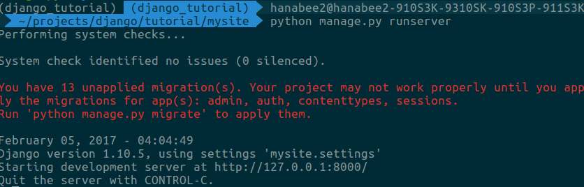
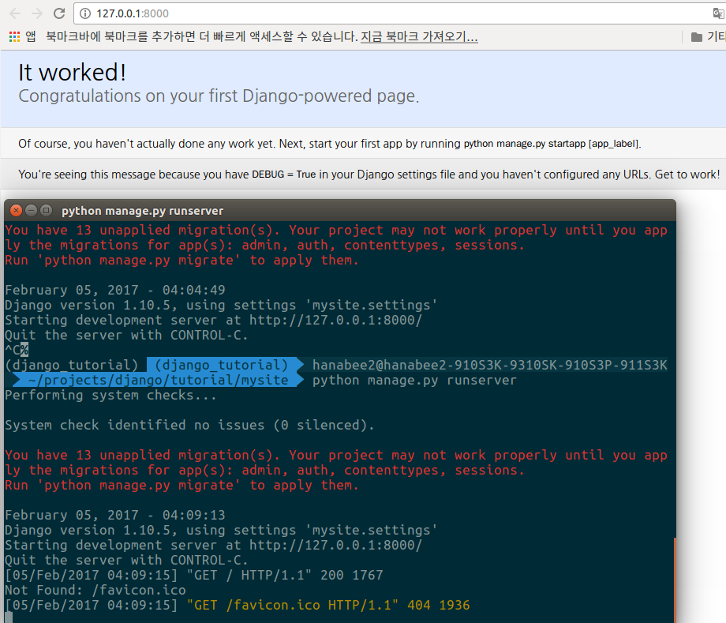
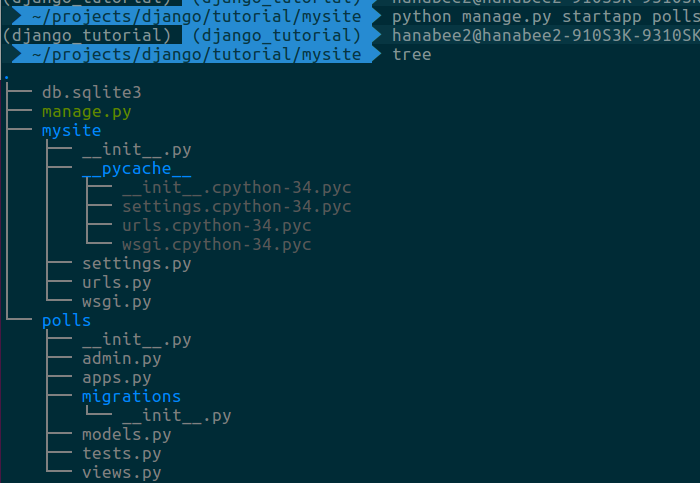
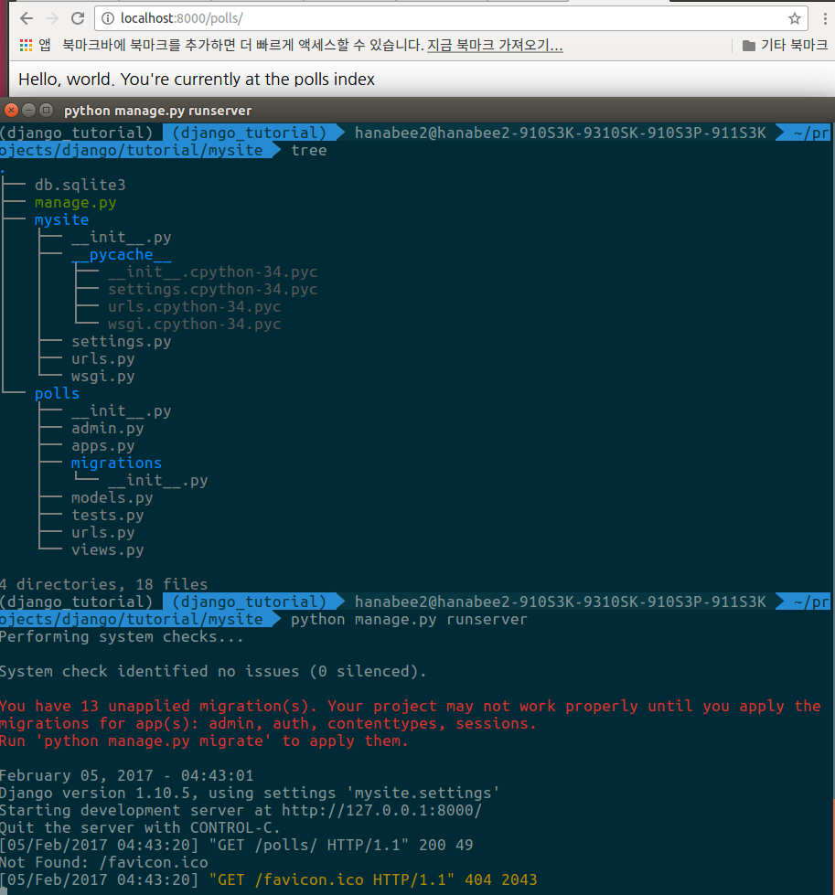

# Making Django App, Part 1
**Reference** : <http://django-document-korean.readthedocs.io/ko/latest/intro/tutorial01.html>
- '상기 사이트로 가서 첫 번째 장고 앱 작성하기, part7까지 따라하기'가 hw

- 이 튜토리얼을 통해, 간단한 설문조사(Polls) 어플리케이션을 만드는 과정을 배워본다.
- 다음과 같이 두 파트로 구성
	- 사람들이 설문 내용을 보고 직접 투표할 수 있는 개방된 사이트
	- 관리자가 설문을 추가, 변경, 삭제할 수 있는 관리용 사이트
### 프로젝트 만들기
- Django를 처음 사용한다면, 초기 설정에서 주의를 기울여야 함.
- Django project 를 구성하는 코드를 자동 생성.
- A Python package – i.e. a directory of code – that contains all the settings for an instance of Django.
- 이 과정에서 database configuration, Django-specific options and application-specific settings설정들과 같은  
Django 인스턴스를 구성하는 수많은 설정들이 생성되기 때문.
- 코드를 저장할 디렉토리로 이동 한 후, 다음의 명령을 수행한다.

```python
$ django-admin startproject mysite
```
- 이 명령은 현재 디렉토리에서 ```mysite 라는 디렉토리를 생성```



- mysite/ 디렉토리 바깥의 디렉토리는 단순히 프로젝트를 담는 공간입니다.
이 이름은 Django 와 아무 상관이 없으니, 원하는 이름으로 변경해도 된다.

- manage.py: Django 프로젝트와 다양한 방법으로  
상호작용 하는 커맨드라인의 유틸리티.

- mysite/ 디렉토리 내부에는 project 를 위한 실제 Python 패키지들이 저장.
이 디렉토리 내의 이름을 이용하여,(mysite.urls 와 같은 식으로)   
project 어디서나 Python 패키지들을 import 할 수 있다.

- mysite/__init__.py: Python 으로 하여금  
이 디렉토리를 패키지 처럼 다루라고 알려주는 용도의 단순한 빈 파일.

- mysite/settings.py: 현재 Django project 의 환경/구성 저장.
Django settings 에서 환경 설정이 어떻게 동작하는지 확인할 수 있다.

- mysite/urls.py: 현재 Django project 의 URL 선언을 저장.
Django 로 작성된 사이트의 “목차” 라고 할 수 있다.
URL dispatcher 에서 URL 에 대한 자세한 내용을 읽어보세요.

- mysite/wsgi.py: 현재 project 를 서비스 하기 위한 WSGI 호환 웹 서버의 진입점.

### 개발 서버
- 당신의 Django project 가 제대로 동작하는지 확인해 보자.
	1. mysite 디렉토리로 이동하고, 
	2. 다음 명령어를 입력
	```$ python manage.py runserver```	
	
	
- Django 개발 서버를 시작했습니다.  
개발 서버는 순수 Python 으로 작성된 경량 웹 서버.   
Django 에 포함되어 있기 때문에 아무 설정없이 바로 개발에 사용할 수 있다.

- 이제 서버가 동작하기 시작했으니,  
웹 브라우져에서 http://127.0.0.1:8000/ 를 통해 접속할 수있다.


- 포트 변경하기
- runserver의 자동 변경 기능

## 설문조사 앱 만들기
- 이제, 작업을 시작하기 위해 당신의 환경(project) 이 설치되었음.
- Django 에서 당신이 작성하는 각 어플리케이션들은 다음과 같은 관례로 Python 패키지가 구성됨.  
Django 는 앱(app) 의 기본 디렉토리 구조를 자동으로 생성할 수 있는 도구를 제공.  

- 당신의 app 은 Python 경로 어디라도 있을 수 있다.
그러나 이 예제에서는, mysite 같은 submodule 말고,  
top-level 에서 곧바로 import 할 수 있게  
manage.py 바로 옆에 생성할 것.

- app 을 생성하기 위해 manage.py 가 존재하는 디렉토리에서 다음의 명령을 입력
```$ python manage.py startapp polls```


## 첫 번째 View 작성하기
- polls/view.py를 열어 다음과 같은 파이썬 코드를 입력
```python
>> polls/views.py
from django.http import HttpResponse

def index(request):
    return HttpResponse("Hello, world. You're at the polls index.")
```
- Django 에서 가장 간단한 형태의 view. 
- view 를 호출하려면 이와 연결된 URL 이 있어야 하는데,  
이를 위해 URLconf 가 사용된다.
- polls 디렉토리에서 URLconf 를 생성하려면,   
urls.py 라는 파일을 생성해야 합니다.
- polls/urls.py파일에 하기 코드 입력
```python
>>> polls/urls.py
from django.conf.urls import url

from . import views

urlpatterns = [
    url(r'^$', views.index, name='index'),
]
```

- 다음 단계는, project 최상단의 URLconf 에서 polls.urls 모듈을 바라보게 설정.
- mysite/urls.py 파일을 열고, 
django.conf.urls.include 를 import 하십시요.
- 그리고 urlpatterns 리스트에 include() 함수를 다음과 같이 추가한다.
```python
>>> mysite/urls.py
from django.conf.urls import include, url
from django.contrib import admin

urlpatterns = [
    url(r'^polls/', include('polls.urls')),
    url(r'^admin/', admin.site.urls),
]
```
- include() 함수는 다른 URLconf 를 참조할 수 있도록 도와준다.
- include() 함수를 위한 정규 표현식에서 끝을 의미하는 기호로 $ 대신 슬래시(/) 가 붙는다는 점을 기억하십시요.
- Django 가 include() 를 만나게 되면,  
그 시점까지 일치하는 URL 의 부분을 잘라내고,  
남은 부분을 후속 처리를 위해 include 된 URLconf 로 전달한다.
- 즉, /polls/some/method 를 요청받으면,  
some/method 가 polls/urls.py 의 URLconf 로 넘어간다.
- admin.site.urls 를 제외한, 다른 URL 패턴을 include 할 때마다  
항상 include() 를 사용해야 합니다.
- 이제 index view 가 URLconf 에서 연결되었습니다.
- 잘 작동하는지 확인하기 위해 다음을 입력
```$ python manage.py runserver```

- 브라우저에서 ```http://localhost:8000/polls/``` 를 입력하면  
index view 로 정의한 ```“Hello, world. You’re at the polls index.”```가 보일 것임.

- url() 함수에는 4 개의 인수가 전달되었는데,
- 두개의 필수 인수로 **```regex```** 와 **```view```** 가 있고,
- 두개의 옵션 인수로 **```kwargs```** 와 **```name```** 이 있다

	1. **url() 인수**: **```regex```**
**```“regex”```** 는 보통 정규 표현식(“Regular Expression”) 을 짧게 줄여 쓰는 표현.
문자열의 패턴을 일치시키는 문법을 말하며, 이 경우에는 url 의 패턴을 찾아내는데 사용되었음.
Django 에서는 목록의 첫번째 정규표현식부터 시작해서, 요청된 URL 에 대하여 일치하는 정규 표현식이 발견 될때까지 차례로 비교한다.
이 정규 표현식 들은 GET 이나 POST 의 매개변수나, 도메인 이름을 뒤지지는 않는다.
예를 들어, https://www.example.com/myapp/ 가 요청된 경우,
URLconf 는 오직 myapp/ 부분만 바라봅니다.
https://www.example.com/myapp/?page=3 같은 요청에도,
URLconf 는 역시 myapp/ 부분만 신경씁니다.
정규 표현식에 대해 도움이 필요하다면, Wikipedia’s entry 를 참고하시거나 re 모듈의 문서를 참고해라.
특히 Jeffrey Friedl 가 쓴 오라일리 출판의 ```“정규표현식 완전 해부와 실습”(“Mastering Regular Expressions”)``` 는 완벽한 참고서입니다.
그러나 현실적으로 이 모든 내용을 전부 알아야 할 필요는 없다.
딱 필요한 만큼, 간단한 패턴을 잡아낼 정도만 알면 된다.
사실, 복잡한 정규표현식을 사용하면 검색 속도가 아주 느려지므로,
전적으로 정규 표현식에 의존하지 않아야 합니다.
마지막으로 성능에 관해 알아야 할 사실은,
이런 정규 표현식들은 URLconf 모듈이 처음 불러올 때 자동으로 컴파일 되기 때문에 엄청나게 빠르다는 것.
물론 앞서 언급했듯이 복잡한 검색을 쓰지 않는 한 말이죠.

	2. **url() 인수**: **```view```**
Django 에서 일치하는 정규 표현식을 찾아내면,
HttpRequest 객체를 첫번째 인수로 하고,
정규표현식에서 “잡힌” 값들을 나머지 인수로 하여 특정한 view 함수를 호출합니다.
만약 정규표현식이 간단한 형식이라면,
잡힌 값들은 단순히 순서 기반의 인수로서 함수에 넘겨집니다.
만약 이름 기반의 정규표현식이라면, 잡힌 값들은 키워드 인수들로 함수에 넘겨집니다.

	3. **url() 인수**: **```kwargs```**
임의의 키워드 인수들은 목표한 view 에 사전형으로 전달됩니다.
그러나 이 튜토리얼에서는 사용하지 않을겁니다.

	4. **url() 인수**: **```name```**
URL 에 이름을 지으면, 템플릿을 포함한 Django 어디에서나 명확하게 참조할 수 있다.
이 강력한 기능을 이용하여,
단 하나의 파일만 수정해도 project 내의 모든 URL 패턴을 바꿀 수 있도록 도와줍니다.
