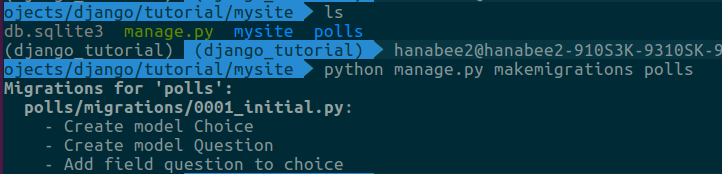
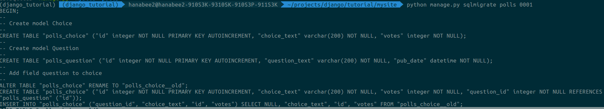
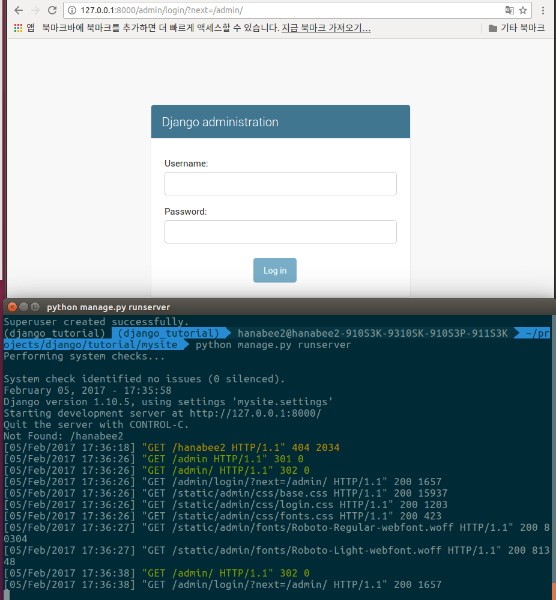
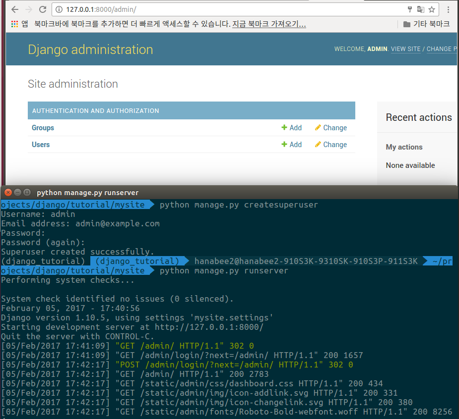
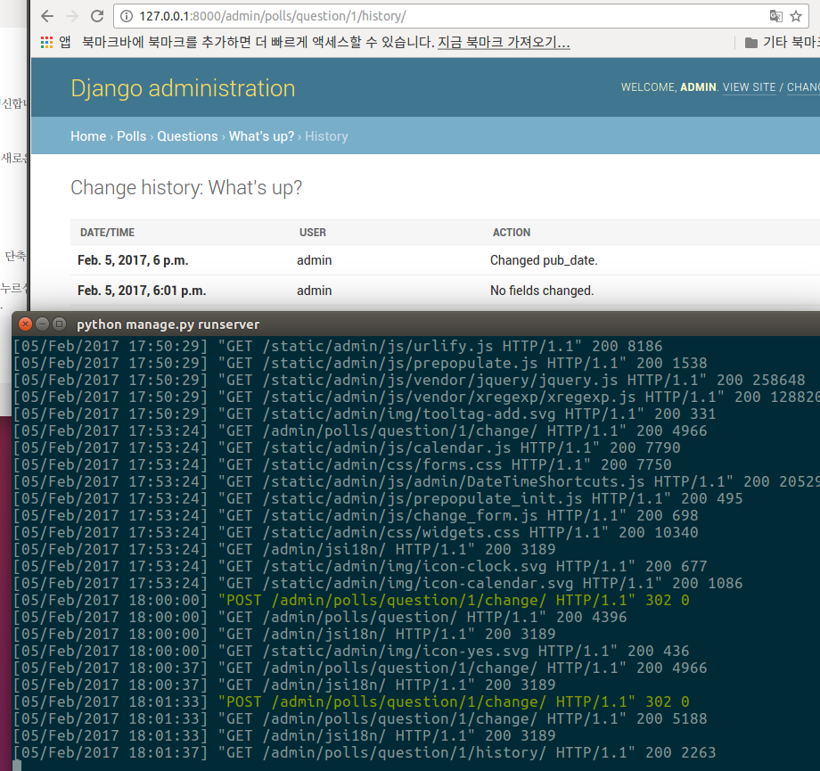

# Making Django App, Part 2
**Reference** : <http://django-document-korean.readthedocs.io/ko/latest/intro/tutorial02.html>

## DB 설치
- 이제, mysite/settings.py 파일을 열어보세요. 
이 파일은 Django 설정을 모듈 변수로 표현한 보통의 Python 모듈이다.

- 기본적으로는 SQLite 을 사용하도록 구성되어 있습니다. 
- 만약 데이터베이스를 처음 경험해보거나,  
Django 에서 데이터베이스를 한번 경험해 보고 싶다면,   
SQLite 가 가장 간단한 방법입니다.
- SQLite 는 Python 에서 기본으로 제공되기 때문에  
별도로 설치할 필요가 없습니다.
- 그러나 실제 project 를 시작할 때에는,  
나중에 데이터베이스를 교체하느라 골치아파질 일을 피하기 위해서라도  
PostgreSQL 같이 좀 더 확장성있는 데이터베이스를 사용하고 싶어질 것이다.
- mysite/settings.py 을 편집하는 동안, 시간대에 맞춰 set TIME_ZONE 값을 설정
- 기본적으로는, INSTALLED_APPS 는 Django 와 함께 딸려오는 다음의 app 들을 포함합니다.
	- django.contrib.admin – 관리용 사이트, 곧 사용하게 될겁니다.
	- django.contrib.auth – 인증 시스템.
	- django.contrib.contenttypes – 컨텐츠 타입을 위한 프레임워크.
	- django.contrib.sessions – 세션 프레임워크.
	- django.contrib.messages – 메세징 프레임워크.
	- django.contrib.staticfiles – 정적 파일을 관리하는 프레임워크.

- 이러한 기본 어플리케이션들 중 몇몇은 최소한 하나 이상의 데이터베이스 테이블을 사용하는데,
그러기 위해서는 데이터베이스에서 테이블을 미리 만들 필요가 있다. 
- 이를 위해, 다음의 명령을 실행해 보자
```python
$ python manage.py migrate
```
- migrate 명령은 INSTALLED_APPS 의 설정을 탐색하여, 
mysite/settings.py 의 데이터베이스 설정과 app 과 함께
제공되는 데이터베이스 migrations에 따라, 
필요한 데이터베이스 테이블을 생성합니다.
- 이 명령을 수행하면 각 migration 이 적용되는 메세지가 화면에 출력되는 것을 확인할 수 있습니다. 
- 어떤 내용이 생성되었는지 궁금하다면, 
데이터베이스 클라이언트로 접속한 후, 
\dt (PostgreSQL), 
SHOW TABLES; (MySQL), 
.schema (SQLite), 
SELECT TABLE_NAME FROM USER_TABLES; (Oracle) 을 통해 Django 가 생성한 테이블을 확인해 볼 수 있습니다.

## 모델 만들기
- 모델이란 부가적인 메타데이터를 가진 데이터베이스의 구조(layout)를 말한다.
- 우리가 만드는 단순한 설문조사(poll) 앱을 위해 Question 과 Choice 라는 두개의 모델을 만들어 보겠습니다. 
- Question 은 질문(question) 과 발행일(publication date) 을 위한 두개의 필드를 가집니다. 
- Choice 는 선택지(choice) 와 표(vote) 계산을 위한 두개의 필드를 가집니다.
- 각 Choice 모델은 Question 모델과 연관(associated) 된다.
- 이런 개념은 간단한 Python 클래스로 표현할 수 있습니다. 
polls/models.py 파일을 수정하여 다음과 같이 만들어 봅시다.
```python
from django.db import models

class Question(models.Model):
    question_text = models.CharField(max_length=200)
    pub_date = models.DateTimeField('date published')


class Choice(models.Model):
    question = models.ForeignKey(Question, on_delete=models.CASCADE)
    choice_text = models.CharField(max_length=200)
    votes = models.IntegerField(default=0)
```
- 각 모델은 django.db.models.Model 이라는 클래스의 서브클래스로 표현됩니다.
- 각 모델은 몇개의 클래스 변수를 가지고 있으며,
각각의 클래스 변수들은 모델의 데이터베이스 필드를 나타냅니다.

- 데이터베이스의 각 필드는 Field 클래스의 인스턴스로서 표현됩니다
- CharField 는 문자(character) 필드를 표현하고,
DateTimeField 는 날짜와 시간(datetime) 필드를 표현합니다.
이것은 각 필드가 어떤 자료형을 가질 수 있는지를 Django 에게 말해준다.

- Field 클래스의 생성자에 선택적인 첫번째 위치 인수를 전달하여
사람이 읽기 좋은(human-readable) 이름을 지정할 수도 있다.
만약 이 선택적인 첫번째 위치 인수를 사용하지 않으면,  
Django 는 기계가 읽기 좋은 형식의 이름을 사용합니다.
- 이 예제에서는, Question.pub_date 에 한해서만 인간이 
읽기좋은 형태의 이름을 정의하겠습니다.
그 외의 다른 필드들은, 기계가 읽기 좋은 형태의 이름이라도  
사람이 읽기에는 충분합니다.

- 몇몇 Field 클래스들은 필수 인수가 필요합니다.
예를 들어, CharField 의 경우 max_length 를 입력해 주어야 합니다.
- 이것은 데이터베이스 스키마에서만 필요한것이 아닌 값을 검증할때도 쓰임.
- 또한 Field 는 다양한 선택적 인수들을 가질 수 있습니다. 
이 예제에서는, default 로 하여금 votes 의 기본값을 0 으로 설정

-  ForeignKey 를 사용한 관계설정. 
예제에서는 각각의 Choice 가 하나의 Question 에 관계된다는 
것을 Django 에게 알려줍니다.
Django 는 다-대-일(many-to-one), 다-대-다(many-to-many),
일-대-일(one-to-one)과 같은 모든 일반 데이터베이스의 관계들를 지원한다.

## 모델의 활성화
- 모델에 대한 이 작은 코드가, 
Django 에게는 상당한 량의 정보를 전달합니다. 
- 이 정보로 Django 는 다음을 할 수 있다.
	1. 이 app 에 대하여 데이터베이스 스키마 생성 (CREATE TABLE statements)
	2. Question 과 Choice 객체에 접근하기 위한 Python 데이터베이스 접근 API 를 생성

- 그러나, 가장 먼저 현재 project 에게 polls app 이 설치되어 있다는 것을 알려야 한다.
- 따라서, app 을 현재의 project 에 포함시키기 위해서는,
app 의 구성 클래스에 대한 참조를 INSTALLED_APPS 설정에
추가시켜야 합니다. 
- PollsConfig 클래스는 polls/apps.py 파일 내에 존재합니다.
따라서, 점으로 구분된 경로는 'polls.apps.PollsConfig' 가 된다. 
이 점으로 구분된 경로를, mysite/settings.py 파일을 편집하여
INSTALLED_APPS 설정에 추가하면 된다.
- 이는 다음과 같다.
```python
>>> mysite/settings.py
INSTALLED_APPS = [
    'polls.apps.PollsConfig',
    'django.contrib.admin',
    'django.contrib.auth',
    'django.contrib.contenttypes',
    'django.contrib.sessions',
    'django.contrib.messages',
    'django.contrib.staticfiles',
]
```
- 이제, Django 는 polls app 이 포함된 것을 알게 되었다.
- 다음 명령을 실행해보자
```python
$ python manage.py makemigrations polls
```

- makemigrations 을 실행시킴으로서,  
당신이 모델을 변경시킨 사실과(이 경우에는 새로운 모델을 만들었습니다)   
이 변경사항을 migration 으로 저장시키고 싶다는 것을 Django 에게 알려줌.
- migration 은 Django가 모델(즉, 데이터베이스 스키마를 포함한)의 변경사항을 저장하는 방법으로써,  
디스크상의 파일로 존재합니다

- migration 들을 실행시켜주고, 자동으로 데이터베이스 스키마를 관리해주는 migrate 라는 명령어가 존재합니다. 
- 이 명령을 알아보기 전에 migration 이 내부적으로 어떤 SQL 문장을 실행하는지 살펴봅시다. 
- sqlmigrate 명령은 migration 이름을 인수로 받아, 실행하는 SQL 문장을 보여줍니다.

- 위의 내용을 설명하면 다음과 같다.
	1. 테이블 이름은 app 의 이름과 모델의 이름(소문자)이 조합되어 자동으로 생성됩니다. 
	이 경우, 앱의 이름인 polls 와 소문자로 표기된 모델의 이름인 question 과 choice 가 합쳐집니다.
	이 동작을 재지정(override) 하여 수정할 수 있습니다.)

	2. 기본 키(Primary, ID) 는 자동으로 추가됩니다. 
	(역시 이 동작도 재지정(override) 할 수 있습니다.)

	3. 관례에 따라, Django 는 외래 키(foreign key) 필드명에 "_id" 이름을 자동으로 추가합니다. 
	(물론 이것도 재지정 할 수 있습니다.)

	4. 외래 키 관계는 FOREIGN KEY 제약이 명시적으로 생성됩니다. 
	제약 조건 연기(DEFERRABLE) 에 대해서는 걱정하지 않으셔도 됩니다. 
	이것은 단순히 PostgreSQL 에게 transaction 이 끝날때까지 외래 키를 강제하지 말라고 알려주는 것 뿐입니다.

	5. 사용하는 데이터베이스에 따라, 데이터베이스 고유의 필드타입이 조정됩니다. 
	따라서, 자동 증가 필드를 생성할 경우 auto_increment (MySQL), serial (PostgreSQL), integer primary key autoincrement (SQLite) 와 같이 사용하는 데이터베이스에 따라 
	적절한 필드타입이 자동으로 선택됩니다. 
	필드 명에 사용되는 인용부호도 상황에 따라 겹따옴표나 홑따옴표가 적절히 선택됩니다.

	6. sqlmigrate 명령은 실제로 데이터베이스의 migration 을 실행하지는 않습니다. 
	이 명령은 단순히 결과만 출력할 뿐이며, Django 가 필요로 하는 SQL 이 무엇인지 확인할 수 있습니다. 
	이 결과를 이용하여 Django 가 무엇을 할 것인지 미리 확인하거나, 
	데이터베이스 관리자에게 필요한 SQL 스크립트를 요청할 수도 있습니다.


- 이제, migrate 를 실행시켜 데이터베이스에 모델과 관련된 테이블을 생성해봅시다.
```python
$ python manage.py migrate

- 결과 
Operations to perform:
  Apply all migrations: admin, auth, contenttypes, polls, sessions
Running migrations:
  Rendering model states... DONE
  Applying polls.0001_initial... OK
```
- migrate 명령은 아직 적용되지 않은 모든 migration 들을 수집하여 이를 실행합니다. (Django 는 migration 의 적용 여부를 기록하는 django_migrations 테이블이 있습니다) 
- 이 과정을 통해 모델에서의 변경 사항들과 데이터베이스의 스키마의 동기화가 이루어집니다.
- migration 은 매우 기능이 강력하여, 마치 project 를 개발 할 때처럼
데이터베이스나 테이블에 손대지 않고도 모델의 반복적인 변경을 가능하게 해줍니다.
- 지금은 모델의 변경을 만드는 세단계의 지침을 기억하세요:
	1. (models.py 에서) 모델을 변경합니다.
	2. python manage.py makemigrations 을 통해 
	이 변경사항에 대한 migration 을 만드세요.
	3. python manage.py migrate 명령을 통해 변경사항을 데이터베이스에 적용하세요.

- migration 을 만드는 명령과, 적용하는 명령이 분리된 이유는
버전 관리 시스템에 migration 을 커밋할 수 있게 하여 app 과 함께 제공하기 위해서입니다.
이것은 단순히 당신의 개발을 쉽게 해주는 것 뿐 아니라,
다른 개발자들과 운영 환경에서도 유용하게 사용될 수 있습니다.
(django-admin documentation 문서에 manage.py 유틸리티가 어떤 일들을 할 수 있는지 알 수 있습니다.)

## API 가지고 놀기
- **```Python 쉘```**을 실행하려면 다음의 명령을 입력합니다.
**```$ python manage.py shell```**

- 단순히 “python” 이라고 실행하는 대신에, 위의 명령을 실행한 까닭은,
manage.py 에 설정된 DJANGO_SETTINGS_MODULE 환경변수 때문입니다.
이 환경변수는 mysite/settings.py 파일에 대한 Python import 경로를 Django 에게 제공하여,
대화식 Python 쉘에서 Django 가 접근할 수 있는 Python 모듈
경로를 그대로 사용 할 수 있습니다.
- 즉, Django 에서 동작하는 모든 명령을 대화식 Python 쉘에서
그대로 시험해 볼 수 있습니다.
- 쉘에 진입한 후, database API 를 탐험해 보세요.
```python
>>> from polls.models import Question, Choice   # Import the model classes we just wrote.

# No questions are in the system yet.
>>> Question.objects.all()
<QuerySet []>

# Create a new Question.
# Support for time zones is enabled in the default settings file, so
# Django expects a datetime with tzinfo for pub_date. Use timezone.now()
# instead of datetime.datetime.now() and it will do the right thing.
>>> from django.utils import timezone
>>> q = Question(question_text="What's new?", pub_date=timezone.now())

# Save the object into the database. You have to call save() explicitly.
>>> q.save()

# Now it has an ID. Note that this might say "1L" instead of "1", depending
# on which database you're using. That's no biggie; it just means your
# database backend prefers to return integers as Python long integer
# objects.
>>> q.id
1

# Access model field values via Python attributes.
>>> q.question_text
"What's new?"
>>> q.pub_date
datetime.datetime(2012, 2, 26, 13, 0, 0, 775217, tzinfo=<UTC>)

# Change values by changing the attributes, then calling save().
>>> q.question_text = "What's up?"
>>> q.save()

# objects.all() displays all the questions in the database.
>>> Question.objects.all()
<QuerySet [<Question: Question object>]>
```
- 잠깐만요, <Question: Question object> 는 이 객체를 설명하는데에 정말 하나도 도움이 안되네요. (polls/models.py 파일의) Question 모델을 수정하여 __str__() 메소드를 Question 과 Choice 에 추가해 봅시다.
```python
>>> polls/models.py

from django.db import models
from django.utils.encoding import python_2_unicode_compatible

@python_2_unicode_compatible  # only if you need to support Python 2
class Question(models.Model):
    # ...
    def __str__(self):
        return self.question_text

@python_2_unicode_compatible  # only if you need to support Python 2
class Choice(models.Model):
    # ...
    def __str__(self):
        return self.choice_text
```
- 당신의 모델에 __str__() 메소드를 추가하는것은
객체의 표현을 대화식 프롬프트에서 편하게 보려는 이유 말고도,
Django 가 자동으로 생성하는 관리 사이트 에서도
객체의 표현이 사용되기 때문입니다.

- 이것들은 모두 보통의 Python 메소드입니다. 예시를 위해 수정된 메소드를 추가해 보겠습니다:
```python
>>> polls/models.py

import datetime

from django.db import models
from django.utils import timezone


class Question(models.Model):
    # ...
    def was_published_recently(self):
        return self.pub_date >= timezone.now() - datetime.timedelta(days=1)
```
- import datetime 은 Python 의 표준 모듈인 datetime 모듈이며,
from django.utils import timezone 은 Django 의 시간대 관련 유틸리티인 django.utils.timezone 을 의미합니다.

- 변경된 사항을 저장하고, **```python manage.py shell```** 를 다시 실행해보세요

```python
>>> from polls.models import Question, Choice

# Make sure our __str__() addition worked.
>>> Question.objects.all()
<QuerySet [<Question: What's up?>]>

# Django provides a rich database lookup API that's entirely driven by
# keyword arguments.
>>> Question.objects.filter(id=1)
<QuerySet [<Question: What's up?>]>
>>> Question.objects.filter(question_text__startswith='What')
<QuerySet [<Question: What's up?>]>

# Get the question that was published this year.
>>> from django.utils import timezone
>>> current_year = timezone.now().year
>>> Question.objects.get(pub_date__year=current_year)
<Question: What's up?>

# Request an ID that doesn't exist, this will raise an exception.
>>> Question.objects.get(id=2)
Traceback (most recent call last):
    ...
DoesNotExist: Question matching query does not exist.

# Lookup by a primary key is the most common case, so Django provides a
# shortcut for primary-key exact lookups.
# The following is identical to Question.objects.get(id=1).
>>> Question.objects.get(pk=1)
<Question: What's up?>

# Make sure our custom method worked.
>>> q = Question.objects.get(pk=1)
>>> q.was_published_recently()
True

# Give the Question a couple of Choices. The create call constructs a new
# Choice object, does the INSERT statement, adds the choice to the set
# of available choices and returns the new Choice object. Django creates
# a set to hold the "other side" of a ForeignKey relation
# (e.g. a question's choice) which can be accessed via the API.
>>> q = Question.objects.get(pk=1)

# Display any choices from the related object set -- none so far.
>>> q.choice_set.all()
<QuerySet []>

# Create three choices.
>>> q.choice_set.create(choice_text='Not much', votes=0)
<Choice: Not much>
>>> q.choice_set.create(choice_text='The sky', votes=0)
<Choice: The sky>
>>> c = q.choice_set.create(choice_text='Just hacking again', votes=0)

# Choice objects have API access to their related Question objects.
>>> c.question
<Question: What's up?>

# And vice versa: Question objects get access to Choice objects.
>>> q.choice_set.all()
<QuerySet [<Choice: Not much>, <Choice: The sky>, <Choice: Just hacking again>]>
>>> q.choice_set.count()
3

# The API automatically follows relationships as far as you need.
# Use double underscores to separate relationships.
# This works as many levels deep as you want; there's no limit.
# Find all Choices for any question whose pub_date is in this year
# (reusing the 'current_year' variable we created above).
>>> Choice.objects.filter(question__pub_date__year=current_year)
<QuerySet [<Choice: Not much>, <Choice: The sky>, <Choice: Just hacking again>]>

# Let's delete one of the choices. Use delete() for that.
>>> c = q.choice_set.filter(choice_text__startswith='Just hacking')
>>> c.delete()
```

## Django Admin 모듈 소개

### 관리자 생성하기
- 우선, 관리 사이트에 로그인 할 수 있는 사용자를 생성해 봅시다. 다음과 같은 명령을 수행합니다.
```$ python manage.py createsuperuser```

- 원하는 username 을 입력하고 엔터를 누르세요
```Username: admin```

- 그런 다음 원하는 이메일 주소를 입력하라는 메시지가 표시됩니다.
```Email address: admin@example.com```

- 마지막으로, 암호를 입력하세요. 암호를 두번 물어보게 되는데,  
두번째 입력하는 암호를 올바로 입력했는지를 확인하기 위한 암호입니다.
```
Password: qazwerty
Password (again): qazwerty
Superuser created successfully.
```
### 개발 서버를 실행하기
- Django 의 관리 사이트는 기본으로 활성화 되어 있습니다.
개발 서버를 켜고, 탐험해 봅시다.
- 서버가 기동되지 않았다면 다음과 같이 입력합니다.
```$ python manage.py runserver```

- 이제, 웹 브라우져를 열고 로컬 도메인의 “/admin/” 으로 이동합니다.
예를들면, ```http://127.0.0.1:8000/admin/``` 으로 접근할 수 있습니다.
- 그럼 다음과 같이 로그인 화면이 보일겁니다.


### 관리자 사이트로 들어가기
- 앞서 생성한 슈퍼유저(superuser) 계정으로 로그인 해봅시다.
다음과 같은 Django 관리 인덱스 페이지가 보일것입니다.


- 편집 가능한 그룹과 사용자와 같은 몇 종류의 컨텐츠를 볼 수 있다.
이것들은 django.contrib.auth 모듈에서 제공되는데,
Django 에서 제공되는 인증 프레임워크이다.

### 관리 사이트에서 poll app 을 변경가능하도록 만들기
- 그런데, poll app 이 관리 인덱스 페이지에서 보이지 않네요. 어디에 있을까요?
- 여기서 하나만 더 하면 됩니다.
관리 사이트에 Question 객체가 관리 인터페이스를 가지고 있다는 것을 알려주는 것입니다.
이것을 하기 위해서는, polls/admin.py 파일을 열어 다음과 같이 편집하면 됩니다.

```python
>>> polls/admin.py
from django.contrib import admin
from .models import Question

admin.site.register(Question)
```

### 자유로운 관리 기능을 탐색하기
- 이제, Question 을 등록시켰으니 Django 는 이를 알아채고 관리 인덱스 페이지에 이를 표시할 것입니다.


- “Questions” 을 클릭하십시요. 그러면 질문들을 위한 “change list” 로 이동합니다.
이 페이지는 데이터베이스에 저장된 모든 질문들을 보여주며,
그 중 하나를 선택하여 변경할 수 있습니다.
이전에 등록했던 “What’s up?” 질문이 있을 것입니다.


- “What’s up?” 질문을 클릭하여 수정합니다.


- 여기서 알아둘 것들:
	1. 이 서식은 Question 모델에서 자동으로 생성되었습니다
	2. 모델의 각 필드 유형들은 (DateTimeField, CharField) 적절한 HTML 입력 위젯으로 표현됩니다.
	필드의 각 유형들은 Django 관리 사이트에서 어떻게 표현해되어야 할지 알고 있습니다.
	3. 각각의 DateTimeField 는 JavaScript 로 작성된 단축 기능과 연결됩니다.
	날짜는 “오늘”(“Today”) 버튼과 달력 팝업에서 입력할 수 있으며,
	시간은 “지금”(“Now”) 버튼과 일반적으로 입력하는 시간들을 제공하는
	편리한 팝업을 통해서도 입력할 수 있습니다.
	
- 페이지의 아래 부분에서 다음과 같은 몇가지 옵션을 제공합니다.
	1. 저장(Save)
		- 이 유형의 객체에 대한 변경사항을 저장하고, 
		변경된 목록 페이지를 보여줍니다
	2. 저장 및 편집 계속(Save and continue editing)
		- 이 객체에 대한 변경사항을 저장하고, 현재 편집창을 갱신합니다

	3. 저장 및 다른 이름으로 추가(Save and add another)
		- 변경사항을 저장하고, 이 유형의 객체에 대한 비어있는 새로운 입력창을 불러옵니다
	4. 삭제(Delete) 
		- 삭제를 확인하는 페이지를 띄웁니다.

- “Date published” 의 값을 “오늘”(“Today”) 과 “지금”(“Now”) 단축버튼을 눌러 날찌와 시간을 바꾸십시요.
그런 후, “저장 및 편집 계속”(“Save and continue editing”) 을 누르십시요.
그런 후, 우측 상단의 “히스토리”(“History”) 버튼을 누르십시요. 
Django 관리사이트를 통해 누가(username) 
언제(timestamp) 무엇을 바꾸었는지
목록을 확인할 수 있습니다.

