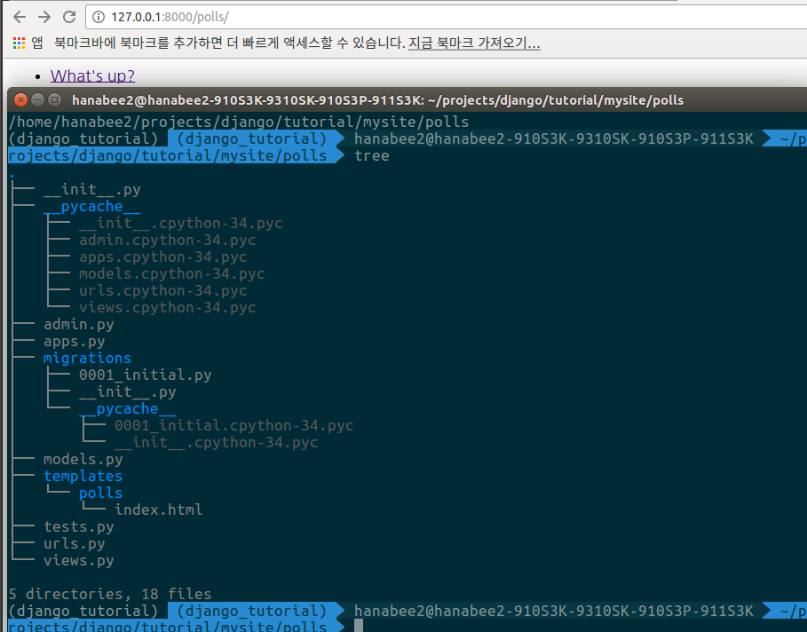
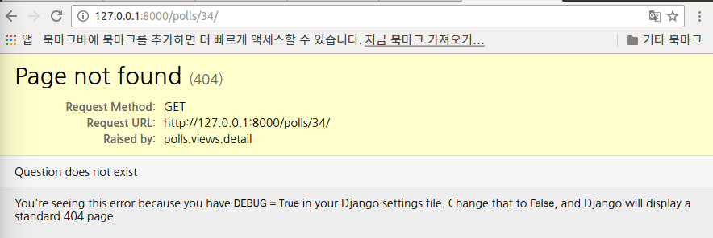

# Making Django App, Part 3
**Reference** : <http://django-document-korean.readthedocs.io/ko/latest/intro/tutorial03.html>

- 이제 poll 어플리케이션에 공개 인터페이스인 “view” 를 추가해 보겠습니다.

## 1. 개요
- view 는 Django 어플리케이션이 일반적으로
특정 기능과 템플릿을 제공하는 웹페이지의 한 종류.
예를 들어, 블로그 어플리케이션의 경우 다음과 같은 view 를 가질 수 있다.
	- Blog 홈페이지
		- 가장 최근의 항목들을 보여줍니다
	- 항목 “세부”(detail) 페이지
		- 하나의 항목에 연결하는 영구적인 링크(permalink)를 제공합니다.
	- 년도별 축적 페이지
		- 주어진 연도의 모든 월별 항목들을 표시합니다.
	- 월별 축적 페이지 
		- 주어진 월의 날짜별 항목들을 표시합니다.
	- 날짜별 축적 페이지
		- 주어진 날짜의 모든 항목들을 표시합니다.
	- 댓글 기능
		- 특정 항목의 댓글을 다룰 수 있는 기능

- 우리가 만드는 poll 어플리케이션에서 다음과 같은 네개의 view 를 만들어 보겠습니다.
	- 질문 “색인” 페이지
		- 최근의 질문들 표시.
	- 질문 “세부” 페이지
		- 질문 내용과, 투표할 수 있는 서식 표시.
	- 질문 “결과” 페이지
		- 특정 질문에 대한 결과 표시.
	- 투표 기능
		- 특정 질문에 대해 특정 선택을 할 수 있는 투표 기능 제공.


- Django 에서는, 웹 페이지와 기타 내용들이 view 에 의해 제공되며,
- 각 view 는 간단한 Python 함수(혹은 클래스를 사용할 경우엔 메소드) 를 사용하여 작성됩니다.
- Django 는 요청된 URL 을 조사하여 view 를 선택합니다.
(조금 더 정확히 말하자면, 도메인 네임에 따라오는 URL 부분을 이용합니다.)
- URL 패턴은 URL 을 간단하게 일반화 시킨 것을 말함. 
예를 들어, /newsarchive/<year>/<month>/ 같이 표현할 수 있습니다.
- view 를 URL 에서 얻기위해, Django 는 URLconfs 라고 부르는 것을 사용.
- URLconf는 URL 패턴(정규 표현식으로 표현)과 view 를 연결한 것.
- 이 튜토리얼은 URLconfs를 사용하기 위한 기본적인 절차를 안내한다. 더 자세한 정보를 얻으시려면 django.urls 를 참고해 주십시요.

## 2. 조금 더 view 작성하기
- 이제, polls/views.py 에 view 를 추가해 봅시다. 
이 view 들은 인수를 받기 때문에 조금 모양이 다릅니다.

```python
>>> polls/views.py

def detail(request, question_id):
    return HttpResponse("You're looking at question %s." % question_id)

def results(request, question_id):
    response = "You're looking at the results of question %s."
    return HttpResponse(response % question_id)

def vote(request, question_id):
    return HttpResponse("You're voting on question %s." % question_id)
```

- polls.urls 모듈에서 새로 작성된 view 들을 연결하기 위해 다음과 같이 url() 함수 호출을 추가합니다.

```python
>>> polls/views.py

def detail(request, question_id):
    return HttpResponse("You're looking at question %s." % question_id)

def results(request, question_id):
    response = "You're looking at the results of question %s."
    return HttpResponse(response % question_id)

def vote(request, question_id):
    return HttpResponse("You're voting on question %s." % question_id)
```
- 브라우저에 ```“http://127.0.0.1:8000/polls/34/”``` 를 입력해 보세요.
이 주소에 접속하면 detail() 함수를 호출하여
URL 에 입력한 ID 를 출력할 것입니다.
- “http://127.0.0.1:8000/polls/34/” 와 “http://127.0.0.1:8000/polls/34/” 도 실행해 보세요.
투표 결과와 투표 페이지의 뼈대가 되는 페이지가 출력될 것입니다.


- 사용자가 웹사이트의 페이지를 요청할때, (“/polls/34” 를 입력했다고 가정하겠습니다.) 
Django 는 mysite.urls 모듈을 불러옵니다.
ROOT_URLCONF 설정에 의해 설정되어 있기 때문입니다. 
mysite.urls 에서 urlpatterns 이라는 변수를 찾아,
정규표현식을 순서대로 따라갑니다. 
'^polls/' 를 찾은 후, 일치하는 문자열("polls/")을 버립니다.
이후 남은 문자인 "34/" 를 polls.urls URLconf 에게 전달하여
남은 처리를 진행합니다.
이제 r'^(?P<question_id>[0-9]+)/$' 에 패턴이 일치하고, 
그 결과로 detail() 함수가 호출됩니다.

```detail(request=<HttpRequest object>, question_id='34')```

- question_id='34' 부분은 (?P<question_id>[0-9]+) 에서 왔습니다. 
패턴을 괄호로 감싸 일치하는 패턴의 문자열을 잡아낸 후,
이를 view 함수의 인수로서 넘깁니다. 
?P<question_id> 는 일치하는 패턴을 구별하기 위해 정의한 이름입니다.
그리고 [0-9]+ 는 연속된 숫자의 나열을 잡아내기 위한 정규 표현식입니다.

## 3. view 가 실제로 뭔가 하도록 만들기
- 각 view 는 두가지중 하나를 하도록 되어 있습니다. 요청된 페이지의 내용이 담긴 HttpResponse 객체를 반환하거나, 혹은 Http404 같은 예외를 발생하게 해야합니다. 나머지는 당신에게 달렸습니다.

- 당신이 작성한 view 는 데이터베이스의 레코드를 읽을 수도 있습니다. 
또한 view 는 Django 나, Python 에서 서드파티로 제공되는 
템플릿 시스템을 사용 할 수도 있습니다. 
- view 는 PDF 를 생성하거나, XML 출력을 하거나, 
실시간으로 ZIP 파일을 만들 수 있습니다. 
view 는 당신이 원하는 무엇이든, Python 의 어떤 라이브러리라도 사용할 수 있습니다.
- 모든 Django 는 HttpResponse 객체나, 혹은 예외(exception) 를 원합니다.
- 왜냐면, 그렇게 다루는게 편리하기 때문입니다. 
Tutorial 2 의 예제에서 Django 자신만의 데이터베이스 API 를 사용해봅시다. 
새로운 index() view 하나를 호출했을 때, 
시스템에 저장된 최소한 5 개의 투표 질문이 콤마로 분리되어,
발행일에 따라 출력됩니다.

```python
>>>polls/views.py

from django.http import HttpResponse
from .models import Question

def index(request):
    latest_question_list = Question.objects.order_by('-pub_date')[:5]
    output = ', '.join([q.question_text for q in latest_question_list])
    return HttpResponse(output)

# Leave the rest of the views (detail, results, vote) unchanged
```
- 여기 몇가지 문제가 있습니다.
view 에서 페이지의 디자인이 하드코딩 되어 있습니다.
만약 페이지가 보여지는 방식을 바꾸고 싶다면,
이 Python 코드를 편집해야만 할겁니다.
그럼, view 가 사용할 수 있는 템플릿을 작성하여,
Python 코드로부터 디자인을 분리하도록 Django 의 템플릿 시스템을 사용해 봅시다.
-  우선, ```polls 디렉토리```에 ```templates 라는 디렉토리```를 만듭니다.
Django 는 여기서 템플릿을 찾게될 것입니다

- project 의 TEMPLATES 설정에는 Django 가 어떻게 template 을 불러오고 랜더링 할 것인지 를 서술합니다.
기본 설정 파일은 APP_DIRS 옵션이 True 로 설정된
DjangoTemplates 백엔드를 구성합니다.
관례에 따라, DjangoTemplates 은 
```각 INSTALLED_APPS 디렉토리```의 ```“templates” 하위 디렉토리를 탐색```합니다.

- ```방금 만든 templates 디렉토리``` 내에 ```polls 라는 디렉토리```를 생성하고,
그 안에 ```index.html``` 을 만듭니다.
즉, ```template``` 은 ```polls/templates/polls/index.html``` 과 같은 형태가 됩니다.
- app_directories template 로더가 그렇게 동작하기 때문에,
Django 에서 이 template 을 ```단순히 polls/index.html``` 로 참조할 수 있습니다
- 템플릿 네임스페이싱
> polls/templates/polls 라고 만들 필요 없이, 
그냥 polls/templates 에 넣어도 되지 않을까? 라고 생각할지도 모릅니다.
그러나 이것은 별로 좋은 생각이 아닙니다.
Django 는 이름이 일치하는 첫번째 template 을 선택하는데,
만약 동일한 template 이름이 다른 어플리케이션에 있을 경우,
Django 는 이 둘간의 차이를 구분하지 못합니다.
Django 에게 정확한 template 을 지정하기 위해서
가장 편리한 방법은 이름공간으로 구분짓는 것인데,
어플리케이션의 이름으로 된 디렉토리에
이러한 template 들을 넣으면 됩니다.

- 템플릿에 다음과 같은 코드를 입력합니다

```python
>>> polls/templates/polls/index.html

    <ul>
    
        <li><a href="/polls/{{ question.id }}/">{{ question.question_text }}</a></li>
    
    </ul>

    <p>No polls are available.</p>

```
- 이제, template 을 이용하여 polls/views.py 에 index view 를 업데이트 해보도록 하겠습니다.
```python
>>> polls/views.py

from django.http import HttpResponse
from django.template import loader

from .models import Question

def index(request):
    latest_question_list = Question.objects.order_by('-pub_date')[:5]
    template = loader.get_template('polls/index.html')
    context = {
        'latest_question_list': latest_question_list,
    }
    return HttpResponse(template.render(context, request))
```
- 이 코드는 polls/index.html template 을 불러온 후, 
context 를 전달합니다. 
- context 는 template 에서 쓰이는 변수명과,
Python 의 객체를 연결하는 사전형 값입니다.

- 브라우저에서 ```“http://127.0.0.1:8000/polls/”``` 페이지를 불러오면,
Tutorial 2 에서 작성한 “What’s up” 질문이 포함된 리스트가 표시됩니다.
표시된 질문의 링크는 해당 질문에 대한 세부 페이지를 가르킵니다.



## 4. 지름길: render()
- template 에 context 를 채워넣어 표현한 결과를
HttpResponse 객체와 함께 돌려주는 구문은 자주 쓰는 용법입니다.
- 따라서 Django 는 이런 표현을 쉽게 표현할 수 있도록
단축 기능(shortcuts)을 제공합니다.
- index() view 를 단축 기능으로 작성하면 다음과 같습니다.
```python
>>> polls/views.py
from django.shortcuts import render

from .models import Question

def index(request):
    latest_question_list = Question.objects.order_by('-pub_date')[:5]
    context = {'latest_question_list': latest_question_list}
    return render(request, 'polls/index.html', context)
```
- 모든 view 에 적용한다면, 
더 이상 loader 와 HttpResponse 를 import 하지 않아도 됩니다.
(만약 detail, results, vote 에서 stub 메소드를 가지고 있다면,
 HttpResponse 를 유지해야 할 것입니다.)

- render() 함수는 request 객체를 첫번째 인수로 받고, 
template 이름을 두번째 인수로 받으며, 
context 사전형 객체를 세번째 선택적(optional) 인수로 받습니다.
인수로 지정된 context 로 표현된 template 의 HttpResponse 객체가 반환됩니다.

## 5. 404 에러 일으키기
- 이제, 질문의 detail view 에 태클을 걸어보겠습니다.
detail view 는 지정된 설문조사의 질문 내용을 보여주는데, 다음과 같습니다
```python
>>>polls/views.py

from django.http import Http404
from django.shortcuts import render

from .models import Question
# ...
def detail(request, question_id):
    try:
        question = Question.objects.get(pk=question_id)
    except Question.DoesNotExist:
        raise Http404("Question does not exist")
    return render(request, 'polls/detail.html', {'question': question})
```
- 상기처럼 새로운 내용이 추가되었습니다.
view 는 요청된 질문의 ID 가 없을 경우,
Http404 예외를 발생시킵니다.

- 조금 후에 polls/detail.html template 에 무엇을 넣을 수 있는지 논의하겠지만,
일단 위의 예제를 동작시키기 위해 아래의 내용이 들어있는 파일을 작성하세요
```python
>>> polls/templates/polls/detail.html
{{ question }}
```


## 6. 지름길: get_object_or_404()
- 만약 객체가 존재하지 않을 때 get() 을 사용하여 Http404 예외를 발생시키는것은 자주 쓰이는 용법입니다.
- Django 에서 이 기능에 대한 단축 기능을 제공합니다.
- detail() view 를 단축 기능으로 작성하면 다음과 같습니다.
```python
>>>polls/views.py
from django.shortcuts import get_object_or_404, render

from .models import Question
# ...
def detail(request, question_id):
    question = get_object_or_404(Question, pk=question_id)
    return render(request, 'polls/detail.html', {'question': question})
```
- get_object_or_404() 함수는 Django 모델을 첫번째 인자로 받고, 
몇개의 키워드 인수를 모델 관리자의 get() 함수에 넘깁니다.
만약 객체가 존재하지 않을 경우, Http404 예외가 발생합니다.

## 7. Template 시스템 사용하기
- poll 어플리케이션의 detail() view 로 되돌아 가봅시다. 
context 변수 question 이 주어졌을때, 
polls/detail.html 라는 template 이 어떻게 보이는지 봅시다.

```python
>>> polls/templates/polls/detail.html
<h1>{{ question.question_text }}</h1>
<ul>

    <li>{{ choice.choice_text }}</li>

</ul>
```
- 예제의 {{ question.question_text }} 구문을 보면, 
Django 는 먼저 question 객체에 대해 사전형으로 탐색합니다. 
- 탐색에 실패하게 되면 속성값으로 탐색합니다. 
(이 예에서는 속성값에서 탐색이 완료됩니다만) 
만약 속성 탐색에도 실패한다면,
리스트의 인덱스 탐색을 시도하게 됩니다.

-  반복 구문에서 메소드 호출이 일어납니다. 
question.choice_set.all 은 Python 에서 
question.choice_set.all() 코드로 해석되는데,
이때 반환된 Choice 객체의 반복자는  에서 사용하기 적당합니다.

## 8. Template 에서 하드코딩된 URL 을 제거하기
- 기억하셔야 할 것은, polls/index.html template 에 링크를 적으면, 
이 링크는 다음과 같이 부분적으로 하드코딩 됩니다.
```html 
<li><a href="/polls/{{ question.id }}/">{{ question.question_text }}</a></li>
```
- 이러한 하드코딩된 강결합 접근법의 문제는, 
수많은 template 을 가진 project 의 URL 을 바꾸는게 어려운 일이 된다는 점입니다. 
- 그러나, 이미 polls.urls 모듈의 url() 함수에서 인수의 이름을 정의 했으므로,
이를  template 태그에서 사용하여
특정 URL 경로의 의존성을 제거할 수 있습니다.
```html
<li><a href="">{{ question.question_text }}</a></li>
```
- 이것이 polls.urls 모듈에 서술된 URL 의 정의를 탐색하는 식으로 동작합니다. 
- 다음과 같이 ‘detail’ 이라는 이름의 URL 이 어떻게 정의되어 있는지 확인할 수 있습니다.

- 만약 detail view 의 URL 을 polls/specifics/12/ 로 바꾸고 싶다면,
template 에서 바꾸는 것이 아니라 polls/urls.py 에서 바꿔야 합니다.
```python
# added the word 'specifics'
url(r'^specifics/(?P<question_id>[0-9]+)/$', views.detail, name='detail'),
```

## 9. URL 의 이름공간(namespace) 나누기
- 튜토리얼의 project 는 하나의 polls 라는 app 하나만 가지고 진행했습니다. 
- 실제 Django 의 project 는 app 이 몇개라도 올 수 있습니다.
- Django 는 이 app 들의 URL 을 어떻게 구별해 낼까요?
예를 들어, polls app 은 detail 이라는 view 를 가지고 있고,
동일한 project 에 블로그를 위한 app 이 있을수도 있습니다. 
Django 가  template 태그를 사용할 때, 
어떤 app 의 view 에서 URL 을 생성할지 알 수 있을까요?

- 정답은 URLconf 에 이름공간(namespace)을 추가하는 것입니다. 
polls/urls.py 파일에 app_name 을 추가하여 
어플리케이션의 이름공간을 설정할 수 있습니다.
```python
>>> polls/urls.py
from django.conf.urls import url

from . import views

app_name = 'polls'
urlpatterns = [
    url(r'^$', views.index, name='index'),
    url(r'^(?P<question_id>[0-9]+)/$', views.detail, name='detail'),
    url(r'^(?P<question_id>[0-9]+)/results/$', views.results, name='results'),
    url(r'^(?P<question_id>[0-9]+)/vote/$', views.vote, name='vote'),
]
```
- 이제, polls/index.html template 의 기존 내용을
```python
>>> polls/templates/polls/index.html
<li><a href="">{{ question.question_text }}</a></li>
```
- 아래와 같이 이름공간으로 나눠진 detail 의 view 를 가르키도록 변경하세요.
```python
>>> polls/templates/polls/index.html
<li><a href="">{{ question.question_text }}</a></li>
```