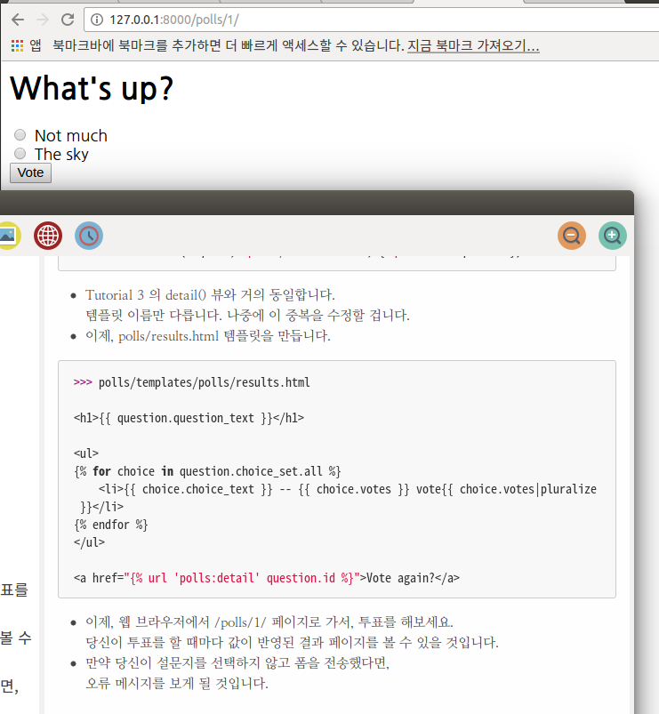
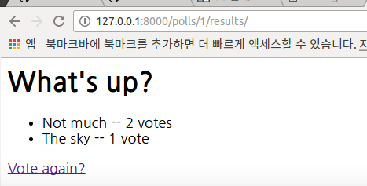
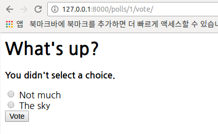

# Making Django App, Part 4
**Reference** : <http://django-document-korean.readthedocs.io/ko/latest/intro/tutorial04.html>


## 1.간단한 폼 만들기
- poll detail templates에 있는 ```polls/detail.html```을 추가해 봅시다. 
그러면, templates는 하기와 같이 HTML 의 <form> 요소를 갖게 됩니다.
```html
>>> polls/templates/polls/detail.html

<h1>{{ question.question_text }}</h1>

<p><strong>{{ error_message }}</strong></p>

<form action="" method="post">


    <input type="radio" name="choice" id="choice{{ forloop.counter }}" value="{{ choice.id }}" />
    <label for="choice{{ forloop.counter }}">{{ choice.choice_text }}</label><br />

<input type="submit" value="Vote" />
</form>
```
- 간략하게 설명하면:
	- 위의 템플릿은 각 질문 선택 항목에 대한 라디오 버튼을 표시합니다.
	각 라디오 버튼의 value 는 연관된 질문 선택 항목의 ID입니다. 
	각 라디오 버튼의 name 은 "choice"입니다.
	즉, 누군가가 라디오 버튼 중 하나를 선택하여 폼을 제출하면, 
	POST 데이터 인 choice=#을 보낼 것입니다. 
	여기서 #은 선택한 항목의 ID입니다. 
	이것은 HTML 폼의 기본 개념입니다.
	- 폼의 action을 로 설정하고, 
	method="post" 로 설정하였습니다.
	이 폼을 전송하는 행위는 서버측 자료를 변경할 것이므로,
	method="post" (method="get" 와 반대로) 를 사용하는 것은 매우 중요합니다.
	서버 측 자료를 변경하는 폼을 작성할 때마다,
	method="post" 를 사용하세요. 
	이 팁은 Django에만 국한되지 않습니다. 
	이것은 웹개발 시의 권장사항 입니다.
	- forloop.counter 는 for 태그가 반복을 한 횟수를 나타냅니다.

	- 우리는 POST 폼(자료를 수정하는 효과를 가진)을 만들고 있으므로, 
	사이트 간 요청 위조 (Cross Site Request Forgeries)에 대해 고민해야 합니다.
	고맙게도, Django는 사이트 간 요청 위조(CSRF)에 대항하기위한 
	사용하기 쉬운 시스템을 가지고 있기 때문에, 
	너무 심각하게 고민할 필요가 없습니다. 
	간단히 말하면, 내부 URL들을 향하는 모든 POST 폼에 
	템플릿 태그 를 사용하면 됩니다.

- 이제 제출된 데이터를 처리하고
그 데이터로 무언가를 수행하는 Django 뷰를 작성하겠습니다. 
- 튜토리얼 3 에서 설문조사 어플리케이션을 위해 
아래에 나와있는 코드를 포함하는 URLconf 를 만들었습니다:

```python
>>> polls/urls.py
url(r'^(?P<question_id>[0-9]+)/vote/$', views.vote, name='vote'),
```

- 또, 우리는 vote() 함수를 가상으로 만들었습니다. 
실제로 구현을 해봅시다. 
- polls/views.py 에 다음을 추가합시다
```python
>>> polls/views.py

from django.shortcuts import get_object_or_404, render
from django.http import HttpResponseRedirect, HttpResponse
from django.urls import reverse

from .models import Choice, Question
# ...
def vote(request, question_id):
    question = get_object_or_404(Question, pk=question_id)
    try:
        selected_choice = question.choice_set.get(pk=request.POST['choice'])
    except (KeyError, Choice.DoesNotExist):
        # Redisplay the question voting form.
        return render(request, 'polls/detail.html', {
            'question': question,
            'error_message': "You didn't select a choice.",
        })
    else:
        selected_choice.votes += 1
        selected_choice.save()
        # Always return an HttpResponseRedirect after successfully dealing
        # with POST data. This prevents data from being posted twice if a
        # user hits the Back button.
        return HttpResponseRedirect(reverse('polls:results', args=(question.id,)))
```
- 위 코드는 이 튜토리얼에서 아직 다루지 않은 몇 가지를 포함하고 있습니다
	- request.POST 는 키로 전송된 자료에 접근할 수 있도록 
	해주는 사전과 같은 객체입니다. 
	이 경우, request.POST['choice'] 는 선택된 설문의 ID를 
	문자열로 반환합니다. 
	request.POST 의 값은 항상 문자열들입니다.
	- Django는 같은 방법으로 GET 자료에 접근하기 위해 
	request.GET 를 제공합니다. 
	그러나 POST 요청을 통해서만 자료가 수정되게하기 위해서, 
	명시적으로 코드에 request.POST 를 사용하고 있습니다.

	- 만약 POST 자료에 choice 가 없으면, 
	request.POST['choice'] 는 KeyError 가 일어납니다.
	위의 코드는 KeyError 를 체크하고, choice가 주어지지 않은 경우에는
	에러 메시지와 함께 설문조사 폼을 다시보여줍니다.

	- 설문지의 수가 증가한 이후에, 코드는 일반
	HttpResponse 가 아닌 HttpResponseRedirect 를 반환하고, 
	HttpResponseRedirect 는 하나의 인수를 받습니다.
	그 인수는 사용자가 재전송될 URL 입니다.
	(이 경우에 우리가 URL을 어떻게 구성하는지 다음 항목을 보세요).

	- 위의 파이썬 주석이 지적했듯이, 
	POST 데이터를 성공적으로 처리 한 후에는 
	항상 HttpResponseRedirect 를 반환해야 합니다.
	이 팁은 Django에만 국한되는것이 아닌 웹개발의 권장사항
	입니다.

	- 우리는 이 예제에서 HttpResponseRedirect 생성자 안에서 
	reverse() 함수를 사용하고 있습니다. 
	이 함수는 뷰 함수에서 URL을 하드코딩하지 않도록 도와줍니다. 
	제어를 전달하기 원하는 뷰의 이름을, 
	URL패턴의 변수부분을 조합해서 해당 뷰를 가리킵니다. 
	여기서 우리는 튜토리얼 3 에서 설정했던 URLconf를 사용하였으며, 
	이 reverse() 호출은 아래와 같은 문자열을 반환할 것입니다
```'/polls/3/results/'```
	여기서 3 은 question.id 의 값입니다.
	이렇게 리디렉션된 URL은 최종 페이지를 표시하기 위해 
	'results' 뷰를 호출합니다.

참고 ) 튜토리얼 3 에서 언급했듯이, request 는 HttpRequest 개체입니다.

- 어떤 이가 설문조사에 설문을 하고난 뒤에는, 
vote() 뷰는 설문조사 결과 페이지로 리다이렉트합니다. 
그 뷰를 작성해봅시다.
```python
>>> polls/views.py
from django.shortcuts import get_object_or_404, render

def results(request, question_id):
    question = get_object_or_404(Question, pk=question_id)
    return render(request, 'polls/results.html', {'question': question})
```

- Tutorial 3 의 detail() 뷰와 거의 동일합니다. 
템플릿 이름만 다릅니다. 나중에 이 중복을 수정할 겁니다.

- 이제, polls/results.html 템플릿을 만듭니다.
```python
>>> polls/templates/polls/results.html

<h1>{{ question.question_text }}</h1>

<ul>

    <li>{{ choice.choice_text }} -- {{ choice.votes }} vote{{ choice.votes|pluralize }}</li>

</ul>

<a href="">Vote again?</a>
```
- 이제, 웹 브라우저에서 /polls/1/ 페이지로 가서, 투표를 해보세요. 



- 당신이 투표를 할 때마다 값이 반영된 결과 페이지를 볼 수 있을 것입니다.

- 만약 당신이 설문지를 선택하지 않고 폼을 전송했다면, 
오류 메시지를 보게 될 것입니다.


## 2. 제너릭 뷰 사용하기: 적은 코드가 더 좋습니다.
- detail() (Tutorial 3에서 만든)과 results() 뷰는 매우 간단합니다. 
그리고 위에서 말한것처럼 중복됩니다. 
polls 리스트를 보여주는 index() 뷰와도 비슷합니다.

- 이러한 뷰는 URL에서 전달 된 매개 변수에 따라 
데이터베이스에서 데이터를 가져 오는 것과 
템플릿을 로드하고 렌더링 된 템플릿을 리턴하는 
기본 웹 개발의 일반적인 경우를 나타냅니다. 
Django는 이런 매우 일반적인 경우를 위해 
“제너릭 뷰”시스템이라는 지름길을 제공합니다.

- 제너릭 뷰는 일반적인 패턴을 추상화하여 앱을 작성하기 위해 
Python 코드를 작성하지 않아도됩니다.

- 우리의 설문조사 애플리케이션을 제너릭 뷰 시스템을 사용하도록 변환하여 
우리의 코드를 삭제할 수 있도록 합시다. 
이러한 전환을 하려면 그저 다음과 같은 몇 단계 만 거치면 됩니다.
	1. URLconf를 변환하십시오.
	2. 불필요한 오래된보기 중 일부를 삭제하십시오.
	3. Django의 제너릭 뷰를 기반으로 새로운 뷰를 도입하십시오.

### 1. URLconf 수정
- 먼저, polls/urls.py URLconf를 열어 다음과 같이 변경하십시오

```python
>>> polls/urls.py

from django.conf.urls import url

from . import views

app_name = 'polls'
urlpatterns = [
    url(r'^$', views.IndexView.as_view(), name='index'),
    url(r'^(?P<pk>[0-9]+)/$', views.DetailView.as_view(), name='detail'),
    url(r'^(?P<pk>[0-9]+)/results/$', views.ResultsView.as_view(), name='results'),
    url(r'^(?P<question_id>[0-9]+)/vote/$', views.vote, name='vote'),
]
```
- 두 번째와 세 번째 패턴의 정규식에서 일치하는 패턴의 이름이
<question_id>에서 <pk>로 변경되었습니다.

### 2. 조회수 수정
- 다음으로 이전의 index, detail, results뷰를 제거하고 
장고의 일반적인 뷰를 대신 사용하겠습니다.
그렇게하려면 polls/views.py 파일을 열고 다음과 같이 변경하십시오.

```python
>>> polls/views.py

from django.shortcuts import get_object_or_404, render
from django.http import HttpResponseRedirect
from django.urls import reverse
from django.views import generic

from .models import Choice, Question

class IndexView(generic.ListView):
    template_name = 'polls/index.html'
    context_object_name = 'latest_question_list'

    def get_queryset(self):
        """Return the last five published questions."""
        return Question.objects.order_by('-pub_date')[:5]

class DetailView(generic.DetailView):
    model = Question
    template_name = 'polls/detail.html'

class ResultsView(generic.DetailView):
    model = Question
    template_name = 'polls/results.html'

def vote(request, question_id):
    ... # same as above, no changes needed.
```
- ListView와 DetailView의 두 가지 제너릭 뷰를 사용하고 있습니다. 
이 두보기는 각각 “개체 목록 표시” 및 “특정 개체 유형에 
대한 세부 정보 페이지 표시” 개념을 추상화합니다.

	- 각 제너릭 뷰는 어떤 모델이 적용될 것인지를 알아야합니다. 
	이것은 model 속성을 사용하여 제공됩니다.

	- DetailView 제너릭 뷰는 URL에서 캡쳐 된 
	기본 키 값이```”pk”```라고 기대하기 때문에
	question_id를 제너릭 뷰를 위해 pk로 변경합니다.

- 기본적으로 DetailView 제너릭 뷰는 <app name>/<model name>_detail.html 템플릿을 사용합니다.
이번의 경우에는 "polls/question_detail.html"템플릿을 사용할 것입니다. 
template_name 속성은 Django에게 자동 생성 된 
기본 템플릿 이름 대신에 특정 템플릿 이름을 사용하도록
 알려주기 위해 사용됩니다. 
 results리스트 뷰에 대해서 template_name을 지정합니다 
 - 이들이 둘다 동일한 DetailView를 사용하고 있더라도,
결과 뷰와 상세 뷰가 렌더링 될 때 서로 다른 모습을 갖도록한다.

- 마찬가지로, ListView 제네릭 뷰는
 <app name>/<model name>_list.html 템플릿을 기본으로 사용합니다.
 이미 있는 "polls/index.html" 템플릿을 사용하기 위해 
 ListView 에 template_name 를 전달했습니다.

- 이 튜토리얼의 이전 부분에서 템플릿에는 question 및
 latest_question_list 컨텍스트 변수가 포함 된 
 컨텍스트가 제공되었습니다. 
 DetailView의 경우, question 변수가 자동으로 제공됩니다. 
 Django 모델 (Question)을 사용하기 때문에 
 Django는 컨텍스트 변수의 적절한 이름을 결정할 수 있습니다. 
 그러나 ListView의 경우 자동 생성 된 컨텍스트 변수는 question_list 입니다. 
 이것을 덮어 쓰려면 context_object_name 속성을 제공하고, 
 대신에 latest_question_list를 사용하도록 지정하십시오. 
 다른 접근 방법으로, 템플릿을 새로운 기본 컨텍스트 변수와 일치하도록 변경할 수 있습니다. 
 그러나 원하는 변수를 사용하도록 Django에 지시하는 것이 훨씬 쉽습니다.
 
- 서버를 실행하고 제너릭 뷰를 기반으로한 새 설문조사 앱을 사용하십시오.
