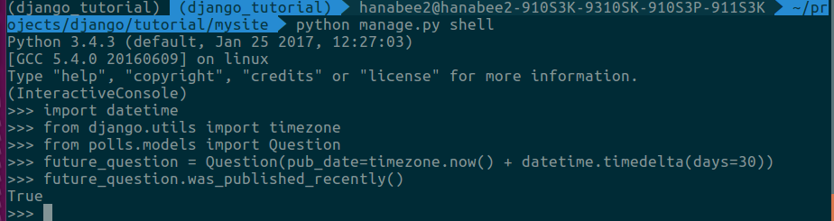
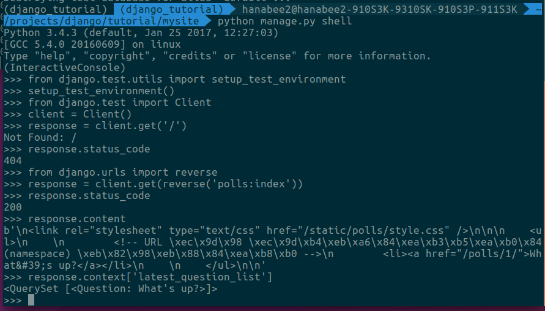

# Making Django App, Part 5
**Reference** : <http://django-document-korean.readthedocs.io/ko/latest/intro/tutorial05.html>


## 자동화 된 테스트 소개
### 자동화 된 테스트 란 무엇
 -자동화 된 테스트에서 다른 점은 테스트 작업이 시스템에서 수행된다는 것입니다. 
 - 한 번 테스트 세트를 작성한 이후에는 앱을 변경할 때 
 수동 테스트를 수행하지 않아도 원래 의도대로 코드가 작동하는지 확인할 수 있습니다
### 테스트를 만들어야하는 이유
1. 테스트를 통해 시간을 절약 할 수 있습니다.
2. 테스트는 문제를 그저 식별하는 것이 아니라 예방합니다.
3. 테스트가 코드를 더 매력적으로 만듭니다.
4. 테스트는 팀이 함께 일하는것을 돕습니다

## 기초 테스팅 전략
- 어떤 프로그래머들은 “테스트 주도 개발“이라는 원칙을 따릅니다. 
- 테스트 주도 개발은 파이썬 테스트 케이스로 문제를 간추려 공식화합니다.

## 우리의 첫 테스트 작성하기
### 우리는 버그를 확인합니다
- 다행스럽게도 polls 어플리케이션에는 우리가 즉시 해결할수있는 약간의 버그가 있습니다. 
Question.was_published_recently() 메소드는 
Question이 어제까지 게시된 경우 True를 반환하며(올바른 동작),
그뿐 아니라 Question의 pub_date 필드가 미래로 설정되어 있을
때도 그렇습니다(틀린 동작).

- 버그가 실제로 존재하는지 확인하기위해 Admin을 사용하여 
미래의 날짜로 질문을 만들고 shell을 사용해서 확인합니다.

```python
>>> import datetime
>>> from django.utils import timezone
>>> from polls.models import Question
>>> # create a Question instance with pub_date 30 days in the future
>>> future_question = Question(pub_date=timezone.now() + datetime.timedelta(days=30))
>>> # was it published recently?
>>> future_question.was_published_recently()
True
```


### 버그를 노출하는 테스트 만들기
- 문제를 테스트하기 위해 shell 에서 방금 수행 한 작업은 
자동화 된 테스트에서 수행 할 수있는 작업이므로
자동화 된 테스트로 바꾸도록 합시다.

- 애플리케이션 테스트는 일반적으로 애플리케이션의 tests.py 파일에 있습니다.
테스트 시스템은 test 로 시작하는 파일에서 테스트를 자동으로 찾습니다.

- polls 어플리케이션의 tests.py 파일에 다음을 입력하십시오.
```python
>>> polls/tests.py
import datetime

from django.utils import timezone
from django.test import TestCase

from .models import Question

class QuestionMethodTests(TestCase):

    def test_was_published_recently_with_future_question(self):
        """
        was_published_recently() should return False for questions whose
        pub_date is in the future.
        """
        time = timezone.now() + datetime.timedelta(days=30)
        future_question = Question(pub_date=time)
        self.assertIs(future_question.was_published_recently(), False)
```
- 우리가 여기서 한 것은 미래로 설정된 pub_date를 가진
 Question인스턴스를 생성하는 메소드를 가진
 django.test.TestCase 서브 클래스를 생성한 것입니다. 
 그런 다음 was_published_recently()의 결과를 확인합니다.
 이는 반드시 False가 되어야 합니다.

### 테스트 실행
- 터미널에서 테스트를 실행할 수 있습니다.
```$ python manage.py test polls```
- 그러면 다음과 같은 것을 볼 수 있습니다.
```python
Creating test database for alias 'default'...
F
======================================================================
FAIL: test_was_published_recently_with_future_question (polls.tests.QuestionMethodTests)
----------------------------------------------------------------------
Traceback (most recent call last):
  File "/path/to/mysite/polls/tests.py", line 16, in test_was_published_recently_with_future_question
    self.assertIs(future_question.was_published_recently(), False)
AssertionError: True is not False

----------------------------------------------------------------------
Ran 1 test in 0.001s

FAILED (failures=1)
Destroying test database for alias 'default'...
```
- 상기 내용을 요약하자면,
	- python manage.py test polls는 polls 어플리케이션에서 테스트를 찾았습니다
	- django.test.TestCase 클래스의 서브 클래스를 찾았습니다.
	- 테스트 목적으로 특별한 데이터베이스를 만들었습니다.
	- 테스트 메소드 - 이름이 test로 시작하는 것들을 찾습니다.
	- test_was_published_recently_with_future_question에서 
	pub_date필드가 30일 미래인 Question 인스턴스를 생성했습니다
	- ... assertIs() 메소드를 사용하여, 
	우리가 False가 반환되기를 원함에도 불구하고,
	 was_published_recently() 가 True를 반환한다는 것을 발견했습니다.

- 즉, 테스트는 어떤 테스트가 실패했는지와 실패가 발생한 행까지 알려줍니다.

### 버그 수정
- 우리는 이미 문제가 무엇인지 알고 있습니다.
- Question.was_published_recently()는 pub_date 가 미래에 있다면 
False 를 반환해야 합니다. 
- models.py에서 메소드를 수정하십시오. 
그래서 날짜가 과거에 있을 때에만 True를 반환 할 것입니다.
```python
>>> polls/models.py
def was_published_recently(self):
    now = timezone.now()
    return now - datetime.timedelta(days=1) <= self.pub_date <= now
```
- 이제 테스트를 다시 실행해보자.
```python
Creating test database for alias 'default'...
.
----------------------------------------------------------------------
Ran 1 test in 0.001s

OK
Destroying test database for alias 'default'...
```
- 버그를 확인한 후에 우리는 이를 드러내는 테스트를 작성하였으며,
 코드에서 버그를 수정하고 테스트를 통과했습니다.

### 보다 포괄적인 테스트 : 여기서부터(?) 에러 발생
- 우리가 여기있는 동안, 우리는 was_published_recently()메소드를
 고정하는 것 이상을 할 수 있습니다.
사실 하나의 버그를 고치면서 다른 새로운 버그를 만들어 낸다면 분명 
곤란할 것입니다.

- 메소드의 동작을 보다 포괄적으로 테스트하기 위해 **```동일한 클래스```**에 
**```하기 두 가지 테스트 메소드```**를 추가하십시오.

```python
>> polls/tests.py
def test_was_published_recently_with_old_question(self):
    """
    was_published_recently() should return False for questions whose
    pub_date is older than 1 day.
    """
    time = timezone.now() - datetime.timedelta(days=30)
    old_question = Question(pub_date=time)
    self.assertIs(old_question.was_published_recently(), False)

def test_was_published_recently_with_recent_question(self):
    """
    was_published_recently() should return True for questions whose
    pub_date is within the last day.
    """
    time = timezone.now() - datetime.timedelta(hours=1)
    recent_question = Question(pub_date=time)
    self.assertIs(recent_question.was_published_recently(), True)
```
- 이제 우리는 Question.was_published_recently()가 
과거, 현재, 미래의 질문에 대해 올바른 값을 반환한다는 걸 
확인시켜주는 세가지 테스트를 가졌습니다.

## 뷰 테스트
- 설문조사 어플리케이션은 상당히 대충대충 만들어져 있습니다. 
이 어플리케이션은 pub_date필드가 미래에있는 질문 까지도 포함하여 게시합니다. 
이것을 개선 해야합니다. 미래로 pub_date를 설정하는 것은 
그 시기가 되면 질문이 게시되지만 그때까지는 보이지 않는 것을 
의미 해야 합니다.

### 뷰에 대한 테스트
- 위의 버그를 수정했을 때 먼저 테스트를 작성한 다음 코드 수정을 했습니다. 
사실 그것은 테스트 주도 개발의 간단한 예제 였지만 
어떤 순서로 작업하는지는 중요하지 않습니다.
- 버그를 수정하기 전에 우리가 사용 할 수있는 도구를 살펴 보겠습니다.

### 장고 테스트 클라이언트
- Django는 뷰 레벨에서 코드와 상호 작용하는 사용자를 시뮬레이션 하기위해
테스트 Client 클래스를 제공합니다. 
이 테스트 클라이언트를 tests.py또는 shell에서 사용할 수 있습니다.

- 우리는 shell로 다시 시작하면서 tests.py 에서 필요하지 않았던 것들을 몇 가지 해야합니다. 
첫 번째는 shell에서 테스트 환경을 설정하는 것입니다:
```python
>>> from django.test.utils import setup_test_environment
>>> setup_test_environment()
```
- response.context와 같은 response의 추가적인 속성을 사용할수 있게 하기 위해서
 setup_test_environment()를 사용하여 템플릿 렌더러를 설치합니다. 
 이 메소드는 테스트 데이터베이스를 셋업하지 않습니다. 
 그렇기 때문에 테스트는 현재 사용중인 데이터베이스 위에서 돌게 되며
 결과는 데이터베이스에 이미 만들어져있는 질문들에 따라서 
 조금씩 달라질수 있습니다. 또한 settings.py의 TIME_ZONE이 
 올바르지 않으면 예기치 않은 결과가 발생할 수 있습니다. 
 초기에 어떻게 설정해놨는지 기억나지 않는다면 
 진행하기 전에 먼저 확인하십시오.

- 다음으로 우리는 테스트 클라이언트 클래스를 import 해야합니다
```python
>>> from django.test import Client
>>> # create an instance of the client for our use
>>> client = Client()
```
- 이런것들이 준비가 되었다면 이제 우리는 클라이언트에세 우리를 위해 일을 하라고 시킬수 있습니다.
```python
>>> # get a response from '/'
>>> response = client.get('/')
>>> # we should expect a 404 from that address
>>> response.status_code
404
>>> # on the other hand we should expect to find something at '/polls/'
>>> # we'll use 'reverse()' rather than a hardcoded URL
>>> from django.urls import reverse
>>> response = client.get(reverse('polls:index'))
>>> response.status_code
200
>>> response.content
b'\n    <ul>\n    \n        <li><a href="/polls/1/">What&#39;s up?</a></li>\n    \n    </ul>\n\n'
>>> # If the following doesn't work, you probably omitted the call to
>>> # setup_test_environment() described above
>>> response.context['latest_question_list']
<QuerySet [<Question: What's up?>]>
```



### 뷰를 개선시키기
- 설문 조사 목록에는 아직 게시되지 않은 설문 조사
(즉, 장래에 pub_date가 있는 설문 조사)가 표시됩니다. 
그것을 수정합시다.
```python
>>> polls/views.py
class IndexView(generic.ListView):
    template_name = 'polls/index.html'
    context_object_name = 'latest_question_list'

    def get_queryset(self):
        """Return the last five published questions."""
        return Question.objects.order_by('-pub_date')[:5]
```
- 우리는 get_queryset() 메소드를 수정하여 
timezone.now() 와 비교하여 날짜를 검사하도록 변경해야 합니다. 
먼저 가져 오기를 추가해야합니다
```python
>>> polls/views.py
from django.utils import timezone
```

- 그리고 다음과 같이 get_queryset 메소드를 수정해야합니다:
```python
>>> polls/views.py
def get_queryset(self):
    """
    Return the last five published questions (not including those set to be
    published in the future).
    """
    return Question.objects.filter(
        pub_date__lte=timezone.now()
    ).order_by('-pub_date')[:5]
```
- Question.objects.filter (pub_date__lte = timezone.now ()) 는
timezone.now 보다 pub_date 가 작거나 같은 Questions 를 
포함하는 queryset을 리턴합니다.

### 새로운 뷰 테스트
- polls/tests.py에 다음을 추가하십시오.
```python
>>> polls/tests.py
from django.urls import reverse
```
- 새로운 테스트 클래스와 함께 질문들을 생성하는 함수를 만들것입니다.
```python
>>> polls/tests.py
def create_question(question_text, days):
    """
    Creates a question with the given `question_text` and published the
    given number of `days` offset to now (negative for questions published
    in the past, positive for questions that have yet to be published).
    """
    time = timezone.now() + datetime.timedelta(days=days)
    return Question.objects.create(question_text=question_text, pub_date=time)


class QuestionViewTests(TestCase):
    def test_index_view_with_no_questions(self):
        """
        If no questions exist, an appropriate message should be displayed.
        """
        response = self.client.get(reverse('polls:index'))
        self.assertEqual(response.status_code, 200)
        self.assertContains(response, "No polls are available.")
        self.assertQuerysetEqual(response.context['latest_question_list'], [])

    def test_index_view_with_a_past_question(self):
        """
        Questions with a pub_date in the past should be displayed on the
        index page.
        """
        create_question(question_text="Past question.", days=-30)
        response = self.client.get(reverse('polls:index'))
        self.assertQuerysetEqual(
            response.context['latest_question_list'],
            ['<Question: Past question.>']
        )

    def test_index_view_with_a_future_question(self):
        """
        Questions with a pub_date in the future should not be displayed on
        the index page.
        """
        create_question(question_text="Future question.", days=30)
        response = self.client.get(reverse('polls:index'))
        self.assertContains(response, "No polls are available.")
        self.assertQuerysetEqual(response.context['latest_question_list'], [])

    def test_index_view_with_future_question_and_past_question(self):
        """
        Even if both past and future questions exist, only past questions
        should be displayed.
        """
        create_question(question_text="Past question.", days=-30)
        create_question(question_text="Future question.", days=30)
        response = self.client.get(reverse('polls:index'))
        self.assertQuerysetEqual(
            response.context['latest_question_list'],
            ['<Question: Past question.>']
        )

    def test_index_view_with_two_past_questions(self):
        """
        The questions index page may display multiple questions.
        """
        create_question(question_text="Past question 1.", days=-30)
        create_question(question_text="Past question 2.", days=-5)
        response = self.client.get(reverse('polls:index'))
        self.assertQuerysetEqual(
            response.context['latest_question_list'],
            ['<Question: Past question 2.>', '<Question: Past question 1.>']
        )
```
- 먼저, 질문 생성 함수인 create_question 은 테스트 과정 중 
설문을 생성하는 부분에서 반복 사용합니다.

- test_index_view_with_no_questions는 질문을 작성하지 않지만,
 “설문조사가 없습니다.” 라는 메시지를 확인하고, 
 latest_question_list가 비어 있음을 확인합니다. 
 django.test.TestCase 클래스는 몇 가지 추가적인 선언 메소드를 제공합니다. 
 이 예제에서 우리는 assertContains()와 assertQuerysetEqual()을 사용합니다.

- test_index_view_with_a_past_question에서는, 
설문을 만들고 그것이 목록에 나타나는지 확인합니다.

- test_index_view_with_a_future_question에서는 
미래의 pub_date로 질문을 만듭니다. 
데이터베이스는 각 테스트 메소드마다 재설정되므로, 
첫 번째 질문은 더 이상 존재하지 않으며, 인덱스에는 질문이 없어야 합니다.

### DetailView 테스트하기
- 우리가 만든 것이 잘 작동합니다
- 그러나 미래의 설문들은 목록에 나타나지는 않지만, 
사용자가 URL을 알고 있거나, 추측하면 접근할 수 있습니다. 
- 그래서 우리는 DetailView에 비슷한 제약 조건을 추가 할 필요가 있습니다
```python
>>> polls/views.py

class DetailView(generic.DetailView):
    ...
    def get_queryset(self):
        """
        Excludes any questions that aren't published yet.
        """
        return Question.objects.filter(pub_date__lte=timezone.now())
```
- 물론, 우리는 시간이 지난 pub_date 값을 가지고 있는 설문은 표시 되고, 
미래의 pub_date는 표시되지 않게 몇 가지 검사를 추가 할 것입니다.

```python
>>> polls/tests.py

class QuestionIndexDetailTests(TestCase):
    def test_detail_view_with_a_future_question(self):
        """
        The detail view of a question with a pub_date in the future should
        return a 404 not found.
        """
        future_question = create_question(question_text='Future question.', days=5)
        url = reverse('polls:detail', args=(future_question.id,))
        response = self.client.get(url)
        self.assertEqual(response.status_code, 404)

    def test_detail_view_with_a_past_question(self):
        """
        The detail view of a question with a pub_date in the past should
        display the question's text.
        """
        past_question = create_question(question_text='Past Question.', days=-5)
        url = reverse('polls:detail', args=(past_question.id,))
        response = self.client.get(url)
        self.assertContains(response, past_question.question_text)
```

### 더 많은 테스트를위한 아이디어
- 우리는 비슷한 get_queryset 메소드를 ResultsView에 추가하고 
그 뷰에 대한 새로운 테스트 클래스를 생성해야 합니다. 
그것은 우리가 방금 만든 것과 매우 유사합니다.
사실 계속 반복 작업을 할 것입니다.

## 테스트 할 때는, 많이 할 수록 좋습니다
- 테스트들이 현명하게 배열되어있는 한 관리가 어려워지지 않을 것입니다. 
경험에 근거한 좋은 방법 중에는 다음과 같은 내용이 있습니다.
	- 각 모델이나 뷰에 대한 별도의 TestClass
	- 테스트하려는 각 조건 집합에 대해 분리된 테스트 방법
	- 기능를 설명하는 테스트 메소드 이름

## 추가 테스팅