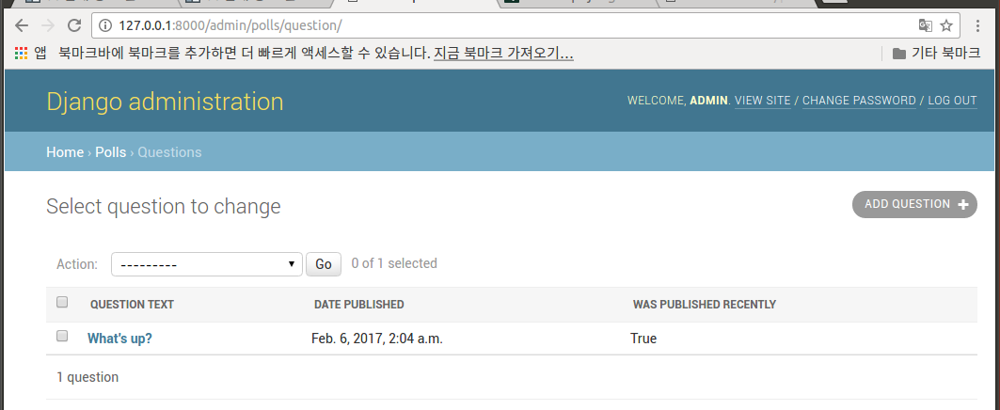
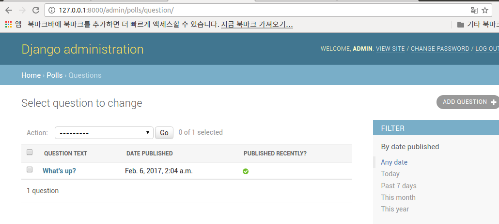
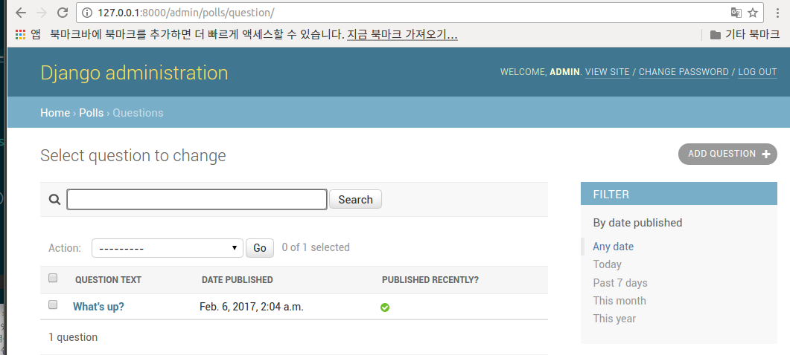

# Making Django App, Part 7
**Reference** : <http://django-document-korean.readthedocs.io/ko/latest/intro/tutorial07.html>

- 우리는 웹 설문조사 어플리케이션을 계속 사용하고 있으며, 
튜토리얼 2장에서 봤었던 자동으로 생성된 관리자 사이트를 
커스터마이징하는 데 초점을 맞출 것입니다.


## 관리자 폼 커스터마이징
- Question 모델을 admin.site.register(Question)에 등록함으로써, 
Django는 디폴트 폼 표현을 구성 할 수 있었습니다. 
관리 폼이 보이고 작동하는 방법을 커스터마이징하려는 경우가 있습니다. 
객체를 등록 할 때, Django에 원하는 옵션을 알려주면 
커스터마이징 할 수 있습니다.
- 수정 폼의 필드를 재정렬하여 이것이 작동하는법을 보겠습니다. 
admin.site.register(Question) 줄을 다음과 같이 바꾸세요
```python
>>> polls/admin.py
from django.contrib import admin

from .models import Question

class QuestionAdmin(admin.ModelAdmin):
    fields = ['pub_date', 'question_text']

admin.site.register(Question, QuestionAdmin)
```
- 모델의 관리자 옵션을 변경해야 할 때마다 이 패턴 – 모델 어드민 클래스를 만든 다음, 
admin.site.register()에 두 번째 인수로 전달합니다 – 을 
따라하면 됩니다.
- 여기서 특별한 변경 사항은 “발행일”이 “설문” 필드 앞에 오게 만듭니다.


- 단지 2개의 필드만으로는 인상적이지는 않지만, 
수십 개의 필드가 있는 관리 폼의 경우에는 직관적인 순서를
선택하는 것이 사용 편리성의 중요한 부분입니다.
- 수십 개의 필드가 있는 폼에 관해서는 폼을 fieldset으로 분할하는 것이 좋습니다.
```python
>>> polls/admin.py
from django.contrib import admin

from .models import Question

class QuestionAdmin(admin.ModelAdmin):
    fieldsets = [
        (None,   {'fields': ['question_text']}),
        ('Date information', {'fields': ['pub_date']}),
    ]

admin.site.register(Question, QuestionAdmin)
```
- fieldsets의 각 튜플의 첫 번째 요소는 fieldset의 제목입니다. 
다음과 같이 변경되었습니다.


## 관련된 객체 추가
- 우리는 Question 관리자 페이지를 가지고 있습니다. 
그러나, Question은 여러 개의 Choice들을 가지고 있음에도,
admin 페이지는 선택 사항을 표시하지 않습니다.
아직까진 말이죠.
- 이 문제를 해결하는 데는 두 가지 방법이 있습니다. 
첫 번째는 Question에서 했던 것처럼 관리자에 Choice를 등록하는 것입니다. 간단합니다.
```python
>>> polls/admin.py
from django.contrib import admin

from .models import Choice, Question
# ...
admin.site.register(Choice)
```


- 이 양식에서 “Question” 필드는 데이터베이스의 모든 질문을 
포함하는 select box입니다. 
Django는 ForeignKey가 admin에서 ``<select>``로 표현되어야 함을 알고 있습니다. 
우리의 경우, 지금은 단 하나의 질문 만이 존재합니다.

- 또한 “Question” 옆의 “Add Another” 링크를 주목하세요. 
ForeignKey 관계를 가진 모든 객체는 저 링크가 붙습니다. 
“Add Another”를 클릭하면 “Add question” 폼이 있는 
팝업 창이 나타납니다. 해당 창에 질문을 추가하고,
 “Save”를 클릭하면 장고는 질문을 데이터베이스에 저장하고, 
 동적으로 이를 선택된 항목으로
 당신이 보고있는 “Add choice” 폼에 추가합니다.

- 그러나 실제로 이것은 Choice 객체를 시스템에 추가하는 비효율적인 방법입니다. 
Question 객체를 생성 할 때 여러개의 Choices를 직접 추가 할
수 있다면 더 좋을 것입니다. 그것을 만들어 봅시다.

- Choice 모델에 대한 register() 호출을 제거하십시오. 
그런 다음 Question 등록 코드를 다음과 같이 편집하십시오.

```python
>>> polls/admin.py
from django.contrib import admin

from .models import Choice, Question

class ChoiceInline(admin.StackedInline):
    model = Choice
    extra = 3

class QuestionAdmin(admin.ModelAdmin):
    fieldsets = [
        (None,   {'fields': ['question_text']}),
        ('Date information', {'fields': ['pub_date'],
         'classes': ['collapse']}),
    ]
    inlines = [ChoiceInline]

admin.site.register(Question, QuestionAdmin)
```
- 위 소소는 Django에게 “Choice 객체는 Question 관리자 페이지에서 편집된다. 
기본으로 3가지 선택 항목을 제공함.” 이라고 알려줍니다.

- 모양을 보려면 “Add question” 페이지를 로드하십시오.


- 이 화면은 다음과 같이 작동합니다: 
관련된 선택 사항을 위한 슬롯이 세 개 있습니다 – extra로 지정됨 – 이미 생성된 객체의 “Change” 페이지의 경우에도 빈 세 개의 슬롯이 생깁니다.

- 3개의 현재 슬롯 끝에 “Add another Choice” 링크가 있습니다.
그것을 클릭하면 새로운 슬롯이 추가됩니다. 
추가된 슬롯을 제거하려면 추가 된 슬롯의 오른쪽 상단에있는 X를 클릭하십시오. 
원래의 세 슬롯은 제거 할 수 없습니다. 아래 이미지는 추가 된 슬롯을 보여줍니다.
- 작은 문제가 하나 있습니다. 
관련 Choice 객체를 입력하기 위한 모든 필드를 표시하는 데는 
많은 화면 공간이 필요합니다. 
이런 이유로 Django는 인라인 관련 객체를 표시하는 표 형식의 방법을 제공합니다. 
다음과 같이 ChoiceInline 선언을 변경하면됩니다.
```python
>>> polls/admin.py
class ChoiceInline(admin.TabularInline):
    #...
```
- StackedInline 대신에 TabularInline을 사용하면, 
관련된 객체는 좀 더 조밀하고 테이블 기반 형식으로 표시됩니다:


- 참고로 “Delete?” 열은 “Add Another Choice” 버튼으로 
추가된 행과 이미 저장된 행을 삭제하는데 사용합니다

## 관리자 변경 목록(change list) 커스터마이징
- 이제 질문 관리 페이지가 괜찮아 보이므로, 
시스템의 모든 질문을 표시하는 “변경 목록” 페이지를 약간 조정하십시오.


- 기본적으로 Django는 각 객체의 str()을 표시합니다. 
그러나 개별 필드를 표시 할 수 있는 경우가 가끔 도움이 될 수 있습니다.
이렇게 하려면 list_display admin 옵션을 사용합니다. 
이 옵션은 객체의 변경 목록 페이지에서 열로 표시할 필드 이름들의 튜플입니다.

```python
>>> polls/admin.py
class QuestionAdmin(admin.ModelAdmin):
    # ...
    list_display = ('question_text', 'pub_date')
```
- 튜토리얼 2장에서 사용한 was_published_recently()도 추가합니다.
```python
>>> polls/admin.py
class QuestionAdmin(admin.ModelAdmin):
    # ...
    list_display = ('question_text', 'pub_date', 'was_published_recently')
```
- 이제 질문 변경 목록 페이지는 다음과 같습니다.



- was_published_recently 헤더의 경우를 제외하고 그 값으로 
정렬하기 위해 열 머리글을 클릭 할 수 있습니다. 
왜냐하면 임의의 메서드의 출력에 의한 정렬은 지원되지 않기 때문입니다. 
또한 was_published_recently에 대한 열 머리글은 
기본적으로 메서드 이름 (밑줄을 공백으로 대체)이며 
각 줄에는 출력의 문자열 표현이 포함되어 있습니다.

- 다음과 같이 해당 메소드 (polls/models.py)에 몇 가지 속성을 
부여하여 향상시킬 수 있습니다
```python
>>> polls/models.py
class Question(models.Model):
    # ...
    def was_published_recently(self):
        now = timezone.now()
        return now - datetime.timedelta(days=1) <= self.pub_date <= now
    was_published_recently.admin_order_field = 'pub_date'
    was_published_recently.boolean = True
    was_published_recently.short_description = 'Published recently?'
```

- polls/admin.py 파일을 다시 편집하고 
Question 변경 목록 페이지에 개선점을 추가하십시오.
list_filter를 사용하는 필터. QuestionAdmin에 다음 줄을 추가하십시오.
```list_filter = ['pub_date']```
- pub_date 필드에 의해 사람들이 변경 목록을 필터링 할 수 있게 해주는 “Filter” 사이드 바가 추가되었습니다:



- 이제 검색 기능을 추가해 보겠습니다.
```search_fields = ['question_text']```



- 그러면 변경 목록 맨 위에 검색 창이 추가됩니다. 
누군가가 검색어를 입력하면, 장고는 question_text 필드를 
검색합니다. 당신이 원하는만큼의 필드를 사용할 수 있습니다.
그것은 내부적으로 LIKE 쿼리를 사용하기 때문에 검색 필드의 수
를 적당한 수로 제한하면 데이터베이스가 검색을 더 쉽게 할 수 있습니다.

## 관리자 룩앤필 커스터마이징

## 프로젝트의 템플릿 커스터마이징
- 프로젝트 디렉토리(manage.py를 포함하고 있는)에 templates 디렉토리를 만듭니다. 
템플릿은 장고가 액세스 할 수있는 파일 시스템 어디에서나 사용할 수 있습니다. 
(Django는 서버가 실행되는 사용자로 실행됩니다.) 
그러나 프로젝트 내에 템플릿을 유지하는 것은 따라야 할 좋은 규칙입니다.

- 설정 파일 (mysite/settings.py를 기억하세요)을 열고 
DIRS 옵션을 TEMPLATES 설정에 추가하십시오:
```python
>>> mysite/mysite/settings.py

TEMPLATES = [
    {
        'BACKEND': 'django.template.backends.django.DjangoTemplates',
        'DIRS': [os.path.join(BASE_DIR, 'templates')],
        'APP_DIRS': True,
        'OPTIONS': {
            'context_processors': [
                'django.template.context_processors.debug',
                'django.template.context_processors.request',
                'django.contrib.auth.context_processors.auth',
                'django.contrib.messages.context_processors.messages',
            ],
        },
    },
]
```

- DIRS는 Django 템플릿을 로드 할 때 검사 할 파일 시스템 디렉토리 목록입니다. 
바로 검색 경로입니다.

- 이제 templates 디렉토리에 admin이라는 디렉토리를 만들고,
 장고 자체 소스 코드 (django/contrib/admin/templates)을 해당 디렉토리에 복사합니다.

```python
 Django 소스 파일이 시스템에 있는 위치를 알고 싶은 경우, 하기와 같은 명령을 실행하십시오.
$ python -c "import django; print(django.__path__)"
```
- 장고 자체 소스 코드 위치
```python
/home/hanabee2/.pyenv/versions/django_tutorial/lib/python3.4/site-packages/django/contrib/admin/templates
```
 
- 그런 다음, base_site.html 파일을 편집하고 {{site_header|default:_ 
('Django administration' }}(중괄호를 포함하여)를 
자신의 사이트 이름으로 바꿉니다. 
다음과 같은 코드 섹션을 작성해야 합니다.
```python

<h1 id="site-name"><a href="">Polls Administration</a></h1>

```
- 이 방법을 사용하여 템플릿을 재정의하는 방법을 학습합니다. 
실제 프로젝트에서는 아마
 django.contrib.admin.AdminSite.site_header 속성을 
 사용하여 이 개별 커스터마이징을보다 쉽게 만들 수 있습니다.

- 이 템플릿 파일에는 및 {{title}}과 같은
텍스트가 많이 포함되어 있습니다. 
{%와 {{태그들은 장고의 템플릿 언어의 일부입니다. 
Django가 admin/base_site.html을 렌더링 할 때, 
이 템플릿 언어는 Tutorial 3 에서 보았듯이,
최종 HTML 페이지를 생성하기 위해 평가 될 것입니다.

- Django의 기본 admin 템플릿 중 어떤 것도 덮어 쓸수 있습니다. 
템플릿을 덮어 쓰려면, base_site.html로했던 것과 똑같은 일을 하면 됩니다.
즉, 기본 디렉토리에서 그것을 커스텀 디렉토리로 복사하고 변경하십시오.

## 어플리케이션의 템플릿 사용자 정의
- 그러나 DIRS가 기본설정으로 비어 있다면, 장고는 기본 관리자 템플릿을 어떻게 찾을까요? 
- 그 해답은 APP_DIRS 설정이 True로 설정되어 있기 때문에,
 Django는 각 어플리케이션 패키지 내에서 ```templates/```
 서브 디렉토리를 자동으로 찾아서 대체하게 됩니다.
 (django.contrib.admin이 어플리케이션 임을 잊지 마십시오.)
 - 투표 어플리케이션은 복잡하지 않으며 사용자 정의 admin 템플릿이 필요하지 않습니다. 
 그러나 Django의 표준 admin 템플릿을 좀더 정교하게 필요에 맞게 수정 할 경우,
 프로젝트 템플릿 대신 어플리케이션의 템플릿을 수정하는 것이 더 현명합니다. 
 그렇게 하면 다른 새 프로젝트에 투표 애플리케이션을 포함시킬 수 있고, 
 필요할 때는 커스텀 템플릿을 찾을수 있습니다.

## admin 인덱스 페이지 수정하기


http://127.0.0.1:8000/admin/polls/
http://localhost:8000/polls/
http://127.0.0.1:8000/polls/