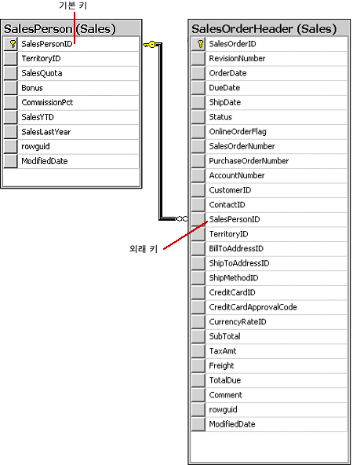

# Models
- 각각의 모델은 python 클래스
- 모델의 각 속성들은 DB의 field
- 일반적으로 각 모델은 DB 테이블 하나에 mapping된다.

## Quick example
```django
from django.db import models

class Person(models.Model):
    first_name = models.CharField(max_length=30)
    last_name = models.CharField(max_length=30)
```
- ```Person``` is a **```model```** 
- ```first_name, last_name``` are **```fields```** of the model.
- each field is specified as ```a class attribute``` 
- each attribute maps to ```a database column```

## Using models
- Once you have defined your models, 
you need to tell Django you’re going to use those models.
-  Do this by editing your settings file 
and changing the INSTALLED_APPS setting 
to add the name of the module that contains your models.py.
- if the module is created by manage.py startapp script,
the module's name should read in INSTALLED_APPS.
- When you add new apps to INSTALLED_APPS, 
be sure to run ```manage.py migrate```, 
optionally making migrations for them first 
with ```manage.py makemigrations```

## Fields
- The most important part of a model – and the only required part of a model – 
is the list of database fields it defines. 
- Fields are specified by class attributes.

### Field types
- Each field in your model should be an instance of the appropriate Field class.
ex) title = models.**```CharField```**(max_length=200)

### Field options
- Each field takes a certain set of field-specific arguments 
(documented in the [model field reference](https://docs.djangoproject.com/en/1.10/ref/models/fields/#model-field-types)
ex) title = models.CharField(**```max_length```**=200)

### Primary key
- Primary key란 column을 고유하게 구분해 주는 최소의 정보.
- example)

		학생
학번	|이름|	학년|	학과
--|--|--|--
100|	김씨|	4|	정보통신
200|	이씨|	3|	전파공학
300|	박씨|	1|	정보통신
400|	조씨|	4|	전파공학
500|	임씨|	2|	컴퓨터공학

- 학생 테이블에서 학번 속성이나 이름 속성은 테이블 내의 행을
 유일하게 식별할 수 있으므로 기본키로 사용될 수 있다.
 
- The primary key field is read-only. 
- If you change the value of the primary key 
on an existing object and then save it, 
a new object will be created alongside the old one.
```
from django.db import models

class Fruit(models.Model):
    name = models.CharField(max_length=100,
     primary_key=True)
```
```
>>> fruit = Fruit.objects.create(name='Apple')
>>> fruit.name = 'Pear'
>>> fruit.save()
>>> Fruit.objects.values_list('name', flat=True)
['Apple', 'Pear']
```

### Automatic primary key fields
- Each model requires exactly one field to have primary_key=True
(either explicitly declared or automatically added).
- This is an auto-incrementing primary key (Q)?

### Verbose field names
- Except for ForeignKey, ManyToManyField and OneToOneField,
Each field type takes an optional ```first positional argument``` – a ```verbose name```.
- ForeignKey, ManyToManyField and OneToOneField
require the first argument to be a model class, 
so use the verbose_name keyword argument:
- example) in case of ForeignKey, 
```
poll = models.ForeignKey(
    Poll,
    on_delete=models.CASCADE,
    verbose_name="the related poll",
)
```
### Foreign key
- 외래 키(FK)는 두 테이블의 데이터 간 연결을 설정하고
 강제 적용하는 데 사용되는 열입니다. 
- 테이블을 만들거나 수정할 때 FOREIGN KEY 제약 조건을 
 정의하여 외래 키를 만들 수 있습니다.
- 외래 키 참조에서는 한 테이블의 기본 키 값을 가지고 있는 열을
 다른 테이블의 열이 참조할 때 두 테이블 간에 연결이 생성됩니
 다. 이때 두 번째 테이블에 추가되는 열이 외래 키가 됩니다.

- ex)


### Relationships
- power of relational databases lies in relating tables to each other
- three most common types of database relationships:
	1. many-to-one, 
	2. many-to-many
	3. one-to-one.

#### Many-to-one relationships
- To define a many-to-one relationship, 
use django.db.models.ForeignKey.

- ForeignKey requires a positional argument: 
the class to which the model is related.

ex) For example, if a Car model has a Manufacturer – 
that is, a Manufacturer makes multiple cars 
but each Car only has one Manufacturer 

>from django.db import models
>
>class **```Manufacturer```**(models.Model):
    # ...
    pass
>
>class **```Car```**(models.Model):
    manufacturer = models.ForeignKey(**```Manufacturer```**, 
    on_delete=models.CASCADE)
    # ...

- [Many-to-one relationship model example](https://docs.djangoproject.com/en/1.10/topics/db/examples/many_to_one/)
- 실습

#### Many-to-many relationships
- It doesn’t matter which model has the ManyToManyField, 
but you should only put it in one of the models – not both.


- 실습
- shell에서 객체 생성, instance 받아오는 것들 익숙해지기.

- For example, if a Pizza has multiple Topping objects – that is, 
a Topping can be on multiple pizzas and each Pizza has multiple toppings
- ManyToMany 관계에서는 아무나 역참조가 되지만,
포함관계에서 상위요소에 해당하는 클래스에 ManyToMany를 선언한다.

```
from django.db import models

class Topping(models.Model):
    # ...
    pass

class Pizza(models.Model):
    # ...
    toppings = models.ManyToManyField(Topping)
```

```python
- ManyToMany Relationship

>>> from pizza.models import Pizza, Topping
>>> cp = Pizza.objects.create(title='Cheese Pizza')
>>> bp = Pizza.objects.create(title='Bulgogi Pizza')
>>> pp = Pizza.objects.create(title='Pepproni Pizza')
>>> Pizza.objects.all()
<QuerySet [<Pizza: Cheese Pizza, (Toppings : )>, 
<Pizza: Bulgogi Pizza, (Toppings : )>, <Pizza: Pepproni Pizza, (Toppings : )>]>
>>> Pizza.objects.values_list('title', flat=True)
<QuerySet ['Cheese Pizza', 'Bulgogi Pizza', 'Pepproni Pizza']>
>>> Pizza.objects.values_list('title', flat=True)
<QuerySet ['Cheese Pizza', 'Bulgogi Pizza', 'Pepproni Pizza']>

>>> t_pimang = Topping.objects.create(title = 'Pimang')
>>> t_cheese = Topping.objects.create(title = 'Cheese')
>>> t_mush = Topping.objects.create(title = 'Mushroom')
>>> t_ham = Topping.objects.create(title = 'Ham')
>>> Topping.objects.values_list('title', flat=True)
<QuerySet ['Pimang', 'Cheese', 'Mushroom', 'Ham']>
>>> cp.toppins = (t_cheese, t_ham)
>>> bp.toppings = (t_cheese, t_mush, t_pimang)
>>> pp.toppings = (t_cheese, t_pimang, t_mush, t_ham)
>>> cp
<Pizza: Cheese Pizza, (Toppings : )>
>>> bp
<Pizza: Bulgogi Pizza, (Toppings : Pimang,Cheese,Mushroom)>
>>> pp
<Pizza: Pepproni Pizza, (Toppings : Pimang,Cheese,Mushroom,Ham)>
>>> cp.toppings = (t_cheese, t_ham)
>>> 
>>> 
>>> cp.toppings.all()
<QuerySet [<Topping: Cheese>, <Topping: Ham>]>
>>> cp.toppings.values_list('title')
<QuerySet [('Cheese',), ('Ham',)]>
>>> cp.toppings.values_list('title', flat=True)
<QuerySet ['Cheese', 'Ham']>
>>> ','.join(cp.toppings.values_list('title', flat=True))
'Cheese,Ham'
```

- DB Browser SQLite3로 확인해보면,
	- 피자(P) <-> 토핑(T)사이에 테이블이 있다. 이게 pizza_pizza_topping 이다. 
 DB Browser에서 DB 구조를 확인해 봤을 때.
피자와 토핑사이에 있는 테이블(P-T테이블)에 피자 id를 올려,
피자를 테이블에 올리고, 각각의 토핑도 P-T 테이블에 올려서,
P-T 테이블에 있는 id에 딸린 topping들을 확인하는 것이 
ManyToMany 관계형이다.
```
(InteractiveConsole)
> from person.models import User
> u1= user.objects.create(name='bhj')
> u2= User.objects.create(name='hhh')
> u1.friends.add(u2)
> u1.friends.all()
<QuerySet [<User: hhh>]>
> u2.friends.all()
<QuerySet [<User: bhj>]>
> 
```

- 위의 내용은 u1에서만 u2를 add했는데, 
u2도 자동으로 u1을 friend로 추가가 되어 있다.

```
symmetrical=False, 이 설정을 해줘야 서로 following되는 걸 막을 수 있다.

> u1=User.objects.create(name='Me')
> u2=User.objects.creat(name='you')
Traceback (most recent call last):
  File "<console>", line 1, in <module>
AttributeError: 'Manager' object has no attribute 'creat'
> u2=User.objects.create(name='you')
> u1.followers.add(u2)
> u1.followers.all()
<QuerySet [<User: you>]>
> u2.followers.all()
<QuerySet []>

- symmetrical=False, 이 설정이 안되어 있을 시 실행 결과,

> from person.models import User,Person
> u1=User.objects.create(name='Me')
> u2=User.objects.create(name='You')
> u1.followers.add(u2)
> u1.followers.all()
<QuerySet [<User: You>]>
> u2.followers.all()
<QuerySet [<User: Me>]>
>
```

- 한 개 필드만 있어도 된다. User 클래스에서
followers, following 두 개 필드가 있는데,
following 필드를 지워도 
symmetrical=False, 이 설정이 되어 있어서
from-to 관계가 있기 때문에 u2.followers.all()의 결과가
위의 것과 다르다. 
```python
 from person.models import User,Person
 u1=User.objects.create(name='Me')
 u2=User.objects.create(name='He')
 u1.followers.add(u2)
 u1.followers.all()
<QuerySet [<User: He>]>
 u2.followers.all()
<QuerySet []>
```

### related_name
- The related_name attribute specifies the name of the reverse 
relation from the User model back to your model.

- If you don't specify a related_name, Django automatically creates 
one using the name of your model with the suffix ```_set```, 
for instance, User.map_set.all().

- If you do specify, e.g. related_name=maps on the User model, 
User.map_set will still work, but the User.maps.

[related_name](http://stackoverflow.com/questions/2642613/what-
is-related-name-used-for-in-django)

### symmetrical
- symmetrical=True results in creating two rows for a single 
relationship between two objects because it is bidirectional. 
For example: If A is a friend of B, then B is a friend of A so we need 
two separate rows in the friends table where first one will indicate 
the relation A -> B and second one is B -> A

[symmetrical](http://stackoverflow.com/questions/36852324/in-
django-what-does-symmetrical-true-do) 

### through_field vs through
- ```through``` 
	- Django allows you to specify the model that will
	 be used ```to govern``` the many-to-many relationship. 
	- You can then put ```extra fields``` on the intermediate mode
	- The most common use for this option is when 
	you want ```to associate extra data``` with a many-to-many relationship

- ```through_field```
	- If Membership has two foreign keys to Person (person and inviter), which makes the relationship ambiguous and Django can’t know which one to use.
	- In this case, you must ```explicitly specify which foreign keys``` Django should use using ```through_fields```

#### One-to-one relationships
- This is most useful on the primary key of an object
when that object “extends” another object in some way.(?)
- OneToOneField requires a positional argument: 
the class to which the model is related.
- one-to-one vs inheritance (?)
- [One-to-one relationship model example ](https://docs.djangoproject.com/en/1.10/topics/db/examples/one_to_one/) 

### Models across file
- OK to relate a model to one from another app. 
- To do this, import the related model 
at the top of the file where your model is defined.
- Then, just refer to the other model class wherever needed.

### Field name restrictions
- A field name cannot be a Python reserved word,
 because that would result in a Python syntax error. 
- A field name cannot contain more than one underscore in a row 
due to the way Django’s query lookup syntax works.

## Meta options
- Model metadata is “anything that’s not a field”
- Give your model metadata by using an inner **```class Meta```**

## Model attributes
- The most important attribute of a model is the **```Manager```**
-  **```Manager```** is the interface through which database query operations are provided to Django models
-  and is used to retrieve the instances from the database.
- Managers are only accessible via model classes, 
not the model instances(?)

## Model method
- model methods should act on a particular model instance
-  **```\_\_str\_\_()```**
- get_absolute_url() : 
	- This tells Django how to calculate the URL for an object.
	- Django uses this any time it needs to figure out a URL for an object.
	
### Overriding perdefined model methods
- You’re free to override any other model method to alter behavior.
- A classic use-case for overriding the built-in methods is 
if you want something to happen whenever you save an object.

For example,
```python
from django.db import models

class Blog(models.Model):
    name = models.CharField(max_length=100)
    tagline = models.TextField()

    def save(self, *args, **kwargs):
        do_something()
        super(Blog, self).save(*args, **kwargs) 
        # Call the "real" save() method.
        do_something_else()
```
```python
from django.db import models

class Blog(models.Model):
    name = models.CharField(max_length=100)
    tagline = models.TextField()

    def save(self, *args, **kwargs):
        if self.name == "Yoko Ono's blog":
            return # Yoko shall never have her own blog!
        else:
            super(Blog, self).save(*args, **kwargs) 
            # Call the "real" save() method.
```
- It’s also important that you pass through the arguments 
that can be passed to the model method

### Executing custom SQL
- Another common pattern is writing custom SQL statements in model methods and module-level methods using raw SQL.
