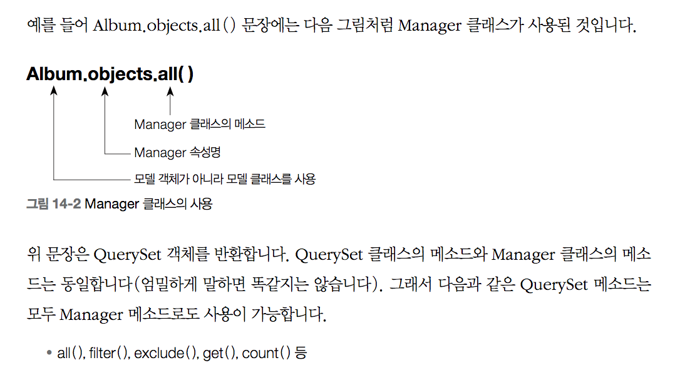
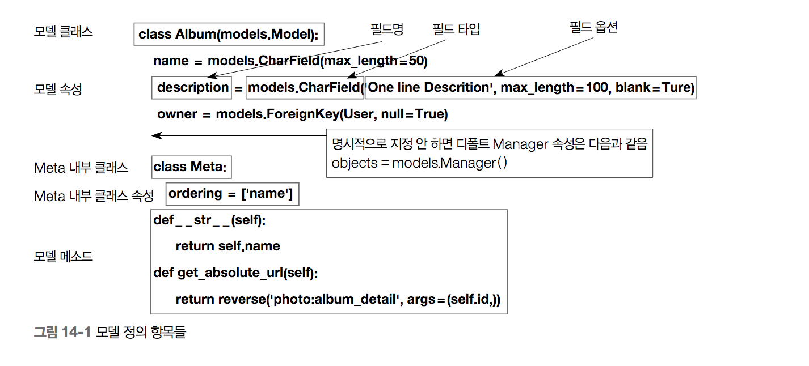

# Models

- Each model is a Python class that subclasses django.db.models.Model.
- Each attribute of the model represents a database field.
- Django gives you an automatically-generated database-access API: see [Making queries](https://docs.djangoproject.com/en/1.11/topics/db/queries/)

```python
rom django.db import models

class Person(models.Model):
    first_name = models.CharField(max_length=30)
    last_name = models.CharField(max_length=30)
```
- This example model defines a Person
- ```first_name``` and ```last_name``` are **```fields```** of the model.
- Each ```field``` is specified as a ```class attribute```, and
- each ```attribute``` maps to a ```database column```



### Using models
- Once you have defined your models, you need to tell 
Django you’re going to use those models. Do this by 
editing your settings file and changing the 
```INSTALLED_APPS``` setting to add the name of the 
module that contains your models.py.

```python
INSTALLED_APPS = [
    #...
    'myapp',
    #...
]
```
- When you add new apps to ```INSTALLED_APPS```,
 be sure to run ```manage.py migrate```,
 optionally ```making migrations``` for them first 
 with manage.py makemigrations.

### Fields
- ```Fields``` are specified by ```class attributes```



#### Field types
- Each ```field``` in your model should be an 
```instance``` of a Field class

#### Field options
- null : empty values as NULL
- blank
- choices : An iterable (e.g., a list or tuple) of 2-tuples
- default
- help_text
- primary_key
- unique

#### Automatic primary key fields
- By default, Django gives each model the following field:
```python
id = models.AutoField(primary_key=True)
```
- This is an auto-incrementing primary key.
- Each model requires exactly one field to have primary_key=True

#### Verbose field names
- Each field type, except for ForeignKey, ManyToManyField and OneToOneField, 
takes an optional first positional argument – a verbose name.
- ForeignKey, ManyToManyField and OneToOneField require 
the first argument to be a model class, so use the verbose_name keyword argument
```python
poll = models.ForeignKey(
    Poll,
    on_delete=models.CASCADE,
    verbose_name="the related poll",
)
```

## Relationships
- the power of relational databases lies in relating tables to each other
- Django offers ways to define the three most common types of database relationships: 
	1. ```many-to-one```, 
	2. ```many-to-many``` and
	3. ```one-to-one```

### 1. Many-to-one relationships
- To define a many-to-one relationship, use django.db.models.ForeignKey
- [ForeignKey](https://docs.djangoproject.com/en/1.11/ref/models/fields/#django.db.models.ForeignKey)  requires a positional argument: the class to which the model is related
- For example, if a Car model has a Manufacturer – 
that is, a Manufacturer makes multiple cars but 
each Car only has one Manufacturer – use the following definitions:
```python
from django.db import models

class Manufacturer(models.Model):
    # ...
    pass

class Car(models.Model):
    manufacturer = models.ForeignKey(Manufacturer, on_delete=models.CASCADE)
    # ...
```

### 2. Many-to-many relationships
- To define a many-to-many relationship, use ManyToManyField.
- ManyToManyField requires a positional argument: the class to which the model is related.
- For example, if a Pizza has multiple Topping objects – 
that is, a Topping can be on multiple pizzas and each 
Pizza has multiple toppings – here’s how you’d represent that:
```python
from django.db import models

class Topping(models.Model):
    # ...
    pass

class Pizza(models.Model):
    # ...
    toppings = models.ManyToManyField(Topping)
```
- It doesn’t matter which model has the ManyToManyField, 
but you should only put it in one of the models – not both
- Generally, ManyToManyField instances should go
 in the object that’s going to be edited on a form. 
In the above example, toppings is in Pizza 
(rather than Topping having a pizzas ManyToManyField ) 

#### Extra fields on many-to-many relationships
- When you’re only dealing with simple many-to-many relationships 
such as mixing and matching pizzas and toppings, 
a standard ManyToManyField is all you need. 
However, sometimes you may need to associate data 
with the relationship between two models
- Django allows you to specify the model that will be used to govern the many-to-many relationship. 
You can then put ```extra fields``` on the ```intermediate model```. 
The intermediate model is associated with the 
ManyToManyField using the ```through``` argument 
to point to the model that will act as an intermediary.
```python
from django.db import models

class Person(models.Model):
    name = models.CharField(max_length=128)

    def __str__(self):              # __unicode__ on Python 2
        return self.name

class Group(models.Model):
    name = models.CharField(max_length=128)
    members = models.ManyToManyField(Person, through='Membership')

    def __str__(self):              # __unicode__ on Python 2
        return self.name

class Membership(models.Model):
    person = models.ForeignKey(Person, on_delete=models.CASCADE)
    group = models.ForeignKey(Group, on_delete=models.CASCADE)
    date_joined = models.DateField()
    invite_reason = models.CharField(max_length=64)
```
- When you set up the intermediary model, 
you explicitly specify foreign keys to the models that 
are involved in the many-to-many relationship. 
This explicit declaration defines how the two models are related.

- a few restrictions on the intermediate model:
	- Your intermediate model must contain one - and only one - foreign key to the source model (this would be Group in our example), 
	or you must explicitly specify the foreign keys 
	Django should use for the relationship 
	using ManyToManyField.```through_fields```. 
	If you have ```more than one foreign key``` and 
	through_fields is not specified, a validation error will be raised. 
	A similar restriction applies to the foreign key to 
	the target model (this would be Person in our example)
	
	- For a model which has a many-to-many 
	relationship to itself through an intermediary 
	model, two foreign keys to the same model are 
	permitted, but they will be treated as the two 
	(different) sides of the many-to-many relationship. 
	If there are ```more than two foreign keys``` though, 
	you must also specify ```through_fields``` as 
	above, or a validation error will be raised.
	- When defining a many-to-many relationship from 
	a model to itself, using an intermediary model, 
	you must use ```symmetrical=False```(see [the model field reference](https://docs.djangoproject.com/en/1.11/ref/models/fields/#manytomany-arguments) ).

- Now that you have set up your ManyToManyField to 
use your intermediary model (Membership, in this case)
```python
>>> ringo = Person.objects.create(name="Ringo Starr")
>>> paul = Person.objects.create(name="Paul McCartney")
>>> beatles = Group.objects.create(name="The Beatles")
>>> m1 = Membership(person=ringo, group=beatles,
...     date_joined=date(1962, 8, 16),
...     invite_reason="Needed a new drummer.")
>>> m1.save()
>>> beatles.members.all()
<QuerySet [<Person: Ringo Starr>]>
>>> ringo.group_set.all()
<QuerySet [<Group: The Beatles>]>
>>> m2 = Membership.objects.create(person=paul, group=beatles,
...     date_joined=date(1960, 8, 1),
...     invite_reason="Wanted to form a band.")
>>> beatles.members.all()
<QuerySet [<Person: Ringo Starr>, <Person: Paul McCartney>]>
```
- Unlike normal many-to-many fields, 
you can’t use ```add(), create(), or set()``` to create relationships:
```python
>>> # The following statements will not work
>>> beatles.members.add(john)
>>> beatles.members.create(name="George Harrison")
>>> beatles.members.set([john, paul, ringo, george])
```
- Why? You can’t just create a relationship between a Person and a Group - you need to specify all the detail for the relationship required by the Membership model.
-  they are disabled for many-to-many relationships that use an intermediate model. 
- The only way to create this type of relationship is 
to create instances of the intermediate model.

```python
>>> Membership.objects.create(person=ringo, group=beatles,
...     date_joined=date(1968, 9, 4),
...     invite_reason="You've been gone for a month and we miss you.")
>>> beatles.members.all()
<QuerySet [<Person: Ringo Starr>, <Person: Paul McCartney>, <Person: Ringo Starr>]>
>>> # This will not work because it cannot tell which membership to remove
>>> beatles.members.remove(ringo)
```

- However, the clear() method can be used to remove all many-to-many relationships for an instance:
```python
>>> # Beatles have broken up
>>> beatles.members.clear()
>>> # Note that this deletes the intermediate model instances
>>> Membership.objects.all()
<QuerySet []>
```

- Once you have established the many-to-many relationships by creating instances of your intermediate model, you can issue queries. Just as with normal many-to-many relationships, you can query using the attributes of the many-to-many-related model:
```python
# Find all the groups with a member whose name starts with 'Paul'
>>> Group.objects.filter(members__name__startswith='Paul')
<QuerySet [<Group: The Beatles>]>
```
- As you are using an intermediate model, you can also query on its attributes
```python
# Find all the members of the Beatles that joined after 1 Jan 1961
>>> Person.objects.filter(
...     group__name='The Beatles',
...     membership__date_joined__gt=date(1961,1,1))
<QuerySet [<Person: Ringo Starr]>
```

- If you need to access a membership’s information you may do so by directly querying the Membership model:
```python
>>> ringos_membership = Membership.objects.get(group=beatles, person=ringo)
>>> ringos_membership.date_joined
datetime.date(1962, 8, 16)
>>> ringos_membership.invite_reason
'Needed a new drummer.
```

- Another way to access the same information is by querying the many-to-many reverse relationship from a Person object:
```python
>>> ringos_membership = ringo.membership_set.get(group=beatles)
>>> ringos_membership.date_joined
datetime.date(1962, 8, 16)
>>> ringos_membership.invite_reason
'Needed a new drummer.'
```

### 3. One-to-one relationships
- To define a one-to-one relationship, use OneToOneField.
- For example, if you were building a database of “places”, 
you would build pretty standard stuff such as address, phone number, etc. in the database. 
Then, if you wanted to build a database of restaurants on top of the places, instead of repeating yourself 
and replicating those fields in the Restaurant model, 
you could make Restaurant have a OneToOneField to 
Place (because a restaurant “is a” place; in fact, to 
handle this you’d typically use [inheritance](https://docs.djangoproject.com/en/1.11/topics/db/models/#model-inheritance) , which involves an implicit one-to-one relation).


### Field name restrictions
1. A field name cannot be a Python reserved word
2. A field name cannot contain more than one underscore in a row, 
due to the way Django’s query lookup syntax works
```python
class Example(models.Model):
    foo__bar = models.IntegerField() # 'foo__bar' has two underscores!
```
## Meta options
- model metadata by using an inner class Meta
```python
from django.db import models

class Ox(models.Model):
    horn_length = models.IntegerField()

    class Meta:
        ordering = ["horn_length"]
        verbose_name_plural = "oxen"
```
- ```Model metadata``` is ```anything that’s not a field```

## Model attributes
- ```Manager```. It’s the interface through which database query operations are provided to Django models 
and is used to retrieve the instances from the database.
- If Manager is not defined,the default name is ```objects```

## Model methods

## Model inheritance
- Model inheritance in Django works almost identically to the way normal class inheritance works in Python,
- The only decision you have to make is whether you want the parent models 
to be models in their own right (with their own database tables), 
or if the parents are just holders of common information 
that will only be visible through the child models.
- There are three styles of inheritance
	1. Often, you will just want to use the parent class to hold information that you don’t want to have to type out for each child model. This class isn’t going to ever be used in isolation, so Abstract base classes[Abstract base classes](https://docs.djangoproject.com/en/1.11/topics/db/models/#abstract-base-classes)  are what you’re after
	2. If you’re subclassing an existing model (perhaps something from another application entirely) and want each model to have its own database table, [Multi-table inheritance](https://docs.djangoproject.com/en/1.11/topics/db/models/#multi-table-inheritance) is the way to go.
	3. Finally, if you only want to modify the Python-level behavior of a model, without changing the models fields in any way, you can use [Proxy models](https://docs.djangoproject.com/en/1.11/topics/db/models/#proxy-models)

### Abstract base classes
- ```Abstract base classes``` are useful when you want to put some common information 
into a number of other models. 
You write your base class and put ```abstract=True``` in the ```Meta class```. 
This model will then not be used to create any database table. 
Instead, when it is used as a base class for other models, 
its fields will be added to those of the child class. 
- It is an error to have fields in the abstract base class with the same name as those in the child 
(and Django will raise an exception).
```python
from django.db import models

class CommonInfo(models.Model):
    name = models.CharField(max_length=100)
    age = models.PositiveIntegerField()

    class Meta:
        abstract = True

class Student(CommonInfo):
    home_group = models.CharField(max_length=5)
```
- The Student model will have three fields: name, age and home_group. 
- The ```CommonInfo model``` cannot be used as a normal Django model, 
since it is an ```abstract base class```. It does not generate a database table or 
have a manager, and ```cannot be instantiated or saved directly```.

#### Meta inheritance
- When an abstract base class is created, 
Django makes any Meta inner class you declared in the base class available as an attribute. 
If a child class does not declare its own Meta class, it will inherit the parent’s Meta. 
If the child wants to extend the parent’s Meta class, it can subclass it
```python
from django.db import models

class CommonInfo(models.Model):
    # ...
    class Meta:
        abstract = True
        ordering = ['name']

class Student(CommonInfo):
    # ...
    class Meta(CommonInfo.Meta):
        db_table = 'student_info'
```
- Django does make one adjustment to the Meta class of an abstract base class: 
before installing the Meta attribute, it sets ```abstract=False```. 
This means that children of abstract base classes don’t automatically become abstract classes themselves. 
Of course, you can make an abstract base class that inherits from another abstract base class.
You just need to remember to explicitly set abstract=True each time.

### Multi-table inheritance
- each model in the hierarchy is a model all by itself.
Each model corresponds to its own database table and can be queried and created individually. 
The inheritance relationship introduces links between the child model and each of its parents 
(via an automatically-created OneToOneField)
```python
from django.db import models

class Place(models.Model):
    name = models.CharField(max_length=50)
    address = models.CharField(max_length=80)

class Restaurant(Place):
    serves_hot_dogs = models.BooleanField(default=False)
    serves_pizza = models.BooleanField(default=False)
```
- All of the fields of Place will also be available in Restaurant, although the data will reside in a different database table. So these are both possible:
```python
>>> Place.objects.filter(name="Bob's Cafe")
>>> Restaurant.objects.filter(name="Bob's Cafe")
```
- If you have a Place that is also a Restaurant, you can get from the Place object to the Restaurant object by using the lower-case version of the model name:
```python
>>> p = Place.objects.get(id=12)
# If p is a Restaurant object, this will give the child class:
>>> p.restaurant
<Restaurant: ...>
```
- However, if p in the above example was not a Restaurant, 
referring to p.restaurant would raise a Restaurant.DoesNotExist exception.

#### Meta and multi-table inheritance
- In the multi-table inheritance situation, it doesn’t make sense for a child class to inherit from its parent’s Meta class. All the Meta options have already been applied to the parent class and applying them again would normally only lead to contradictory behavior
- So a child model does not have access to its parent’s Meta class. However, there are a few limited cases where the child inherits behavior from the parent

#### Inheritance and reverse relations
- Because multi-table inheritance uses an implicit OneToOneField 
to link the child and the parent, it’s possible to move from the parent down to the child, 
as in the above example. However, this uses up the name that is the default ```related_name``` value 
for ```ForeignKey``` and ```ManyToManyField``` relations. 
If you are putting those types of relations on a subclass of the parent model, 
you must specify the ```related_name``` attribute on each such field. If you forget, Django will raise a validation error.
- For example, using the above Place class again, 
let’s create another subclass with a ManyToManyField:

```python
class Supplier(Place):
    customers = models.ManyToManyField(Place)
```
- This results in the error:
```python
Reverse query name for 'Supplier.customers' clashes with reverse query
name for 'Supplier.place_ptr'.

HINT: Add or change a related_name argument to the definition for
'Supplier.customers' or 'Supplier.place_ptr'.
```
- Adding related_name to the customers field as follows would resolve the error: models.ManyToManyField(Place, related_name='provider').


### Proxy models
- When using multi-table inheritance, a new database table is created for each subclass of a model. 
This is usually the desired behavior, since the subclass needs a place to store any additional data fields 
that are not present on the base class. 
Sometimes, however, you only want to change the Python behavior of a model – 
perhaps to change the default manager, or add a new method
- This is what proxy model inheritance is for: creating a proxy for the original model. 
You can create, delete and update instances of the proxy model 
and all the data will be saved as if you were using the original (non-proxied) model. 
The difference is that you can change things like the default model ordering 
or the default manager in the proxy, without having to alter the original.

- Proxy models are declared like normal models. You tell Django that it’s a proxy model 
by setting the ```proxy attribute``` of the ```Meta class``` to ```True```
```python
from django.db import models

class Person(models.Model):
    first_name = models.CharField(max_length=30)
    last_name = models.CharField(max_length=30)

class MyPerson(Person):
    class Meta:
        proxy = True

    def do_something(self):
        # ...
        pass
```
- The MyPerson class operates on the same database table as its parent Person class. 
- In particular, any new instances of Person will also be accessible through MyPerson, and vice-versa:
```python
>>> p = Person.objects.create(first_name="foobar")
>>> MyPerson.objects.get(first_name="foobar")
```
- You could also use a proxy model to define a different default ordering on a model. 
You might not always want to order the Person model, 
but regularly order by the last_name attribute when you use the proxy
```python
class OrderedPerson(Person):
    class Meta:
        ordering = ["last_name"]
        proxy = True
```
- Now normal Person queries will be unordered 
and OrderedPerson queries will be ordered by last_name.

### Multiple inheritance
- Note that inheriting from multiple models that have a common id primary key field will raise an error. 
- To properly use multiple inheritance, you can use an explicit AutoField in the base models:


