# YouTube App 만들기

### API키 작성 순서
1. 소개문서 읽기
	- [YouTube API 시작하기](https://developers.google.com/youtube/v3/getting-started)

2. API콘솔에서 새 프로젝트 생성
	- [API Console](https://console.developers.google.com/iam-admin/projects)

3. 상단 왼쪽 Google APIs이미지 누르고
	- 라이브러리를 선택
	- **YouTube Data API** 선택
	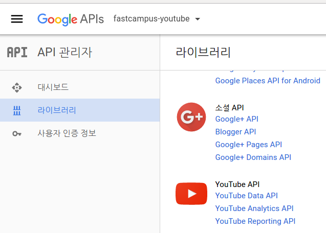  
	- 사용설정 클릭  
	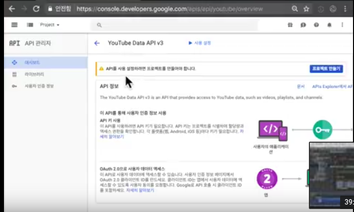 
	
4. 사용자 인증 정보 작성
	- 좌측 **사용자 인증 정보** 클릭
	- 사용자 인증 정보 만들기 -> API 키 선택
	- 생성된 API키 확인(보안상 밑의 부분은 안보임)  
	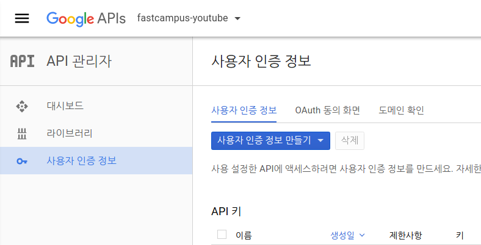  

5. 그 다음 클라이언트 라이브러리로 이동

### 클라이언트 라이브러리 설치
1. 좌측의 클라이언트 라이브러리 (English) 클릭
[https://developers.google.com/youtube/v3/libraries](https://developers.google.com/youtube/v3/libraries)

2. Google API Client Library for Python 선택
[https://developers.google.com/api-client-library/python/](https://developers.google.com/api-client-library/python/)
	- Use standard tools for installation
	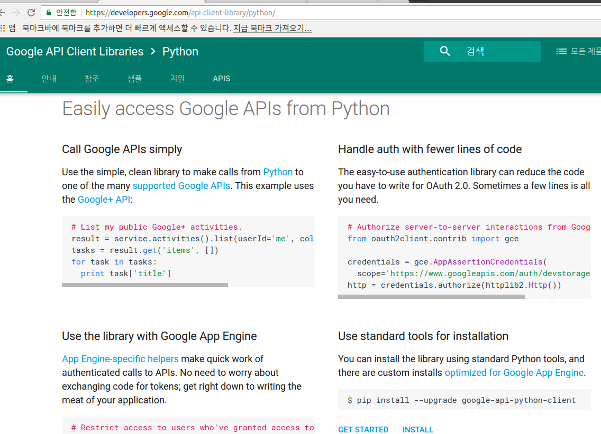  

3. 가상환경 설정하고 하기 패키지 설치
	- 이것을 설치해야 json이 지원이 되는 듯
```python pip install --upgrade google-api-python-client``` 

4. 그리고, API Key값 설정
	- 하기 그림과 같이 django_app과 동일 level에서 **.conf 폴더** 생성
	- 파일 이름은 **settings_local.json**  
	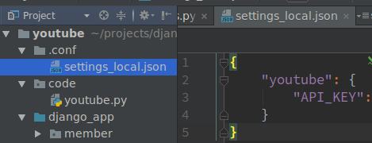  

5. 우리가 할려는 것은 검색리스트를 만드는 것. 
	1. 이와 관련하여 ['Search: list'](https://developers.google.com/youtube/v3/docs/search/list)문서 참조 및  
	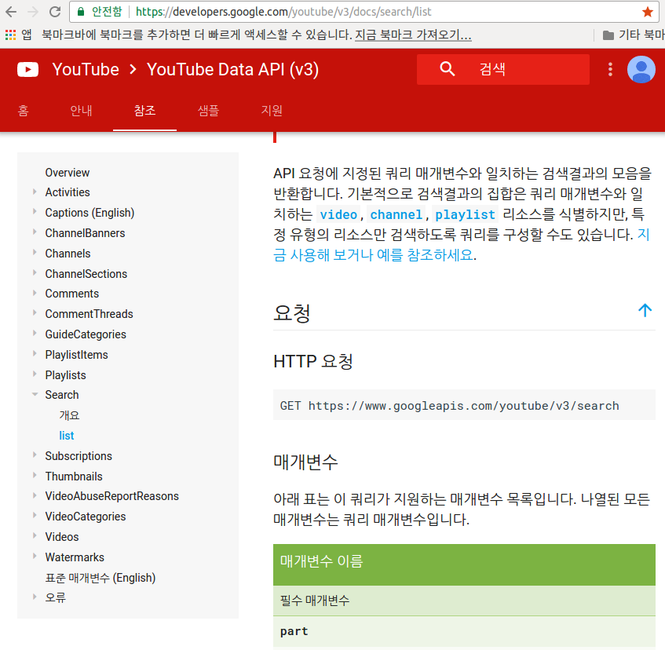  

	2. 하기 **API 요청법 파악**의 2번 참조
	
	- 즉, 5-1, 5-2를 통해 ```HTTP 요청 및 매개변수 part, q, pageToken, type``` 등에 대해 알 수 있다.(코드 활용법은 30-youtube.md을 참조)
 

### API 요청법 파악
1. APIs Explorer로 가상요청 보내기 (Execute without OAuth선택)
[https://developers.google.com/apis-explorer/](https://developers.google.com/apis-explorer/) 
	- YouTube Data 

2. [Youtube Search API Test](https://developers.google.com/apis-explorer/#p/youtube/v3/youtube.search.list)
	- 여기서는 임시 테스트를 해보는 곳.  
	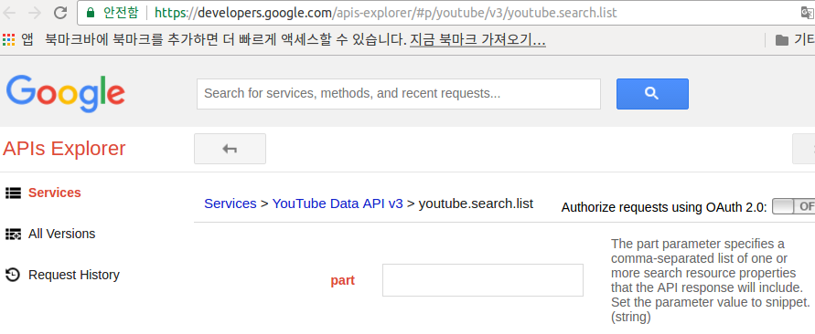  
	
	- 하기 그림의 "Execute withoug OAuth"를 클릭 
	  
	
	- 여기서 얻은 정보들(url, part, q, type 등)을 토대로 하기 postman에서 활용하여 검색한다. (코드에서의 활용법은 30-youtube.md 참조할 것)
	
3. Request의 URL과 Response데이터 확인(postman)
	- 2번에서 테스트를 해 본 걸 토대로, 다음과 같이 확인해 본다.
	- 우선, 하기 그림처럼 좌측 상단의 **앱**을 선택, **postman** 클릭
	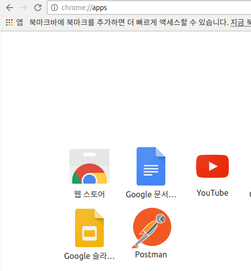 
	
	- **API 요청법 파악 2번**이나 **Search: list**문서에 나온 GET HTTP url을 하기 그림과 같이 GET 오른쪽란에 입력 
	 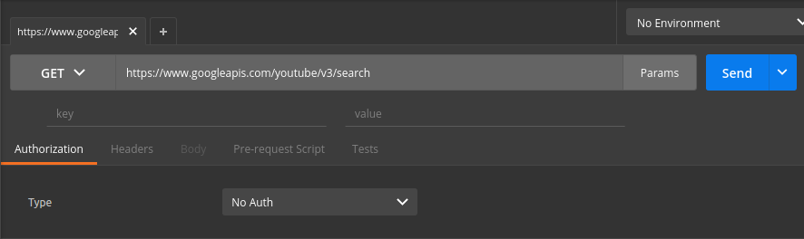 
	 
	- 그 다음, 입력한 url 오른쪽의 Params 클릭하여 key와 value들을 입력.
	여기서는 part, q, type, key를 입력.
	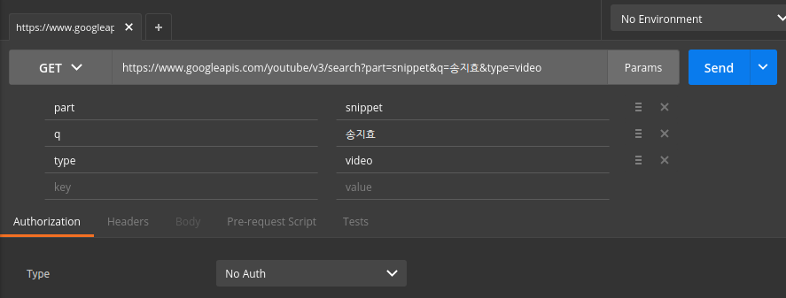 
	
	- 입력 후, Send 클릭하면 결과가 다음과 같이 출력된다.
	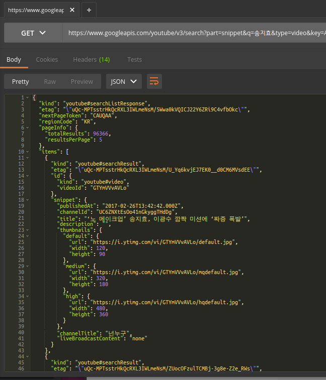 
	- 이렇게 나온 JSON 객체 활용법에 관련해선 30-youtube.md의 3, 4, 5를 참조.
	
### 보충설명
1. [YouTube API 시작하기](https://developers.google.com/youtube/v3/getting-started)읽기
	- 시작하기 전에
		1. Google API 콘솔에 액세스하고 API 키를 요청하며 애플리케이션을 등록하려면 Google 계정이 필요합니다.
		2. API 요청을 제출할 수 있도록 Google에 [애플리케이션을 등록합니다.](https://developers.google.com/youtube/registering_an_application)
		3. 애플리케이션을 등록한 후 다음과 같이 애플리케이션에서 사용할 서비스 중 하나로 YouTube Data API를 선택합니다.
			1. [APIs Console](https://console.developers.google.com/project)로 이동하고 앞에서 등록한 프로젝트를 선택합니다.
			2. **Services** 창을 클릭합니다.
			3. API 목록에서 **YouTube Data API**를 찾아 상태를 ON으로 변경합니다.
		4. JSON(JavaScript Object Notation) 데이터 형식의 주요 개념을 익힙니다. JSON은 임의의 데이터 구조를 간단한 텍스트로 표현하는, 언어에 독립적인 일반적인 데이터 형식입니다. 자세한 내용은 json.org를 참조하세요.
