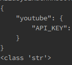
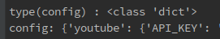

# YouTube App 만들기
### API Key 실습 - 2017.02.21
1. .conf폴더의 settings_local.json을 읽어온다
  

2. 해당 내용을 json.loads()를 이용해 str -> dict형태로 변환
3. requests 라이브러리를 이용(pip install requests), GET요청으로 데이터를 받아온 후,
4. 해당 내용을 다시 json.loads()를 이용해 파이썬 객체로 변환
5. 이후 내부에 있는 검색결과를 적절히 루프하며 print해주기

#### 1. .conf폴더의 settings_local.json을 읽어오기
- .conf폴더까지의 PATH를 특정화해서 변수에 할당
	-> print(특정화한 PATH변수) 를 하면
      .....(경로)/.conf/settings_local.json이 출력되어야 함
- 파이썬에서 파일 읽는 내장함수를 사용해서 결과를 다시 변수에 할당
- 현재 파일 (youtube/code/youtube.py)
```python
> current_path = os.path.abspath(__file__)
> print(current_path)

# 현재 파일에서 한 단계 부모 디렉토리 (youtube/code)
# code디렉토리 보다 한 단계 위, 즉 현재 파이참 프로젝트 루트 폴더 (youtube)
> root_path = os.path.dirname(os.path.dirname(current_path))
> print(root_path)

# 루트 폴더의 바로 아래 .conf폴더 (youtube/.conf)
> conf_path = os.path.join(root_path, '.conf')
> print(conf_path)

# .conf폴더 내부의 settings_local.json파일
> file_path = os.path.join(conf_path, 'settings_local.json')
> content = json.loads(open(os.path.join(conf_path, 'settings_local.json')).read())
> print(content['youtube']['API_KEY'])
```
- dirname 은 상위폴더로 이동
- join은 하위 폴더로 이동

#### 파일을 읽고 닫아준다.
```python
# f = open(path_file_settings_local, 'r')
# config_str = f.read()
# f.close()
with open(file_path, 'r') as f:
    config_str = f.read()
print(config_str)
print(type(config_str))
```
- print 결과
  

- 즉, 출력된 결과는 JSON형태의 문자열이란 의미.

#### 2. 해당 내용을 json.loads()를 이용해 str -> dict형태로 변환
```python
> config = json.loads(config_str)
> print('type(config) : %s' % type(config))
> print('config: %s' % config)

> youtube_api_key = config['youtube']['API_KEY']
> print('youtube_api_key : %s' % youtube_api_key)
```
- print 결과
  

- 위의 JSON형태의 문자열을 JSON 내부 라이브러리(loads)를 통해, 파이썬 객체(dict 형태)로 변환시켜준다.

#### 3. requests 라이브러리를 이용(pip install requests), GET요청으로 데이터를 받아온 후, 이렇게 Parameter와 URL을 분리합니다. (youtube/code/youtube.py)
```python
> params = {
    'key': youtube_api_key,
    'part': 'snippet',
    'q': '송지효',
    'type': 'video',
    'maxResults': 5,
}
> r = requests.get('https://www.googleapis.com/youtube/v3/search', params=params)
> print(r)
> print(r.json())

> content = r.text
> print(content)
```
- requests 사용법은 ['Python Request'](http://docs.python-requests.org/en/master/user/quickstart/#make-a-request) 참조
- Q1) params의 key, part, q 등은 어디서 왔나?
- Q2) url 'https://www.googleapis.com/youtube/v3/search'은 어디서 왔나?
- A) ['Search: list'](https://developers.google.com/youtube/v3/docs/search/list) 문서 참조 및 29-youtube.md의 **API 요청법 파악** 2번 참조할 것.

#### 4. 해당 내용을 다시 json.loads()를 이용해 파이썬 객체로 변환
```python
> result_dict = json.loads(content)
```

#### 5. 이후 내부에 있는 검색결과를 적절히 루프하며 print해주기(youtube/code/youtube.py)
```python
kind = result_dict['kind']
etag = result_dict['etag']
next_page_token = result_dict['nextPageToken']
region_code = result_dict['regionCode']
page_info = result_dict['pageInfo']
page_info_total_results = page_info['totalResults']
page_info_results_per_page = page_info['resultsPerPage']

print('kind : %s' % kind)
print('etag : %s' % etag)
print('next_page_token : %s' % next_page_token)
print('region_code : %s' % region_code)
print('page_info_total_results : %s' % page_info_total_results)
print('page_info_results_per_page : %s' % page_info_results_per_page)

items = result_dict['items']

for item in items:
    title = item['snippet']['title']
    published_date_str = item['snippet']['publishedAt']
    description = item['snippet']['description']
    youtube_id = item['id']['videoId']
    thumbnail_url = item['snippet']['thumbnails']['high']['url']

    # pip install python-dateutil
    published_date = parse(published_date_str)
    print(published_date)
```
 - 이 정보들을 토대로 youtube app을 구현하려고 함.
 	- 검색 리스트, 북마크, 다음 페이지 이동 등..