# Migration Fake 사용법

### 어느 조건에서 사용해야 하나?
기존 M2M 필드에 중간자 모델을 추가하는 과정에서 DB가 꼬이는현상이 발생하였다. 해결 방법은 두가지가 있는데, 하나는 DB를 지우고 다시 만들거나, DB를 지울 수 없는 상황이라면 다른 방법으로 해결을 해야 하는데, 두 번째 방법에 대해 기술하고자 한다.

```python
class MyUser(AbstractUser):
    bookmark_videos = models.ManyToManyField(
        'video.Video',
        blank=True,
    )
```
member_myuser_bookmark_videos  
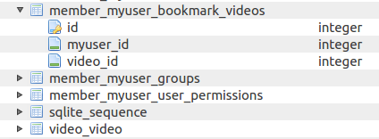

현재 상기와 같이 bookmark_videos를 'video.Video' 모델에 대해 M2M Field로 지정을 한 상태에서, migrate을 하면 DB 테이블에 지정하지 않은 이름의 테이블이 생성된다.
다시 말해, 현재 위 그림의 'member_myuser_bookmark_videos' 테이블은 M2M Field로 인해서 자동으로 생성된 테이블이다.
myuser에 연결되는 foreignkey 필드(myuser_id) 한 개와, video에 연결되는 foreignkey 필드(video_id) 한 개씩 생성되었다.
단순히, 두 테이블이 연결되었다라는 테이블이 생겼다. 그 외의 정보는 아직 없는 상태.  


위와 같이 bookmark를 두 개를 한 상태에서 DB를 보면, 하기 그림과 같다.  
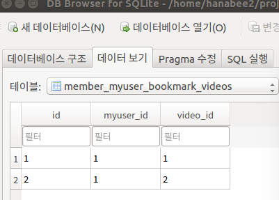

즉, 자신의 bookmark한 video에 대한 정보를 'bookmark_videos'에 넣었다까지 확인 할 수 있다.
여기서, 정보를 추가하고 싶은 경우, 
즉, 상기 테이블에 필드를 추가하고 싶은 경우, 중간자 모델을 사용해야 함.
따라서, 다음과 같이 중간자 모델을 설계하였다.
```python
class MyUser(AbstractUser):
    bookmark_videos = models.ManyToManyField(
        'video.Video',
        blank=True,
        through='BookmarkVideos',
    )

# 중간자 모델
class BookmarkVideos(models.Model):
    user = models.ForeignKey(settings.AUTH_USER_MODEL)
    video = models.ForeignKey('video.Video')
    created_date = models.DateTimeField(auto_now_add=True)
```
이 조건으로 migration을 하면,   
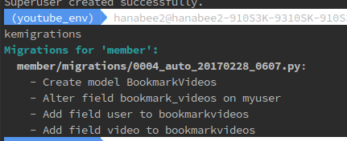

인식하는 건 through 필드를 거쳐가네 그리고 끝. 자동으로 필드 추가라든지의 action을 해주지 못함.
이 상태에서 migrate을 하면,   
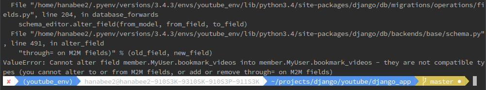

우리는 M2M 필드가 있는 상태에서 중간자 모델을 이용하여 테이블을 만들려고 했는데, 
이미 M2M 필드에 대한 테이블이 만들어져 있는 상태라 발생한 문제임.
django는 위의 그림과 같이 필드를 알아서 변경하지 못하겠다는 에러를 발생시킨 것임.
즉, 기존의 DB와 비교했을 때, 자동으로 맞추지 못하겠다는 표시이다.
그럼, 해결 방법은?
지금 Django DB가 자동으로 member_myuser_bookmark_videos라는 테이블을
중간자 모델로 알아서 바꿔줘야 하는데 못하니까(즉, 새 DB 테이블을 만들지 못함)
우리가 member_myuser_bookmark_videos 테이블에 대한 정보를 Django에 수동으로 만들어 준다.
```python
class MyUser(AbstractUser):
    bookmark_videos = models.ManyToManyField(
        'video.Video',
        blank=True,
        through='BookmarkVideos',
    )

# 중간자 모델
class BookmarkVideos(models.Model):
    myuser = models.ForeignKey(settings.AUTH_USER_MODEL)
    video = models.ForeignKey('video.Video')

    class Meta:
        db_table = 'member_myuser_bookmark_videos'
```
BookmarkVideos 라는 클래스에다 기존 DB에 있는 member_myuser_bookmark_videos라는 테이블을 사용해 라고 강제 설정을 해준다.
그리고, 한번에 바꾸면 못알아들을 수 있으므로, 필드명은 되도록이면 같게 한다.

이 상태에서 migration을 해보면,   
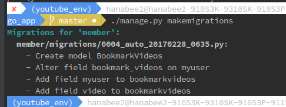

이 의미가 뭐냐면, myuser와 video라는 필드가 BookmarkVideos를 통해(중간자 모델)
을 거쳐간다는 것을 알 수 있고, BookmarkVideos라는 모델도 새로 Create하였다.
새 모델을 create하겠다고 인식한다는 얘기는 DB에 새로운 테이블을 만들겠다고 Django가 인식하고 있다는 얘기가 된다.
근데, 실제로는 테이블이 이미 만들어져 있는 상태. 즉, 우리는 지금 DB에 있는 내용 그대로를 migration을 해준 것 뿐이다.
그래서, 이걸 fake로 migrate해서 Django에게 인식하게 만들어 준다.   
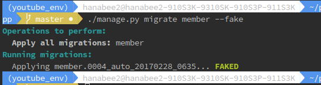

그러면, Django는 BookmarkVideos에 있는 내용들이 DB에 있다고 가정한다.
그러면나면, through를 거쳐가는 필드에 내용을 추가한다.
```python
class MyUser(AbstractUser):
    bookmark_videos = models.ManyToManyField(
        'video.Video',
        blank=True,
        through='BookmarkVideos',
    )

# 중간자 모델
class BookmarkVideos(models.Model):
    myuser = models.ForeignKey(settings.AUTH_USER_MODEL)
    video = models.ForeignKey('video.Video')
    created_date = models.DateTimeField(auto_now_add=True)

    class Meta:
        db_table = 'member_myuser_bookmark_videos'
```
그리고, migrations 하면,   
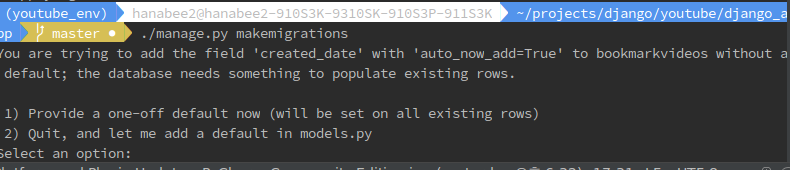

기존 필드가 있을 경우에, default 값이 없는데, 무엇을 넣을지 물어보는 것임.
auto_now_add는 default값이 아니라, save될 때의 값을 의미.
만약, 기존 row에 데이터가 있다면 문제가 될 것임.
없다는 가정하에, 기존에 있던 애들한테만 넣어줄 default값을 timezone_now로 설정.   
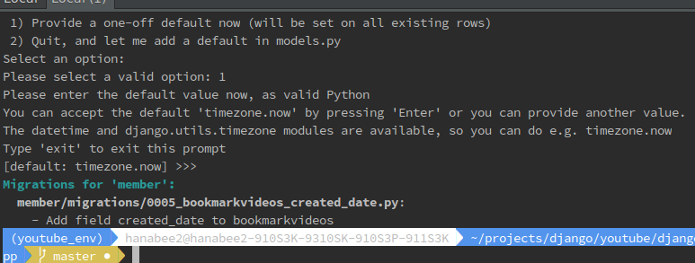 

그리고, migrate하면,   
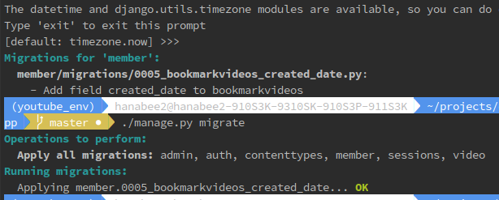 

DB를 확인해보면, 하기와 같이 created_date 필드가 추가가 된 것을 알 수 있다.   
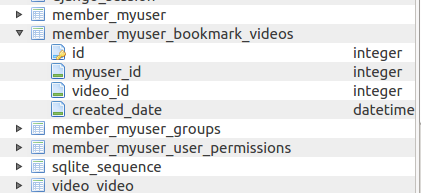 

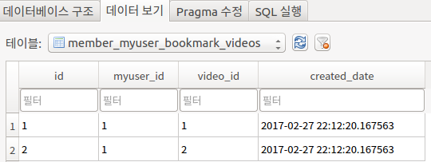 
기존에 있던 데이터들에는 timezone.now 했던 시간들이 입력되어 있다.

그리고, 아까 설정했었던 DB 테이블을 삭제
```
    class Meta:
        db_table = 'member_myuser_bookmark_videos'
```
그리고, migrations   
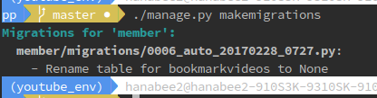 
그러면, Django는 테이블명이 없으니까(위 그림의 None), 자기가 알아서 변경시켜준다.

migrate하고, DB를 확인해보면,   
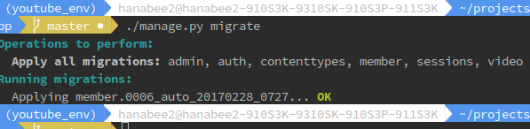 

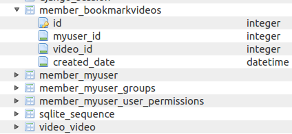   
위 그림과 같이 중간자 모델이름으로 테이블명이 변경된 것을 알 수 있다.

다음으로 muyser라는 필드 이름을 user로 변경해보자
migration을 하면,   
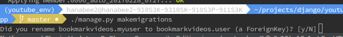 
N이 대문자 이므로, Enter 키가 default로 설정되어 있다는 의미. 따라서, 그냥 Enter치면 default로 no로 인식. 
그래서, 만약 N으로 입력하거나 그냥 Enter치면, 기존 필드에 있던 데이터들이 싹 다 날라가고, 새로운 필드가 생긴다. 
그러므로, 단순히 rename하는 것이라면 무조건 y를 입력해야 함.   
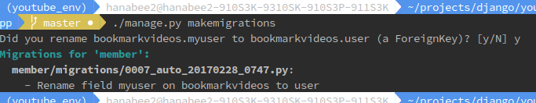 

migrate하고, DB 확인해 보면,   
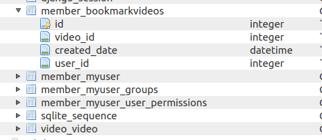 
위 그림과 같이 DB에도 필드명이 수정된 것을 알 수 있다.

이런식으로 기존 DB가 있을 경우에는 DB안에 있는 구조와
Django에서 쓰는 구조랑 최대한 맞춰서 migration을 해줘야 한다.
(강사: stackoverflow를 검색해서 조각조각들을 맞춰서 알아냈음. 헐~)
