# Facebook 로그인 추가
### [앱이나 웹사이트에 Facebook 로그인 추가하기](https://developers.facebook.com/docs/facebook-login) 

### [로그인 플로 직접 빌드](https://developers.facebook.com/docs/facebook-login/manually-build-a-login-flow) 
---
- SDK를 사용하지 않고 앱의 브라우저 기반 로그인을 구현해야 하는 경우 브라우저 리디렉션을 사용하여 로그인 플로를 직접 빌드할 수 있습니다. 이 가이드에서는 로그인 플로의 각 단계를 설명하고 SDK를 사용하지 않고 각 단계를 구현하는 방법을 보여줍니다.
	- [로그인 상태 확인](https://developers.facebook.com/docs/facebook-login/manually-build-a-login-flow#checklogin)  
	- [사용자 로그인 유도](https://developers.facebook.com/docs/facebook-login/manually-build-a-login-flow#login)  
	- [ID 확인](https://developers.facebook.com/docs/facebook-login/manually-build-a-login-flow#confirm)  
	- [액세스 토큰 및 로그인 상태 저장](https://developers.facebook.com/docs/facebook-login/manually-build-a-login-flow#token)  
	- [사용자 로그아웃 유도](https://developers.facebook.com/docs/facebook-login/manually-build-a-login-flow#)  

#### 1. 로그인 상태 확인
#### 2. 사용자 로그인 유도
- **로그인 대화 상자 호출 및 리디렉션 URL 설정**
앱에서 로그인 대화 상자를 표시할 엔드포인트로 리디렉션을 시작해야 합니다.  

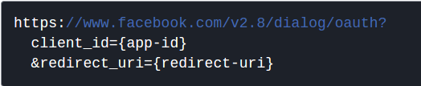  

1. 그러기 위해선 먼저, **app-id**를 만들어야 함.  
	- 위의 ```로그인 플로 직접 빌드```의 ```사용자 로그인 유도```로 접속 후, 우측 상단에 ```내 앱```이동. 그리고 ```새 앱 추가```선택
	-  새 앱 ID만들기에서 입력 후, ```앱 ID 만들기``` 버튼 클릭   
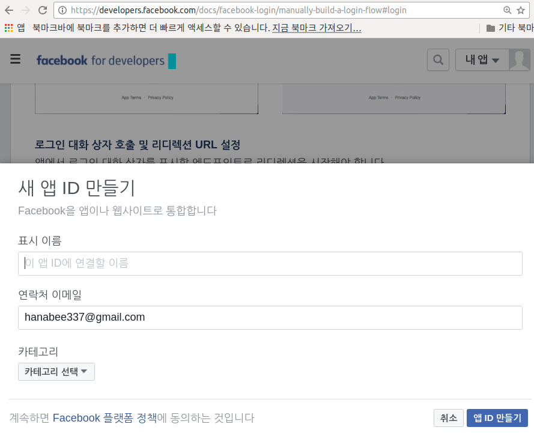   

	- 추가 보안문자 입력 후, 하기 그림과 같이 앱 ID가 만들어 진 것 확인  
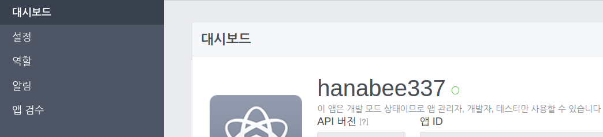  

	- 이 ```앱 ID```가 youtube의 **API_KEY** 처럼 코드 상에선 ```.conf 폴더```에 ```settings_local.json 파일```에 별도 처리되는 정보이다.
	- 코드상에선 다음과 같다.  
	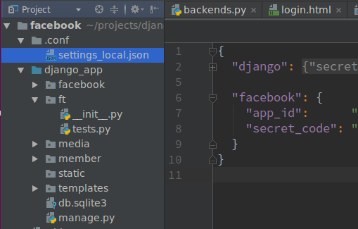   
	
	- 기본 설정하기
		- member app을 만들고, AbstractUser를 상속 받는  MyUser 구현
		- settings.py에 INSTALLED_APPS에 등록하고, AUTH_USER_MODEL = 'member.MyUser' 입력
		- 이후 Migration
		- settings.py 기본 설정하기(templates,static,media path 설정)
	- 여기서 앱 ID와 마찬가지로 별도 관리를 해야되는 값이 있는데, 바로 **SECRET_KEY**값이다.
		- 이 값은 production에 절대로 포함되면 안되는 값.
		- Django는 이 값을 이용해서, 해싱등을 사용하여 패스워드의 고유 값을 만드는데 사용하기 때문이다.

	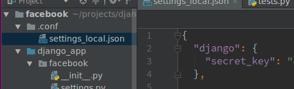  

	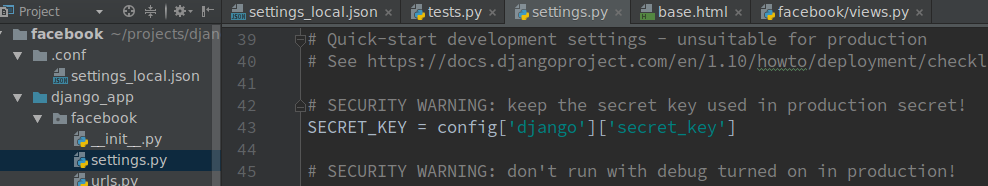  
	
	- 마지막으로 하나 더 별도 관리해야 하는 값이 있는데, ```secret_code``` 값이다. 방법은 하기 그림과 같이 ```보기``` 버튼을 누른 후, 패스워드 입력하면 표시가 된다. 이 값을 ```app_id와 함께 관리```한다.  
	
	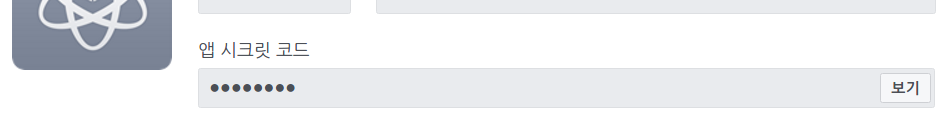  

	- 앱 ID를 view를 통해 template에 전달  
	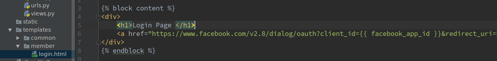  

	- 만약 앱 secret_code가 유출이 되면, 누구든지 우리 앱을 마치 내 앱인 것처럼 사용할 수가 있다. 따라서, client에게 유출이 되어서는 안된다.  
	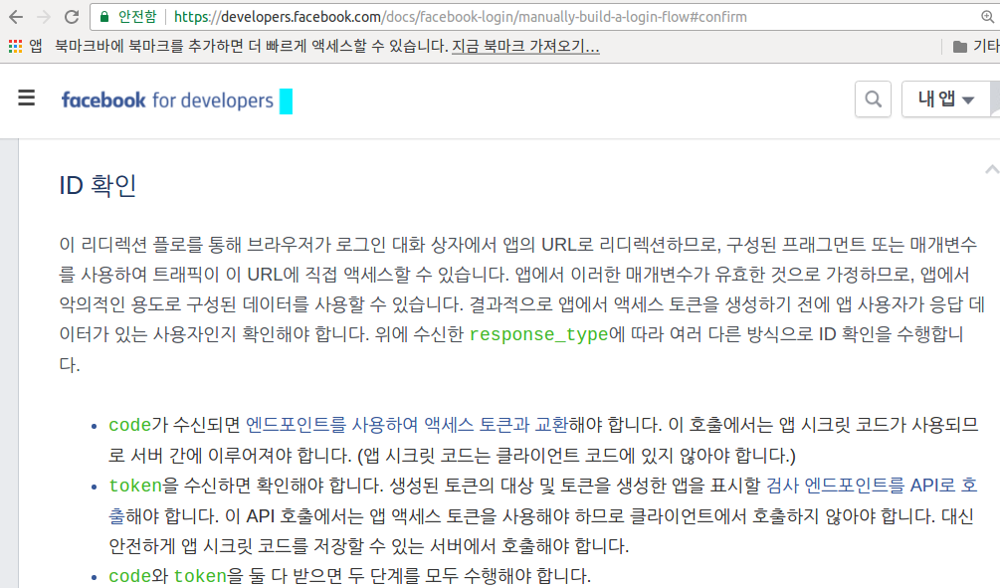 
	
2. **redirect-uri**
	- a tag를 이용하여 이 경로로 이동하면, 페이스북 로그인 할 수 있는 창이 뜬다. 
	그 창에서 로그인을 했을 때, 원래 로그인하려고 했었던 사이트에다 정보를 제공해줘야 하는데, 그 때 ```정보를 받을 url```을 ```redirect uri```에 적어준다. 우리가 하기와 같이 임의로 url을 'localhost의 member/login/facebook/' 으로 정하였다.(코드 참조. 나중에 127.0.0.1은 localhost로 변경됨)
	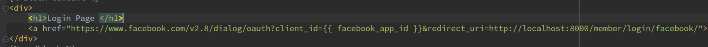   

#### 3. ID 확인
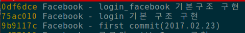  

- 위의 그림과 같이 commit들을 작업하였으면, 기본 template이 만들어 졌을 것이다. 

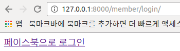  

- 여기서, 위의 링크를 클릭하면, 다음과 같은 오류가 발생함.
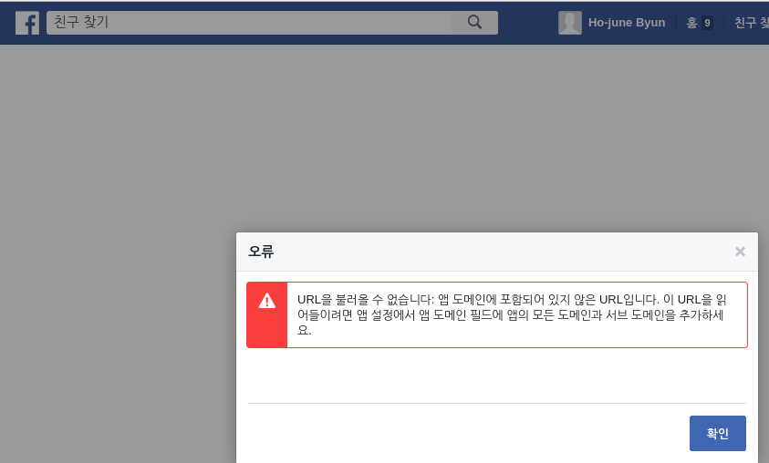  
 
 - 이걸 해결하기 위해, 다음과 같이 한다.
	1. [https://developers.facebook.com/](https://developers.facebook.com/) 로 접속
	2. 접속 후, 우측 상단의 ```내 앱```에서 ```자기 아이디``` 클릭
	3. 그러면, 아까 ```앱 ID```와 ```앱 secret_code```정보가 있는 곳으로 이동.
	4. 거기서 좌측 **설정** 클릭한 후, ```앱 도메인```과 ```사이트 URL```에 각각 ```http://localhost:8000```이라고 입력 후, ```변경 내용 저장``` 버튼 클릭  
	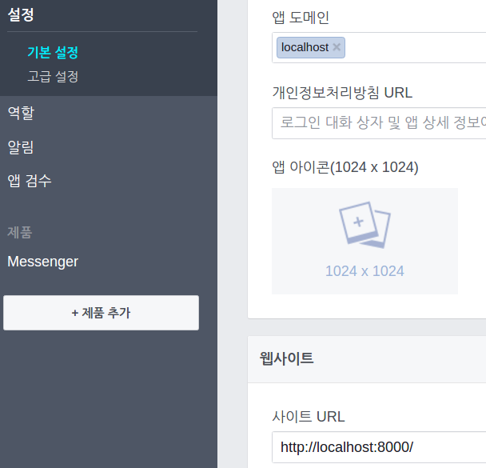   
	
	5. 그리고, login.html의 redirect uri도 localhost로 변경
	6. 그런 다음, ```localhost:8000으로 접속```하면 하기와 같은 에러가 발생  
	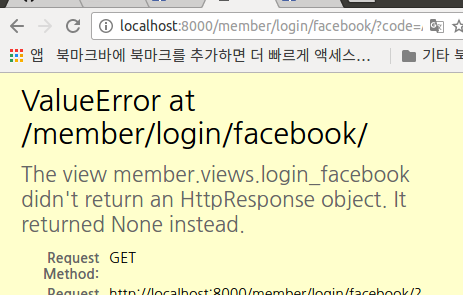   
	
	7. 이 문제에 대한 설명은 아래 문서와 같다. 여기서 ```code```란 위의 6번 그림에 있는 ```http://localhost:8000/member/login/facebook/?code=```에 있는 code를 말하며, 이 code 라는 값이 url에 붙어서 오는데, 이것은 user가 우리 사이트를 통해서 페이스북 로그인을 요청했을 때, 인증이 완료되었다는 특정 값을 페이스북에서 우리 사이트에 보낸 것이다. 이 코드는 사용자가 제대로 로그인했다라는 의미의 코드. 그러나, 이 코드는 다른 사람이 사용할 수 도 있음.  
	  
  	   
	8. 그러므로, 이 코드와 더불어 우리가 이 앱의 소유자라는 것을 증명하는 값(secret_code: 그림상으로는 client_secret 값)을 합쳐서 보내야 access token 값을 페이스북으로부터 받을 수가 있게 된다.  
	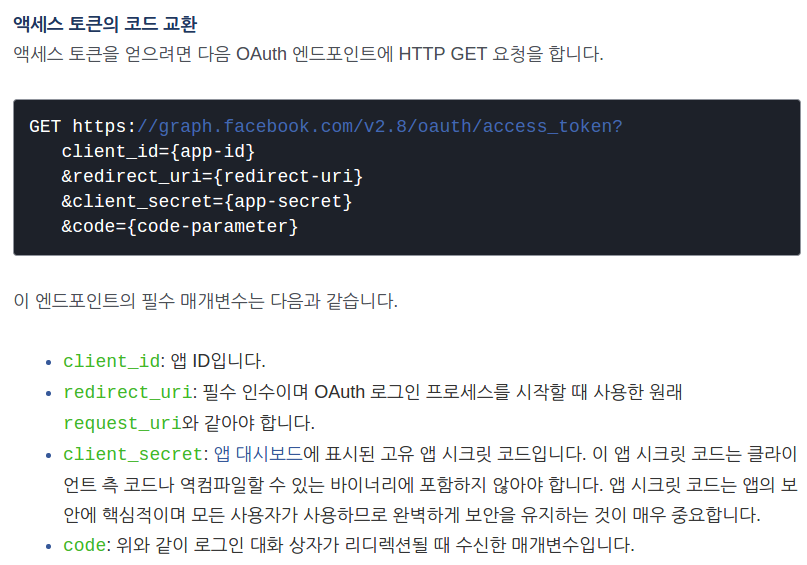  
	
	9. 코드상(member/views.py)으로는 하기와 같으며, 성공시 하기 그림과 같이 JSON 형식으로 반환된다.  
	  
	
```python
        r = requests.get(url_request_access_token, params=params)
        pprint(r.text)
        dict_access_token = r.json()
        ACCESS_TOKEN = dict_access_token['access_token']
        print('ACCESS_TOKEN : %s' % ACCESS_TOKEN)
``` 

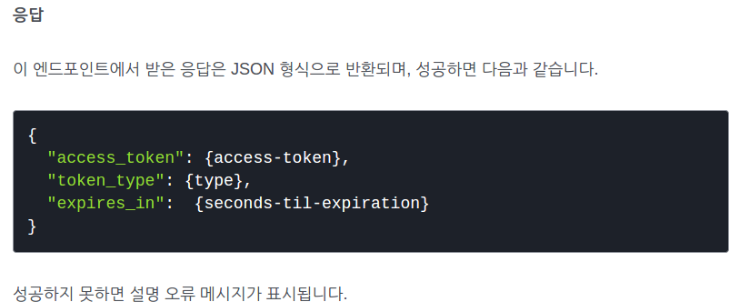  

#### 4. 액세스 토큰 검사
- [액세스 토큰](https://developers.facebook.com/docs/facebook-login/access-tokens/) 문서 참조
- **액세스 토큰 생성**
	1. ```사용자 액세스 토큰```
		- 상기 코드에서 받아온 ```ACCESS_TOKEN```이 사용자 액세스 토큰
	2. ```앱 액세스 토큰```
		- 우리가 페이스북에서 만든 앱(하기 그림에 있는 앱)에 대한 토큰
		  

	3. 페이지 엑세스 토큰 
	
- 여기서 우리는 ```사용자 액세스 토큰```과 ```앱 엑세스 토큰```만 사용.
- ```사용자 액세스 토큰```은 상기 코드에서 이미 받았음.
- ```앱 액세스 토큰``` 생성  
	- 앱 ID와 앱 시크릿 코드를 알면 이 앱의 소유주일 것이다라는 전제하에 두 개를 결합하여 만든 토큰이 ```앱 액세스 토큰```  
	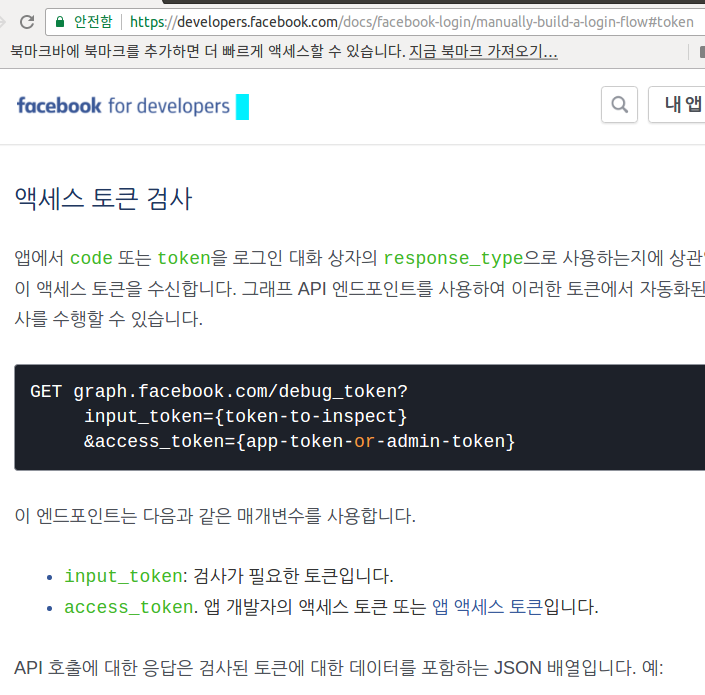  

	- 상기 그림에서 ```input-token```에는 우리가 받은 ```ACCESS_TOKEN```을 입력한다.
	- 그리고, ```access_token```에는 우리의 ```앱 액세스 토큰```을 입력하면 된다.
	- 그러면, 이 ```앱 액세스 토큰```은 어떻게 만들면 되냐하면, 하기와 같이 앱 ID와 앱 시크릿 코드를 이용하면 된다. 
	단, 시크릿 코드가 들어가기 때문에 client단에선 사용불가. 서버단에서만 사용가능.  
	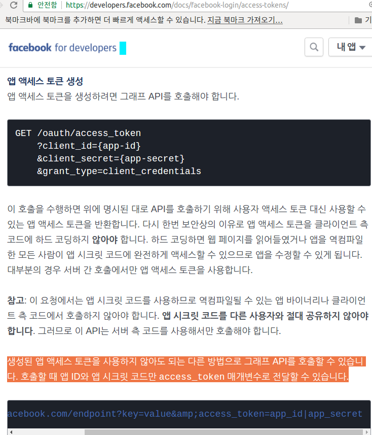  
	
	- 코드로는 다음과 같다.
```python
def login_facebook(request):
    # print(request.GET)
    APP_ID = settings.config['facebook']['app_id']
    SECRET_CODE = settings.config['facebook']['secret_code']
    REDIRECT_URI = 'http://localhost:8000/member/login/facebook/'
    APP_ACCESS_TOKEN = '{app_id}|{secret_code}'.format(
        app_id=APP_ID,
        secret_code=SECRET_CODE,
    )

    # login_fbv에서 페이스북 로그인으로 이동 후,
    # 정상적인 로그인 후 (정상적으로 로그인 시 request.GET에 'code' parameter가 추가됨)
    # redirect_uri를 이용해 다시 login_facebook으로 돌아온 후의 동작
    if request.GET.get('code'):
        code = request.GET.get('code')

        # 전달받은 code 값을 이용해서 access_token값을 요청함
        url_request_access_token = 'https://graph.facebook.com/v2.8/oauth/access_token?'
        params = {
            'client_id': APP_ID,
            'redirect_uri': REDIRECT_URI,
            'client_secret': SECRET_CODE,
            'code': code,
        }
        r = requests.get(url_request_access_token, params=params)
        pprint(r.text)
        dict_access_token = r.json()
        USER_ACCESS_TOKEN = dict_access_token['access_token']
        print('ACCESS_TOKEN : %s' % USER_ACCESS_TOKEN)

        # 유저 액세스 토큰과 앱 엑세스 토큰을 사용해서 토큰 검증을 거친다
        url_debug_token = 'https://graph.facebook.com/debug_token?'
        params = {
            'input_token': USER_ACCESS_TOKEN,
            'access_token': APP_ACCESS_TOKEN,
        }
        r = requests.get(url_debug_token, params=params)
        dict_debug_token = r.json()
        pprint(dict_debug_token)
```
- pprint 결과는 하기 그림과 같다. 여기서 중요한 것은 ```user_id```가 우리에게 보내졌다는 것이다.  
	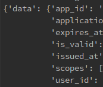  

	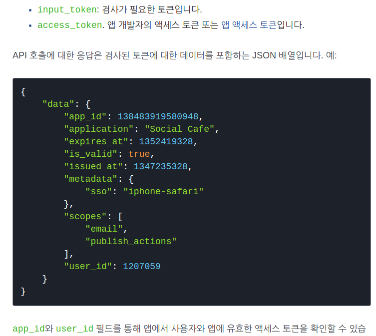  

#### 현재까지의 내용 정리
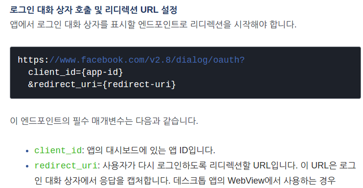  

- 우리는 login.html template에서 a tag를 이용하여 상기 url로 이동하였다. 페이스북 입장에서는 로그인 대화 상자로 이동하고, 이동한 다음에는 다시 돌아올 url을 입력하라는 의미. 
- 로그인 대화 상자를 호출할 때에는 어떤 앱에서 로그인을 시도하려고 하는지 app_id를 적어라는 의미. 그리고, 로그인이 끝났을 때는 다시 url로 돌아가야 처리할 수 있을테니, 돌아갈 url을 적어주면 거기에 parameter들을 더해서 보내주겠다는 의미이다.
- 그래서, 실제 구현한 부분이 하기와 같다.  
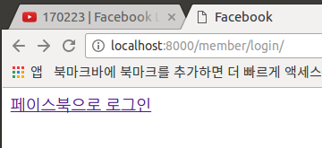  
- 링크를 클릭하면, 하기처럼 대화 상자가 뜨고, 로그인을 마치면 다시 url로 돌아와야 하는데현재 코드는 상태임), url에 ```code```값에 어떤 내용들을 더해 보내주었다.우리는 이 값을 처리해야 주어야 함.
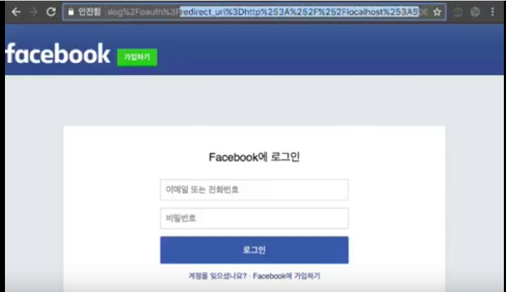  

- ID 확인에서 ```code```라는 키 값을 받게 되면, 이 code값을 엔드포인트(url을 의미)를 사용하여 ```액세스 토큰```과 교환해야 한다. 교환하는 과정에서 ```앱 시크릿 코드```가 사용된다.
- 페이스북입장에서는 받은 정보가 앱 ID 뿐이므로, 우리 앱이라는 것을 검증하기 위해서 앱 시크릿 코드를 같이 보내는 것이다. access_token을 요청할 때.
- 그래서, 그 access_token을 받을 url이 ```url_request_access_token = 'https://graph.facebook.com/v2.8/oauth/access_token?' ``` 이라는 의미.

```pyhon
def login_facebook(request):
    # print(request.GET)
    APP_ID = settings.config['facebook']['app_id']
    SECRET_CODE = settings.config['facebook']['secret_code']
    REDIRECT_URI = 'http://localhost:8000/member/login/facebook/'
    APP_ACCESS_TOKEN = '{app_id}|{secret_code}'.format(
        app_id=APP_ID,
        secret_code=SECRET_CODE,
    )

    # login_fbv에서 페이스북 로그인으로 이동 후,
    # 정상적인 로그인 후 (정상적으로 로그인 시 request.GET에 'code' parameter가 추가됨)
    # redirect_uri를 이용해 다시 login_facebook으로 돌아온 후의 동작
    if request.GET.get('code'):
        # Step 1 : 사용자가 로그인 했다라는 검증
        code = request.GET.get('code')

        # Step 2 : user_access_token(사용자 액세스 토큰) 얻어오기
        url_request_access_token = 'https://graph.facebook.com/v2.8/oauth/access_token?'
        params = {
            'client_id': APP_ID,
            'redirect_uri': REDIRECT_URI,
            'client_secret': SECRET_CODE,
            'code': code,
        }
        r = requests.get(url_request_access_token, params=params)
        pprint(r.text)
        dict_access_token = r.json()
        USER_ACCESS_TOKEN = dict_access_token['access_token']
        print('USER_ACCESS_TOKEN : %s' % USER_ACCESS_TOKEN)
```
- 상기와 같이 params에 정보들(앱 ID와 앱 secret_code, 돌아갈 url, code)을 담아 get 요청을 하면, 페이스북에 로그인 할 수 있는 ```access_token(사용자 액세스 토큰)```을 주겠다는 의미.
- 그 응답이 성공하면 다음과 같이 JSON 형식으로 올 것이다.  
  

- 그런데, 이 받은 ```access_token(사용자 액세스 토큰)```을 사용하기 전에 검사를 해야 함. 검사 가정을 거쳐야지만, ```user_id```를 얻을 수 있으므로, 반드시 거쳐야 하는 과정.  
```python
        # Step 3: debug_token을 얻어오기
        # 유저 액세스 토큰과 앱 엑세스 토큰을 사용해서 토큰 검증을 거친다
        url_debug_token = 'https://graph.facebook.com/debug_token?'
        params = {
            'input_token': USER_ACCESS_TOKEN,
            'access_token': APP_ACCESS_TOKEN,
        }
        r = requests.get(url_debug_token, params=params)
        dict_debug_token = r.json()
        pprint(dict_debug_token)

        USER_ID = dict_debug_token['data']['user_id']
        print('USER_ID : %s' % USER_ID)
```
  

#### Custom Authentification Backends
- 하기 그림과 같은 정보들을 가져올 수 있으므로, 해당 id값을 가지고 user를 만들어 줄 수 있는데, 페이스북에서는 로그인시 패스워드를 따로 물어보지 않음. user name(user id)만 존재하면 됨. 
- 그러나, 인증 시스템에서는 반드시 패스워드가 8자 이상이 있어야 한다. 그래서, ```Custom Authentification Backends```를 만들어야 한다.  

	  

	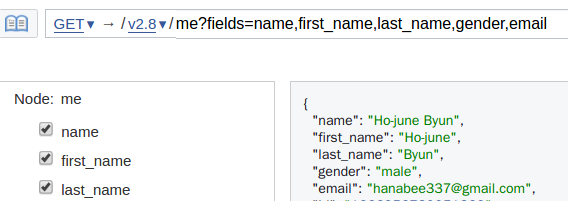  

- [Customizing authentication in Django : Specifying authentication backends](https://docs.djangoproject.com/en/1.10/topics/auth/customizing/#authentication-backends) 참조
- ```Writing an authentication backend``` 구현

```python
def login_facebook(request):
    # print(request.GET)
    APP_ID = settings.config['facebook']['app_id']
    SECRET_CODE = settings.config['facebook']['secret_code']
    REDIRECT_URI = 'http://localhost:8000/member/login/facebook/'
    APP_ACCESS_TOKEN = '{app_id}|{secret_code}'.format(
        app_id=APP_ID,
        secret_code=SECRET_CODE,
    )

    # login_fbv에서 페이스북 로그인으로 이동 후,
    # 정상적인 로그인 후 (정상적으로 로그인 시 request.GET에 'code' parameter가 추가됨)
    # redirect_uri를 이용해 다시 login_facebook으로 돌아온 후의 동작
    if request.GET.get('code'):
        # Step 1 : 사용자가 로그인 했다라는 검증
        code = request.GET.get('code')

        # Step 2 : user_access_token(사용자 액세스 토큰) 얻어오기
        # 전달받은 code 값을 이용해서 access_token값을 요청함
        url_request_access_token = 'https://graph.facebook.com/v2.8/oauth/access_token?'
        params = {
            'client_id': APP_ID,
            'redirect_uri': REDIRECT_URI,
            'client_secret': SECRET_CODE,
            'code': code,
        }
        r = requests.get(url_request_access_token, params=params)
        pprint(r.text)
        dict_access_token = r.json()
        USER_ACCESS_TOKEN = dict_access_token['access_token']
        print('USER_ACCESS_TOKEN : %s' % USER_ACCESS_TOKEN)

        # Step 3: debug_token을 얻어오기
        # 유저 액세스 토큰과 앱 엑세스 토큰을 사용해서 토큰 검증을 거친다
        url_debug_token = 'https://graph.facebook.com/debug_token?'
        params = {
            'input_token': USER_ACCESS_TOKEN,
            'access_token': APP_ACCESS_TOKEN,
        }
        r = requests.get(url_debug_token, params=params)
        dict_debug_token = r.json()
        pprint(dict_debug_token)
        USER_ID = dict_debug_token['data']['user_id']
        print('USER_ID : %s' % USER_ID)

        # 페이스북 유저 ID만으로 인증
        user = authenticate(facebook_id=USER_ID)
        login(request, user)
        return redirect('index')
```
- 페이스북 유저 ID만으로 인증하면, 출력된 ID 값과 앱에 등록되어 있는 ID 값이 달라 확인을 해 보았다. 그 이유는 다음 문서와 같이 app별(여기서는 hanabee337과 Graph API Explorer, 2 개의 앱)로 ID가 unique하다고 하였기 때문이었다. 확인해보니, 다른 앱의 user id가 실제 출력된 값과 동일함을 확인하였다.  
	
	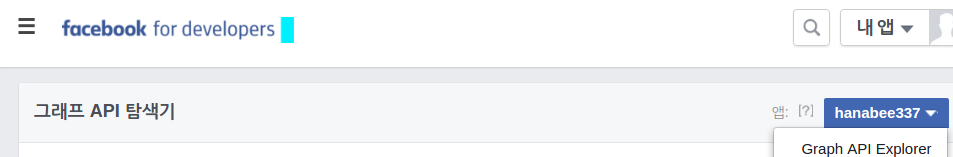  
	
	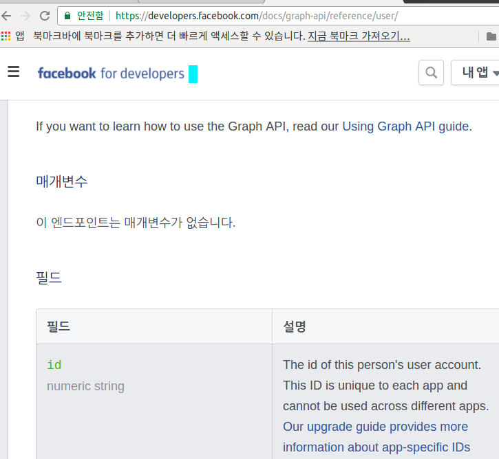  
	
