# 배포하기(AWS)
# Ubuntu Linux Deploy

> AWS EC2 + Ubuntu16.04 + Nginx + uWSGI + Django

## 개념
**Ubuntu Linux**  
서버의 OS

**Nginx**  
웹 서버. 클라이언트로부터의 HTTP요청을 받아 정적인 페이지/파일을 돌려준다.

**Django**  
웹 애플리케이션. 웹 요청에 대해 동적데이터를 돌려준다.

**uWSGI**  
웹 서버(Nginx)와 웹 애플리케이션(Django)간의 연결을 중계해준다.  
(Nginx에서 받은 요청을 Django에서 처리하기 위한 중계인 역할을 해준다)  

**WSGI**  
Web Server Gateway Interface  
파이썬에서 웹 서버(Nginx)와 웹 애플리케이션(Django)간의 동작을 중계해주는 인터페이스  
[Wikipedia](https://ko.wikipedia.org/wiki/%EC%9B%B9_%EC%84%9C%EB%B2%84_%EA%B2%8C%EC%9D%B4%ED%8A%B8%EC%9B%A8%EC%9D%B4_%EC%9D%B8%ED%84%B0%ED%8E%98%EC%9D%B4%EC%8A%A4)

### 2017.03.06
- https://www.hosting.kr/main
- AWS
- aws ec2로 구글링
- aws.amazon.ko - 가입
- aws secret key 털리지 않게 조심하기 : 요금 폭탄 맞을 수도.
- 비밀번호 생성기

- ec2를 할당받아 쓰기
- 그전에 local에서 해당 aws에 접근하기 위해 여러 설정들이 필요함.

## EC2 Instance 생성하기
- AWS Amazon에서 계정 신청

### AWS 인근 서버 지역 설정
- 로그인 후, server 지역 설정
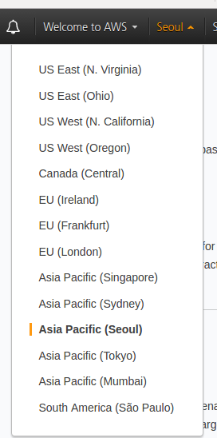  

### AWS EC2 이동
- AWS Services 창에서 ec2 검색하여 하기 그림처럼 virtual servers in the cloud 선택, 아니면, Services 클릭하여 Search services 창에서 ec2 검색하여, 하기 그림처럼 선택
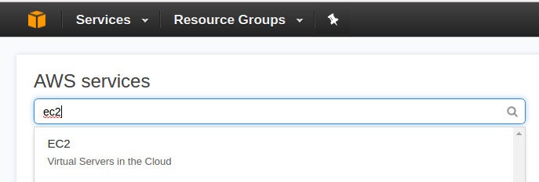  

- 하기 그림처럼 이동됨
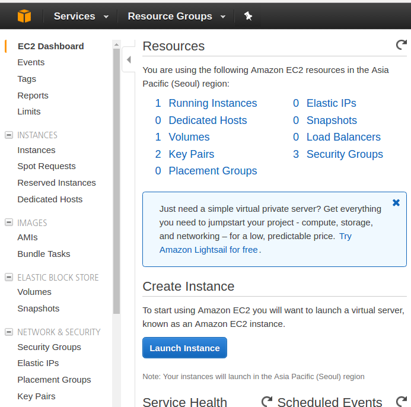  

- 할당받는 서버 한 개를 인스턴스라고 함.

### AWS EC2 Key Pair 만들기
- 여기서 좌측 NETWORK & SECURITY에서 Key Pairs 클릭

- 하기 그림에서처럼 Create Key Pair 버튼 클릭하여 원하는 이름 입력하고, Create 버튼 클릭. 그러면, 내 PC 기본 다운로드 폴더로 <내가 입력했던 key pair name>.pem파일이 자동으로 다운로드 된다. 이 파일은 보안관리해야 함. 삭제될지언정 외부로 노출이 되면 안됨.
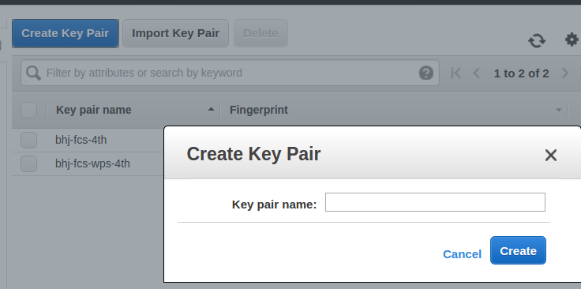  

- 다운로드 받은 .pem 파일에는 RSA Private Key가 들어있음.

- 이 개인키로 서버에 접속할 때, 사용함.

- 참고 문서 : [Amazon EC2 키 페어](http://docs.aws.amazon.com/ko_kr/AWSEC2/latest/UserGuide/ec2-key-pairs.html)

- 로컬 pc에 다운로드 받은 .pem 파일을  ~/.ssh폴더에 넣기
 - 그리고, 보안을 위해 chmod 400로 변경하여 소유주만 읽을 수 있도록 권한설정 변경

- 그런 다음, 하기 그림의 좌측 Instances 클릭하여, 화면 이동 후, Launch Instance 버튼 클릭. 
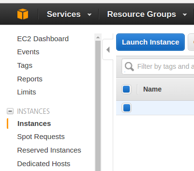  
- Ubuntu Server 16.04용 Select 버튼 클릭
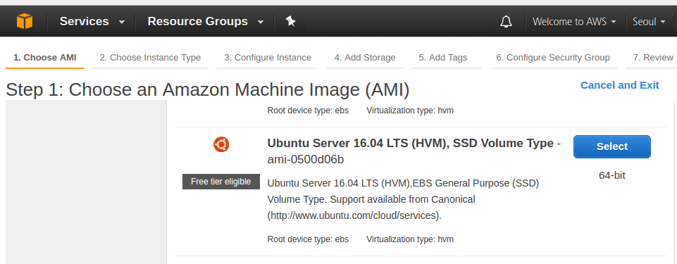  
- 기본 무료로 설정되어 t2.micro 선택하고, Review and Launch 버튼 클릭
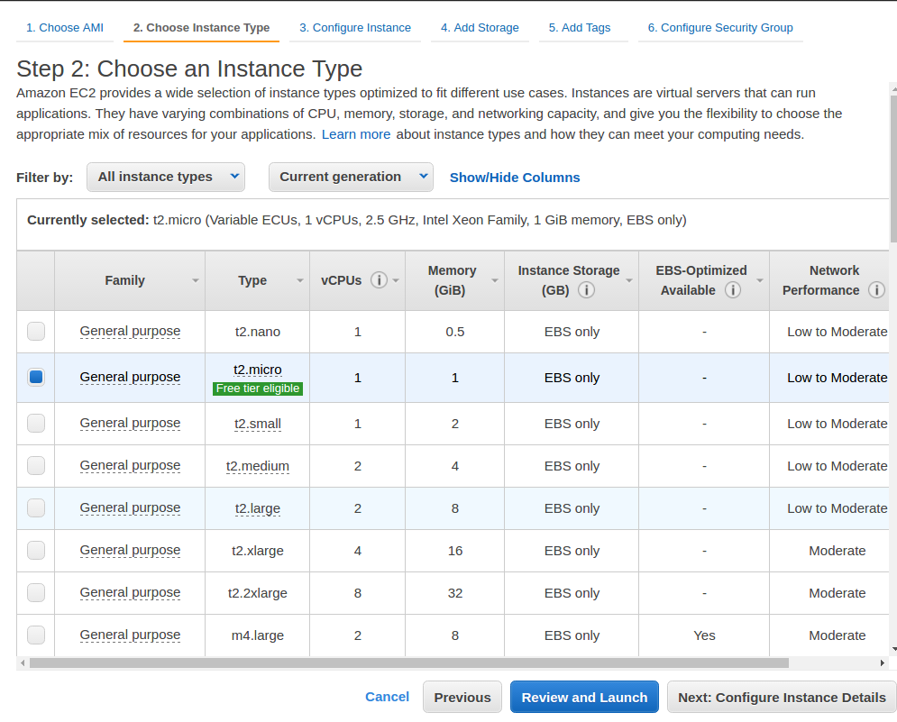  
- 위와 같이 하면, step 7로 이동하게 됨. 경고 문구의 의미는 모든 접속을 허용하겠단 의미이므로, 해커들의 위험을 없애기 위해, 우측 하단의 Edit security groups 클릭 
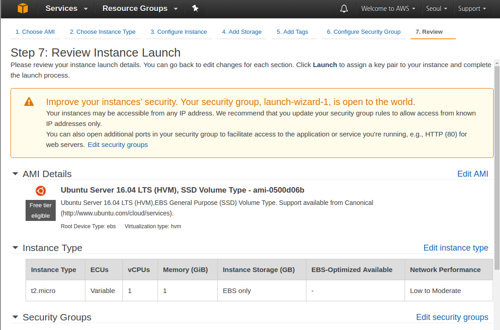  
- step 6 에서 Custom을 My IP로 변경한 후, Review and Launch 버튼 클릭
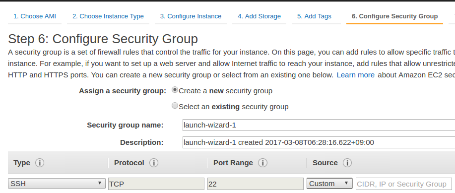  
- 참고로, 한 group에 여러 인스턴스가 붙을 수 있기 때문에, security group이라고 부름.
- step 7에선 Security group name, Description 원하는 것으로 입력한 후, Lauch 버튼 클릭
- 그러면, 팝업창이 뜨는데, Select a key pair에서 아까 우리가 만든 key pair를 선택해준다. 
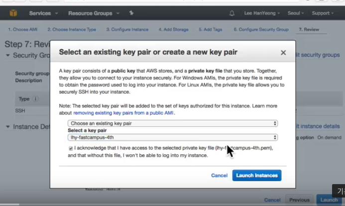  

- 다시 EC2 Dashboard의 Instances로 돌아오면, 새로운 인스턴스가 생성된 것을 확인. Instance state는 Initializing이 끝나면, running상태가 됨. server가 돌아가고 있다는 의미.
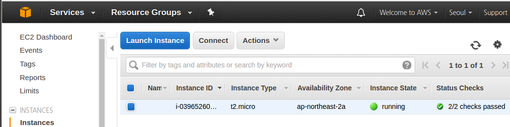  

-  EC2 Dashboard의 Instances에서 하단을 보면, Public DNS와 IPv4 Public IP가 있는데, 이 주소로도 서버 접근이 가능하다.

### SSH를 사용하여 인스턴스에 연결
- [SSH를 사용하여 Linux 인스턴스에 연결](http://docs.aws.amazon.com/ko_kr/AWSEC2/latest/UserGuide/AccessingInstancesLinux.html) 문서 참조

- Linux 인스턴스에 연결에서 4번.
```python
예) ssh -i /path/my-key-pair.pem ec2-user@ec2-198-51-100-1.compute-1.amazonaws.com

ssh -i ~/.ssh/bhj-fcs-wps-4th.pem ubuntu@<EC2 Instances의 Public DNS(IPv4) 입력>
```
- 일일이 입력하기 귀찮으므로, .zshrc 파일에 alias 설정해서 관리하는 것이 편리

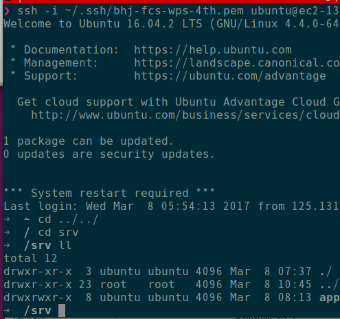  
 
- 위와 같이 로컬 pc에서 입력하고 Enter, 그리고, yes 입력하고 Enter하면, ```서버 접속``` 성공
- 접속이 실패할 경우, IP 확인
	- NETWORK & SECURITY의 Security Groups로 이동
	- 해당 security group 선택
	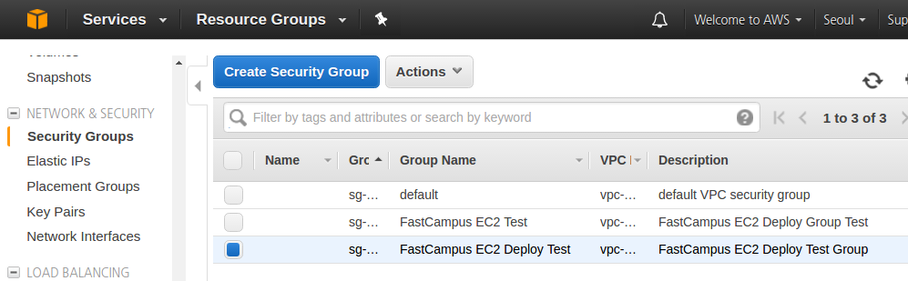  
	- 화면 하단의 Inbound 탭으로 이동하여 Edit 버튼 클릭
	- 클릭하면, Edit inbound rules 창이 뜸. SSH 라인에서 Custom을 My IP로 변경 후, Save 버튼 클릭
	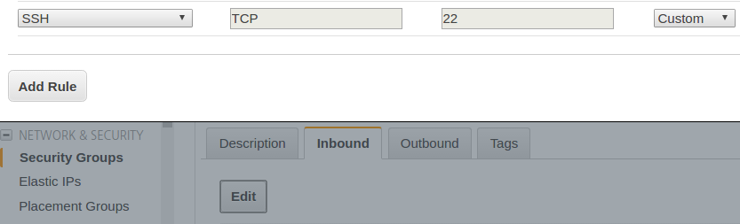  

- 서버에 접속한 후, 하기와 같은 기본 패키지들 설치한다.	
- 언어팩 설치
```python
sudo apt-get install language-pack-ko
sudo locale-gen ko_KR.UTF-8
```

-  ```서버```엔 기본 패키지들이 안깔려있으므로, 설치해준다. 
- 그전에 ```update```먼저 **반드시**할 것(apt-get 자체가 ubuntu에 있는 패키지 관리자)
- pip는 파이썬 패키지 관리자인 것처럼..

	- ubuntu update
 	```
 	sudo apt-get update
 	```
 
 	- python-pip설치
 	```
 	sudo apt-get install python-pip
 	```
 
 	- zsh 설치
 	```
 	sudo apt-get install zsh
 	```
 
 	- oh-my-zsh 설치
 	```
 	sudo curl -L http://install.ohmyz.sh | sh
 	```
 
 	- Default shell 변경, 적용 후, shell 변경 확인
 	```
 	sudo chsh ubuntu -s /usr/bin/zsh
 	```
 
 	- pyenv requirements설치
 	[공식문서 링크](https://github.com/pyenv/pyenv/wiki/Common-build-problems)
	```
	sudo apt-get install -y make build-essential libssl-dev zlib1g-dev libbz2-dev \
	libreadline-dev libsqlite3-dev wget curl llvm libncurses5-dev libncursesw5-dev xz-utils
	```

	- pyenv 설치
	```
	curl -L https://raw.githubusercontent.com/yyuu/pyenv-installer/master/bin/pyenv-installer | bash
	```

	- pyenv 설정 .zshrc에 기록
	```
	vi ~/.zshrc
	export PATH="/home/ubuntu/.pyenv/bin:$PATH"
	eval "$(pyenv init -)"
	eval "$(pyenv virtualenv-init -)"
	```

	- Pillow 라이브러리 설치
	[공식문서 링크](https://pillow.readthedocs.io/en/3.4.x/installation.html#basic-installation)
	```
	sudo apt-get install libtiff5-dev libjpeg8-dev zlib1g-dev \
	libfreetype6-dev liblcms2-dev libwebp-dev tcl8.6-dev tk8.6-dev python-tk
	```

	- 위의 패키지들은 접속한 서버에서 설치한 것임.

### SCP를 사용하여 Linux에서 Linux 인스턴스로 파일 전송
- [SCP를 사용하여 Linux에서 Linux 인스턴스로 파일 전송](http://docs.aws.amazon.com/ko_kr/AWSEC2/latest/UserGuide/AccessingInstancesLinux.html) 문서 참조

- 인스턴스에 연결된 상태에서, 로컬 pc에 있는 우리 코드 보내기
- 로컬 pc에서 작업중인 가상환경으로 이동(deploy_ec2)해야지만 전송할 수 있음.

- 서버에서 완전 ROOT로 이동한 후, srv 폴더에 대해 사용자와 사용자 그룹이 root로 되어 있는데, ubuntu가 사용할 수 있게 ubuntu로 권한 변경. 
- 변경하지 않으면, 일일이 sudo를 입력해야 함. sudo는 현재 명령어를 root권한으로 실행한다는 의미.
```python
sudo chown -R ubuntu:ubuntu srv
```
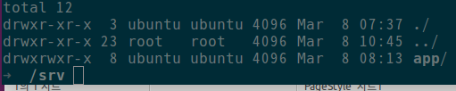  

- 권한 변경 후, srv폴더에서 app 폴더 생성
- 그 다음, 로컬 pc에서 하기와 같은 명령으로 파일 전송. 
- ```보내는 위치 주의할 것``` 
	- manage.py 파일이 있는 위치에서 ```하나 상위 폴더```에서 하기 명령을 할 것
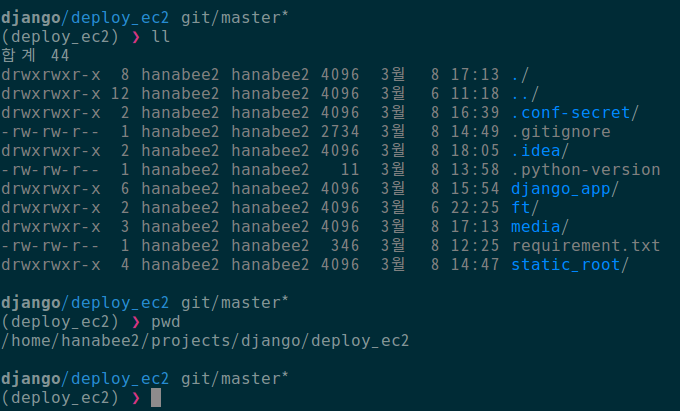  
```python
(deploy_ec2) ❯ pwd
/home/hanabee2/projects/django/deploy_ec2

(deploy_ec2) ❯scp -r -i ~/.ssh/bhj-fcs-wps-4th.pem . ubuntu@<EC2 Instances의 Public DNS:/srv/app/ >

(deploy_ec2) ❯scp -r -i ~/.ssh/bhj-fcs-wps-4th.pem /home/hanabee2/projects/django/deploy_ec2/. ubuntu@<EC2 Instances의 Public DNS:/srv/app/
```

- 다시 ubuntu server에서 srv/app 폴더로 이동
- srv/app 폴더에서 pyenv 설치
	```
	pyenv install 3.5.2
	```

- 가상환경 설정하고, pip install(위치 확인하고 설치 할 것. srv아님. srv/app 확인하고 설치할 것)
	```
	/srv/app : pyenv virtualenv 3.5.3 deploy_ec2
	```

- pip list 확인해보면, install 된 것이 없으므로, 설치.
	```
	/srv/app : pip install -r requirement.txt(로컬 pc에서 ubuntu server로 전송된 파일)
	```

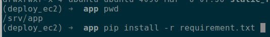  

- 바로 runsercer를 하면, 오류가 발 것임. pip 오류로 인해서.
- 그래서, 가상환경 설정 한 후, ubuntu server 나갔다가 다시 접속한 후에(왜? 가끔 pip 오류가 있다고 함),
/srv/app/django_app에서 ./manage.py runserver 하면 실행이 되어야 한다.

- 그러면, runserver까지는 되는데, 확인을 할 수 없다. 그래서, 다음과 같은 설정을 해준다.
- Security Groups에서 다시 Inbound 탭에서 Edit 버튼 클릭하여,
Edit inbound rules 창이 뜨면, Add Rule 버튼 클릭하여 Custom TCP Rule 선택하고 Source를 Anywhere로 설정, Port Range는 8000으로 설정하고 Save(Edit inbound rules 창엔 현재 2 개가 보일 것임. SSH와 Custom TCP Rule)

- ALLOWED_HOSTS 설정확인
```
vi mysite/settings.py
ALLOWED_HOSTS = [
	'<ec2 domain name'>,
	또는
	'.amazonaws.com',
]
```

- 그런 다음, ```접속한 서버```에서는 다음과 같은 명령으로 runserver를 실행.(8000번 port로 localhost를 열겠다는 의미)
	```
	./manage.py runserver 0.0.0.0:8000
	```


- 0.0.0 같은 경우는 외부에서 접속, 127.0.0 같은 경우는 loopback이라 자기 자신의 컴퓨터안에서만 접속이 가능하다. 따라서, 외부에서의 접속은 불가능.
- ```브라우저에서는 해당 인스턴스의 Public DNS입력하고 뒤에 :8000```를 붙인다. 그러면, Hello World(template에서 작업한 내용)가 출력이 되어야 한다.

여기까지가 170306 | EC2 Deploy 3 동영상 강의내용

---

- **서버에서 작업**
	- 현재 ubuntu에 깔린 것만 upgrade하고 싶은 경우,
	```
	sudo apt-get upgrade
	```
	
	- 현재 ubuntu에 깔린 것 upgrade + 연관된 패키지들 install, upgrade
	```
	sudo apt-get dist-upgrade
	```

	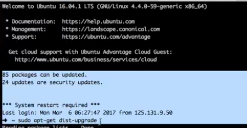  
	
	- 서버가 알아서 off & on
	```
	sudo shutdown -r now
	```
	
- 만약 -r을 안하면 영원히 off상태이므로, EC2 Dashboard의 Instances에서 Stop/Start를 or Reboot를 manually 해줘야 함.
- 로컬 pc에서 다시 서버에 접속해보면, 깔끔해졌음.
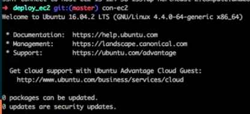  


## uWSGI 관련 설정
- ```서버```에서 **웹 서버 관리용 유저 생성**
	```
	/home/ubuntu에서 
	sudo adduser nginx 
	```

- 패스워드 입력하고, 나머지는 Enter

- 서버에서 **uWSGI설치**
	```
	(virtualenv 환경 내부에서) 
	pip install uwsgi
	```
	
	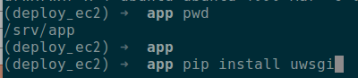  
 
	 - 원래 uwsgi는 nginx(server)로 부터 django(웹어플리케이션)를 연결시켜주는 역할인데, uwsgi 자체도 외부 접속을 받을 수 있는 기능이 있다. 
	 그래서, 테스트용으로는 우리도 사용할 수 있다. 
	 - 원래는 그 역할을 nginx가 하는 것이지만, uwsgi의 커맨드를 사용해서, 서버를 틀 수 있다.
  
- 서버에서 **uWSGI 정상 동작 확인**
	
	```
	예) (virtualenv 환경 내부에서)
	srv/app: uwsgi --http :8000 --home (virtualenv경로) --chdir (django프로젝트 경로) -w (프로젝트명).wsgi
	```

- ex) pyenv virtualenv이름이 deploy_ec2, django프로젝트가 /srv/app/deploy_ec2/django_app, 프로젝트명이 deploy_ec2일 경우,
	```
	(virtualenv 환경 내부에서)
	srv/app: uwsgi --http :8000 --home ~/.pyenv/versions/deploy_ec2 --chdir /srv/app/django_app -w deploy_ec2.wsgi
	```

	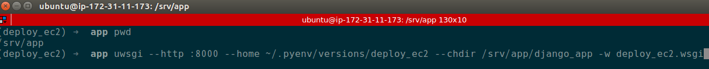  

	- 그리고 나서, 브라우저에서 
http://{EC2 Instances의 Public DNS}:8000 입력해서 출력이 잘 되는지 확인(Hello, World!)

여기까지가 170306 | EC2 Deploy 4 동영상 강의내용

- 서버에서 **uWSGI 사이트 파일 작성**

```python
/srv/app/에서
sudo mkdir /etc/uwsgi
sudo mkdir /etc/uwsgi/sites
sudo vi /etc/uwsgi/sites/app.ini
```

- 생성된 폴더 및 파일 위치
	 

- 참고 링크
[uWSGI: 우분투 + 장고 + Nginx](http://brownbears.tistory.com/16) 

- app.ini 파일에 하기와 같은 내용 입력
```python
[uwsgi]
chdir = /srv/app/django_app # Django application folder 위치
module = deploy_ec2.wsgi:application # Django project name.wsgi
home = /home/ubuntu/.pyenv/versions/deploy_ec2 # VirtualEnv location

uid = www-data # uwsgi가 어떤 user 권한으로 돌아가냐는 의미. 보통 권한을 하나만 준다. 서버만 돌릴 수 있게.
gid = www-data

socket = /tmp/app.sock # 아까는 8000 port로 오는 모든 요청을 받았으나, 그것보다는 파일 형태(socket)로 하는 것이 overhead 낭비가 적다고 함.
chmod-socket = 666
chown-socket = www-data:www-data

enable-threads = true
master = true
pidfile = /tmp/app.pid
```
- ```uWSGI```는 서버 ```가상환경```안에서 실행을 해야한다.

- **uWSGI site파일로 정상 동작 확인**
```
srv/app/에서
uwsgi --http :8000 -i /etc/uwsgi/sites/app.ini
```
- 위처럼 해보면 권한이 없다고 에러가 발생함.

- 따라서, sudo로 root권한으로 실행. 근데, root에는 uwsgi가 안깔려 있으므로, 하기와 같이 path를 입력해줘야 한다.
```python
srv/app/에서
sudo /home/ubuntu/.pyenv/versions/deploy_ec2/bin/uwsgi --http :8000 -i /etc/uwsgi/sites/app.ini
```

- 근데,  하기와 같이 또 에러 발생
```python
*** Starting uWSGI 2.0.14 (64bit) on [Mon Mar  6 17:52:46 2017] ***
compiled with version: 5.4.0 20160609 on 06 March 2017 15:45:23
os: Linux-4.4.0-64-generic #85-Ubuntu SMP Mon Feb 20 11:50:30 UTC 2017
nodename: ip-172-31-11-173
machine: x86_64
clock source: unix
detected number of CPU cores: 1
current working directory: /srv/app/django_app
writing pidfile to /tmp/app.pid
detected binary path: /home/ubuntu/.pyenv/versions/3.5.2/envs/deploy_ec2/bin/uwsgi
!!! no internal routing support, rebuild with pcre support !!!
chdir() to /srv/app/django_app # Django application folder
chdir(): No such file or directory [core/uwsgi.c line 2588]
```

- **원인** : ```ini 파일에서는``` # 처리가 파이썬처럼 주석처리로 인식하지 못하므로, ```# 주석문은 삭제```해야 함.

```python
sudo mkdir /etc/uwsgi
sudo mkdir /etc/uwsgi/sites
sudo vi /etc/uwsgi/sites/app.ini
```

- app.ini 파일에 하기와 같이 #주석문은 삭제해서 입력해야 한다.
```python
[uwsgi]
chdir = /srv/app/django_app
module = deploy_ec2.wsgi:application
home = /home/ubuntu/.pyenv/versions/deploy_ec2

uid = www-data
gid = www-data

socket = /tmp/app.sock
chmod-socket = 666
chown-socket = www-data:www-data

enable-threads = true
master = true
pidfile = /tmp/app.pid
```

여기까지가 170306 | EC2 Deploy 5 동영상 강의내용

- 서버에서 **uWSGI 서비스 설정파일 작성**
- 껏다 켰을 때도, ```일일이 입력하지 않고, 자동으로 작동할 수 있도록 서비스에 등록```을 해놓자.
```python
sudo vi /etc/systemd/system/uwsgi.service 해서 하기 내용 입력

[Unit]
Description=uWSGI Emperor service
After=syslog.target

[Service]
ExecPre=/bin/sh -c 'mkdir -p /run/uwsgi; chown www-data:www-data /run/uwsgi'
ExecStart=/home/ubuntu/.pyenv/versions/deploy_ec2/bin/uwsgi --uid www-data --gid www-data --master --emperor /etc/uwsgi/sites

Restart=always
KillSignal=SIGQUIT
Type=notify
StandardError=syslog
NotifyAccess=all

[Install]
WantedBy=multi-user.target
```
- 하기 순서대로 작업
```python
sudo vi /etc/systemd/system/uwsgi.service
```
- 위 작성한 service 파일이 정상적으로 동작하는지 확인하기 위해 아래 순서대로 작업
```python
sudo systemctl restart uwsgi
ps -ax | grep uwsgi # 프로세스 동작확인 명령어 uwsgi가 실행되고 있는지 확인 목적
```

  

- /tmp 폴더에 app.pid와 app.sock 파일 생성된 것을 확인
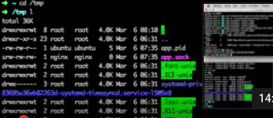  
- app.sock파일은 nginx와 nginx 권한으로 생성되어 있어야 한다.

## Nginx 관련 설정
#### Nginx 안정화 최신버전 사전세팅 및 설치
- **서버 가상환경**(deploy_ec2)에서 작업(/srv/app 폴더)
```python
sudo apt-get install software-properties-common python-software-properties
sudo add-apt-repository ppa:nginx/stable
sudo apt-get update
sudo apt-get install nginx
nginx -v
```

- 위의 패키지들이 잘 설치되었는지 확인하기 위해 
	```
	nginx -v
	```
	
여기까지가 170306 | EC2 Deploy 6 동영상 강의내용

#### Nginx 동작 User 변경
- 접속한 서버에서 작업 
- nginx라는 웹서버를 돌릴 건데, user 이름을 nginx에서 www-data로 변경했으므로, user도 변경해서 등록
- 서버에서 /etc/uwsgi/sites/app.ini, /etc/systemd/system/uwsgi.service 파일들에서 nginx를 www-data로 수정하였음.
- user 변경 등록 
```python
sudo adduser www-data
```
- user 변경으로 인해, 하기 순서대로 재설정들을 해줘야 함.
- 접속한 서버의 /tmp 폴더에서 실행

1. /tmp 폴더에 있는 app.pid와 app.sock 파일 sudo rm으로 삭제
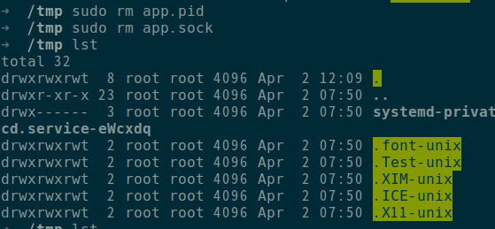 

2. systemctl daemon-reload
3. systemctl restart uwsgi
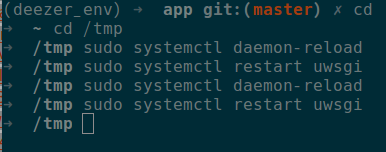

4. 3번을 실행하고 나서, www-data로 user가 변경된 app.pid와 app.sock이 생성되어있어야 한다.
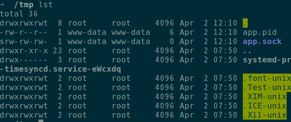
 
여기까지가 170306 | EC2 Deploy 7 동영상 강의내용

### 2017.03.07

### IAM & AWS CLI
- What Is IAM?
	- AWS Identity and Access Management (IAM) is a web service that helps you securely control access to AWS resources for your users. You use IAM to control who can use your AWS resources (authentication) and what resources they can use and in what ways (authorization).

[What Is IAM?](http://docs.aws.amazon.com/IAM/latest/UserGuide/introduction.html)
 
- EC2에 접속할 때는 단순히 key pair만 갖고, 접속이 가능했다. 단순 접속용이란 의미. 
- AWS의 특별한 기능들을 사용하기 위해서는 특별한 사용자를 만들어줘야 하는데, 이 사용자에 대한 access key와 secret key를 만들어줘야 함.
- 우리가 AWS에 가입을 했다. 그러면, 그 계정의 권한은 ROOT권한이다. 그러므로, 모든 걸 다 할 수 있다.
- 그렇다고 해서, 로컬에서는 console에 접속한 것과 같은 효과를 가질 수가 없다.
- aws cli(command line interface) : 로컬에서 aws쪽에 영향을 줄 수 있음. 로컬에서 instance를 만들거나 삭제 등의 작업을 할 수 있다. 이런 작업에 대한 명령들을 로컬에서 할 수 있으므로, powerful한 기능이다. 서버가 몇 만대다 그러면, 일일이 서버 각각 Manually 마우스로 해 줄 순 없으므로, 로컬에서 script로 만들어서 할 수 있다는 얘기이다.
- 그래서, 로컬에서 작업할 수 있는 user를 만들어 줄려구 하는데, 이 user에게 AWS 계정 사용자의 root권한을 부여하면 안되므로, 로컬에서 제한된 작업만을 할 수 있는 user를 만들 것이다.
- 로컬 터미널에서 AWS쪽으로 request를 보낼 때, 이 request를 보낸 user가 맞는 user라는 증명을 보내줘야한다.

- aws console로 접속하여 services에서 IAM 검색
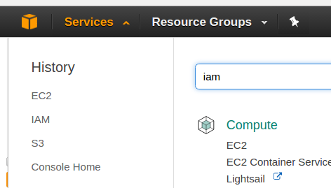   

- Add user 클릭. user name 입력하고, Access Type은 Programmatic access(개발 도구)만 선택한다. 개발환경에 대한 access key ID와 secret access key를 활성화시킨다고 되어있다. Next 버튼을 누르면 유저가 생성되고 키를 제공받는다.

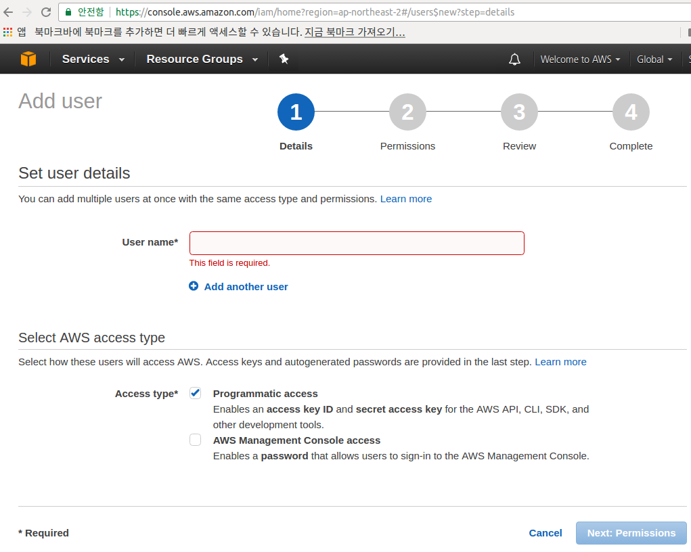  

- 위의 그림에서처럼 access key ID와 secret access key를 가지고 접속을 한다.
- 그냥 console만 로그인 할 거다. 그러면 **AWS Management Console access** 클릭. 
- 그런 다음, **Attach existing policies directly** 선택하고,
검색 창에 ec2 입력하여 **AmazonEC2FullAccess** 선택한 후, Next:Review 버튼 클릭, 다음 창에선 Create User 버튼 클릭
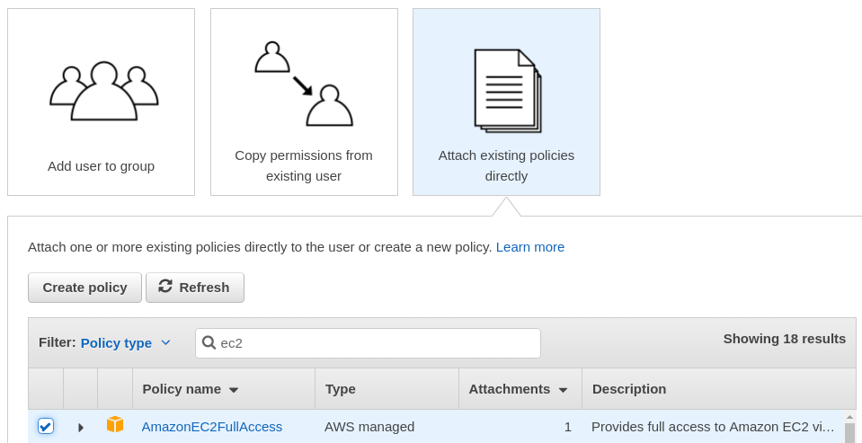  

- 그러면, ```credential.crv``` 파일 생성되는데, 로컬에 다운로드
	- 파일엔 Access key ID와 Secret access key가 들어있음.
	- Secret Access Key는 절대로 유출되서는 안됨

- **로컬 pc의 가상환경**에서 설치
```pip install awscli```
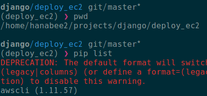  

```python
(deploy_ec2) ❯ aws configure
AWS Access Key ID [****************246A]: AWS Access Key ID 입력
AWS Secret Access Key [****************vsOb]: AWS Secret Access Key입력
Default region name [None]: ap-northeast-2 입력
Default output format [None]: json 입력
```
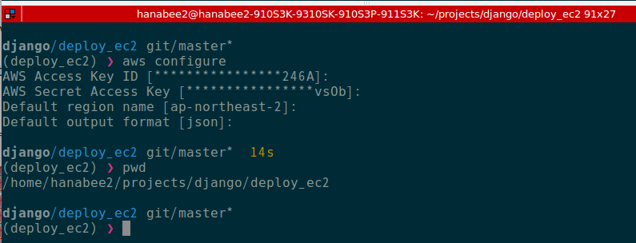  

- 위의 aws configure를 실행하면, ~/.aws 폴더에 config 파일이 자동 생성됨
- aws configure 설정확인은 하기 파일에서 가능 
	- .aws/config 파일 생성되어 있음.
- .aws/credentials 파일에는 aws_secret_access_key, aws_access_key_id에 대한 정보가 있음.

```python
~/.aws
❯ pwd
/home/hanabee2/.aws 

~/.aws
❯ ll
합계 16
drwxrwxr-x  2 hanabee2 hanabee2 4096  3월  7 11:46 ./
drwxr-xr-x 52 hanabee2 hanabee2 4096  3월  7 13:45 ../
-rw-------  1 hanabee2 hanabee2   48  3월  7 11:46 config
-rw-------  1 hanabee2 hanabee2  116  3월  7 11:21 credentials 

(deploy_ec2) ❯ vi ~/.aws/config 
[default]
region = ap-northeast-2
output = json

(deploy_ec2) ❯ vi ~/.aws/credentials 
aws_secret_access_key, aws_access_key_id 정보가 있음.
```
- 궁극적으로는 서버에 접속하는 일이 절대 없어야 함. 배포를 할 때, 서버에 접속하는 일이 없어야 한다고 함.(강사 曰)
- 인스턴스는 서버 한 대의 개념이기 때문에, 서버가 여러 대 일 경우, 일일이 접속해서 작업을 할 수 없다. 따라서, 서버 관련된 관리 작업은 로컬에서 한 번에.

- 중간자 공격을 방어하기 위해 AWS에서는 fingerprint라는 것을 사용.

- 서버의 공개 키와 우리가 로컬에 저장한 개인키를 비교하면 나오는 특정한 값이 있는데, 이를 지문(fingerprint)이라 한다.
- 이 지문 값이 일치하는지를 개인키를 로컬 pc에서 서버로 보낼 때, 바로 확인을 할 수가 있다. 그러면, 중간자는 우리의 개인키를 가지고 있지 않기 때문에, 중간자 공격을 막을 수 있다. 이 때, secret access key와 access key id를 이용한다.
- [인스턴스에서 RSA 키 지문](http://docs.aws.amazon.com/ko_kr/AWSEC2/latest/UserGuide/AccessingInstancesLinux.html)
	- get-console-output(AWS CLI)
	```
	aws ec2 get-console-output --instance-id <instance_id>(로컬 pc의 가상환경에서 입력)
	```
	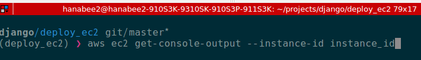  
	
	- instance_id는 aws console에서 확인가능
	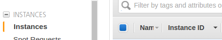  
	
	- 그러면, SSH HOST KEY FINGERPRINTS 라는 부분을 찾을 수 있다고 하는데, ubuntu에서는 안보임.

### Nginx 가상서버 설정 파일 작성
- **서버로 접속**을 해서, /etc/nginx/sites-avalable로 이동하면, default라는 파일이 있음.
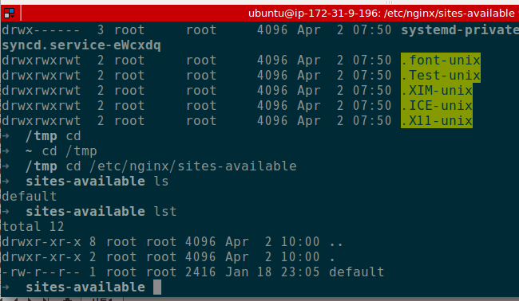 

- 그리고, aws console로 가서 
```
Security Groups -> Inbound -> Edit -> Add Rule -> HTTP 추가 -> Source는 Anywhere 선택
```
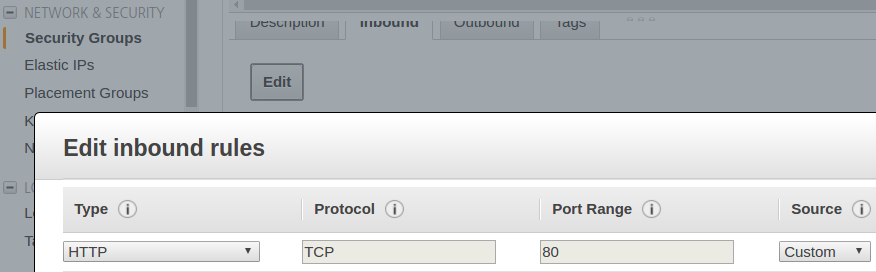  

- 그런 다음에, 브라우저에서 **인스턴스의 Public DNS**로 접속하면, 다음과 같은 화면이 나옴
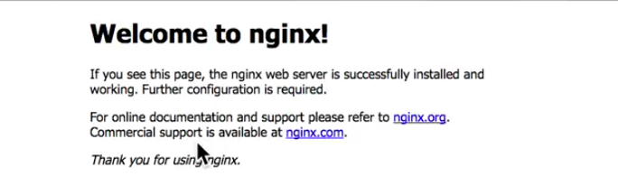  
- 그렇담, 브라우저에 출력된 내용은 어디서 나온 것인지. 하기 그림처럼 default 파일을 열어 보면,
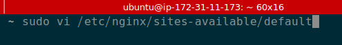  
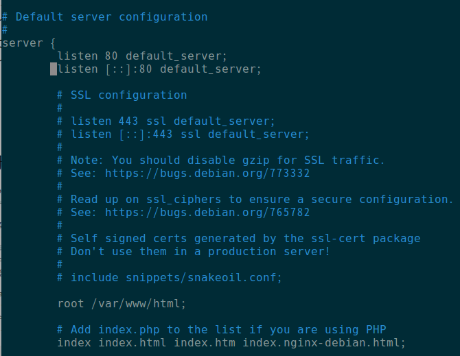  
- listen 80 : 80번 port로 들어오는 요청을 받겠다. html의 위치는 /var/www/html에 있는데,  index index.html index.htm index.nginx-debian.html 이런 파일들 중에서 읽어 오겠단 의미. 
- **서버에 접속**해서 확인해보면,
```
➜  ~ ll /var/www/html/ 
total 12
drwxr-xr-x 2 root root 4096 Mar  7 03:25 ./
drwxr-xr-x 3 root root 4096 Mar  6 17:12 ../
-rw-r--r-- 1 root root  631 Mar  7 03:25 index.nginx-debian.html
```
- index.nginx-debian.html의 내용을 수정하면 브라우저의 내용이 바뀐 것을 확인할 수 있음.
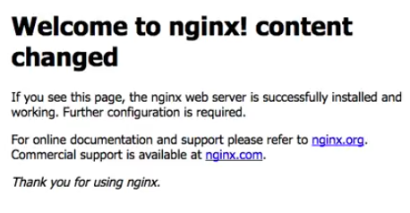  
- 이게 기본값임. 그러나, 우리는 이걸 사용할 것이 아니라, 브라우저로 접속하려 할 때, uwsgi와 django를 연결시켜줘야 함.
- 현재 우리는 uwsgi service를 등록해 놓았기 때문에 자동으로 켜져 있을 것임. ps -ax | grep uwsgi로 확인가능

여기까지가 170307 | EC2 Deploy 8 동영상 강의내용

- **서버로 접속**해서, 하기 파일 생성하여 하기 내용입력 
```python
sudo vi /etc/nginx/sites-available/app

server {
    listen 80;
    server_name localhost <Public DNS 입력>;
    charset utf-8;
    client_max_body_size 128M;

    location / {
        uwsgi_pass    unix:///tmp/app.sock;
        include       uwsgi_params;
    }
}
```

### 설정파일 심볼릭 링크 생성
- Nginx 가상서버 설정 파일 작성 후, 설정파일 심볼릭 링크 생성
```
> sites-enabled sudo ln -s ../sites-available/app .
```
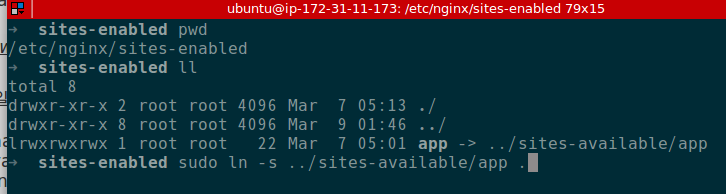  

- 그런데, 아래와 같은 에러가 발생하였음.
```python
➜  sites-enabled cd ../sites-available 
➜  sites-available sudo systemctl restart nginx
Job for nginx.service failed because the control process exited with error code. See "systemctl status nginx.service" and "journalctl -xe" for details.
➜  sites-available pwd
/etc/nginx/sites-available
➜  sites-available 
```

```python
➜  nginx pwd 
/etc/nginx
➜  sudo vi nginx.conf
```
- nginx.conf 파일로 가서 보면, 하기처럼 로그파일 위치가 나옴.
```python
access_log /var/log/nginx/access.log;
error_log /var/log/nginx/error.log;
```
- 해당 위치로 가서 cat으로 확인해보면 에러 로그를 확인할 수 있다.
- 위 파일(nginx.conf)에서 server_names_hash_bucket_size를 주석 해제하고, 64에서 512로 수정하였음.
- 수정한 다음, nginx restart하면 해결됨. 만약, 그래도 안되면, sudo로 app.pid와 app.sock을 삭제하고, **nginx와 uwsgi restart** 시켜볼 것.
```python
➜ sudo rm /tmp/app.pid
➜ sudo rm /tmp/app.sock

➜  sites-available pwd 
/etc/nginx/sites-available
➜  sites-available sudo systemctl restart nginx
➜  sites-available sudo systemctl restart uwsgi
```
- 이러면, Nginx(서버) <-> uWSGI <-> Django(웹 어플리케이션) 연결
 
- app.sock을 통해 WSGI 인터페이스가 요청을 받고 요청을 처리해준다. django와 server :Nginx와의 요청들을. (메모장 참고 및 정리 필요)
- 실제 app.sock에는 아무 데이터가 없음. Then, what is it for?
- 관련하여 uwsgi setting socket 로 구글링 한글문서는 별 소득 없다고 함.
- 공식 문서가 있음.[http://uwsgi-docs.readthedocs.io/en/latest/Configuration.html](http://uwsgi-docs.readthedocs.io/en/latest/Configuration.html)
- Nginx와 uwsgi간 통신은 unix socket으로 한다.
- 추천 도서(Advanced Programming in the UNIX Environment 3 : UNIX 고급 프로그래밍)

- 에러 발생시, 하기와 같은 순서로 디버깅 해보자.
```python
➜  nginx pwd
/var/log/nginx
➜  nginx sudo rm *.log
➜  nginx sudo systemctl daemon-reload
➜  nginx sudo systemctl restart nginx
➜  nginx sudo systemctl restart uwsgi
➜  nginx cat error.log 
```

### 도메인 설정하기
1. cloudflare.com에서 hosting.kr에서 구매한 도메인 mapping하는 법
2. 구매한 도메인 http에서 https로 변경하는 법

#### 1. cloudflare.com에서 DNS mapping하는 법
- A 창에 CNAME 선택하고, NAME에 ec2 입력, IPv4에 <aws console의 Instances에 가서 Public DNS> 입력하고, Add Record하면, 브라우저 ec2.hanabee337.com 연결 확인.
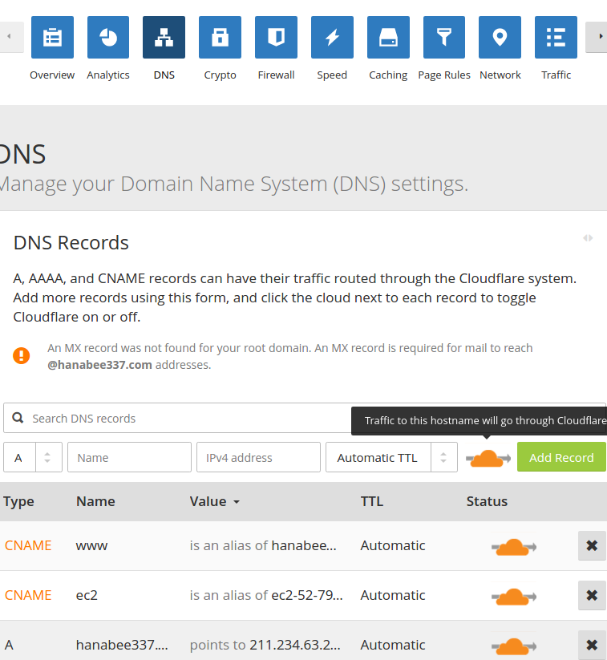  

#### 2. https로 변경하는 법
- https://www.cloudflare.com/a/page-rules/hanabee337.com에서 
Page Rules에서 create Page rules 클릭
- http://*.hanabee337.com/* 입력하고, Add a setting 클릭하여, Always Use HTTPS 선택
- 그러면, ec2.hanabee337.com 도메인이  https://ec2.hanabee337.com 으로 변경됨을 확인.
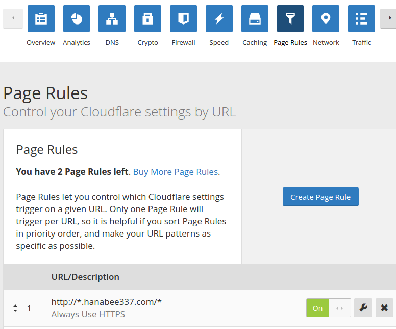  

여기까지가 170307 | EC2 Deploy 9 동영상 강의내용

---

### docker
[초보를 위한 도커 안내서 ](https://subicura.com/2017/01/19/docker-guide-for-beginners-2.html)

- docker 설치하기(**로컬 PC에서**)
```python
curl -s https://get.docker.com/ | sudo sh
```
- docker 설치 위치
```
> which docker
/usr/bin/docker
```

- docker는 기본적으로 root권한이 필요. root가 아닌 사용자가 sudo없이 사용하려면 해당 사용자를 docker그룹에 추가
```
❯ sudo usermod -aG docker $USER # 현재 접속중인 사용자에게 권한주기
```
- 사용자가 로그인 중이라면 다시 로그인 후 권한이 적용됩니다.

- **로컬 pc에 설치** 후, 
```python
❯ docker version
Client:
 Version:      17.03.0-ce
 API version:  1.26
 Go version:   go1.7.5
 Git commit:   60ccb22
 Built:        Thu Feb 23 11:02:43 2017
 OS/Arch:      linux/amd64

Server:
 Version:      17.03.0-ce
 API version:  1.26 (minimum version 1.12)
 Go version:   go1.7.5
 Git commit:   60ccb22
 Built:        Thu Feb 23 11:02:43 2017
 OS/Arch:      linux/amd64
 Experimental: false
 
❯ echo $USER # 환경 변수에 있는 user
hanabee2

❯ env # 환경 변수
```
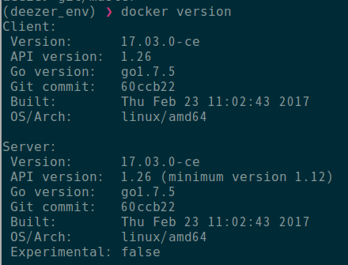  

- ubuntu 16.04 컨테이너를 생성하고 컨테이너 내부에 들어가 봅니다.
```python
❯ docker run ubuntu:16.04
❯ docker run --rm -it ubuntu:16.04 /bin/bash
root@b2d9efd26f67:/# cat /etc/issue
Ubuntu 16.04.2 LTS \n \l

root@b2d9efd26f67:/# ls
bin   dev  home  lib64  mnt  proc  run   srv  tmp  var
boot  etc  lib   media  opt  root  sbin  sys  usr
root@b2d9efd26f67:/# 
```
- root@ 뒤의 숫자는 컨테이너 이름
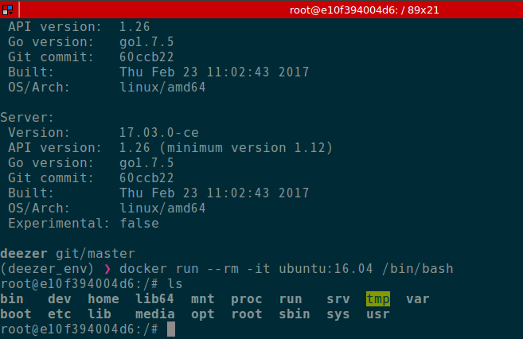  

여기까지가 170307 | EC2 Deploy 10 동영상 강의내용