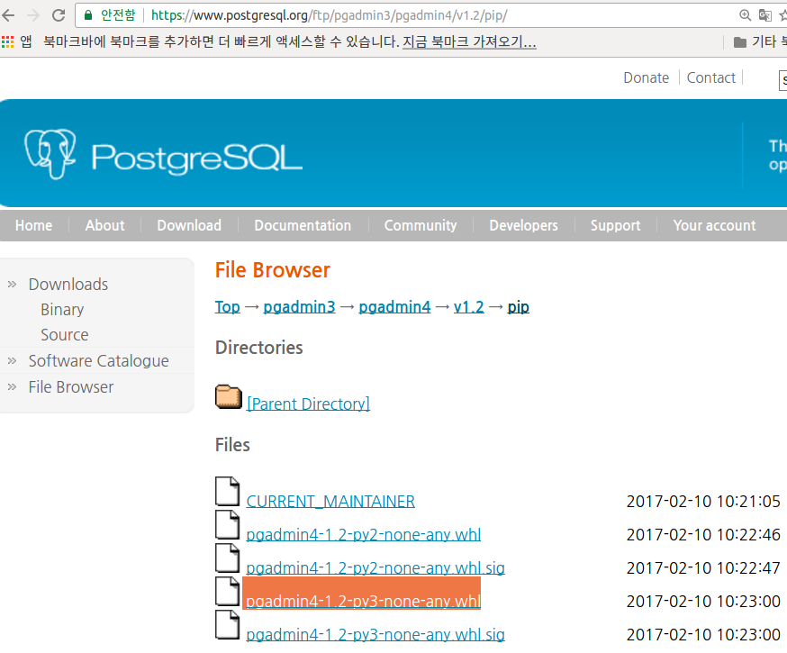
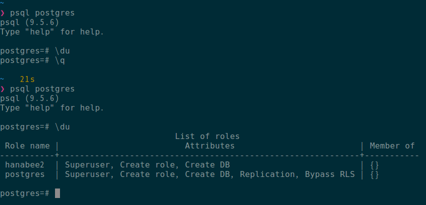
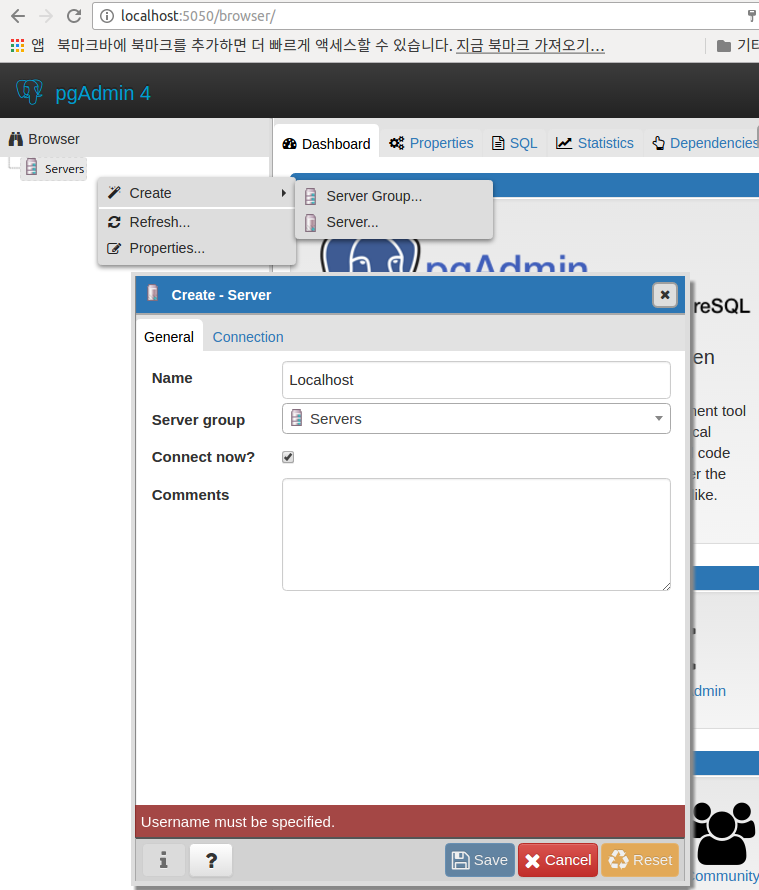
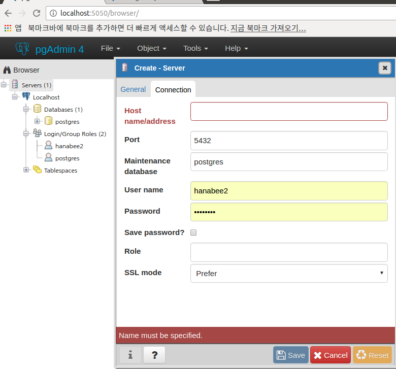
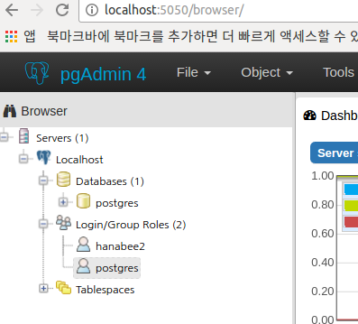
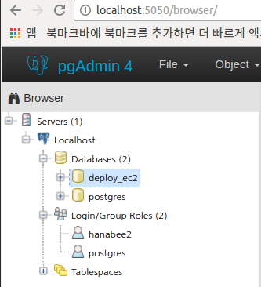
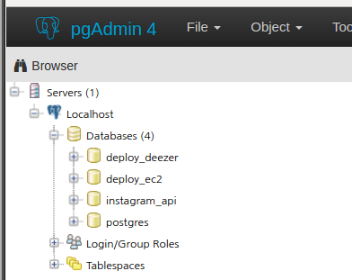

## postgreSQL 설치 및 pgAdmin 접속(2017.03.08)
- 관련 사이트
	- [https://www.postgresql.org/](https://www.postgresql.org/) 
	- [https://www.pgadmin.org/download/pip4.php](https://www.pgadmin.org/download/pip4.php) 
- pgAdmin is the most popular and feature rich Open Source administration and development platform for PostgreSQL.
 
### postgresql pgadmin
- 로컬 pc에서 pgamin용 가상환경 만들고 적용.
```
❯ mkdir pgadmin
❯ cd pgadmin
❯ pyen virtualenv 3.5.2 pgadmin
❯ pyenv local pgadmin
```

- 하기 패키지 설치
```python
(pgadmin) ❯ sudo apt-get install libpq-dev
```

- 하기 사이트에서 해당 링크 주소([https://www.postgresql.org/ftp/pgadmin3/pgadmin4/v1.2/pip/](https://www.postgresql.org/ftp/pgadmin3/pgadmin4/v1.2/pip/) ) 복사하여 wget으로 다운로드
  

```python
(pgadmin) ❯ pwd
/home/hanabee2/pgadmin

(pgadmin) ❯ wget [https://ftp.postgresql.org/pub/pgadmin3/pgadmin4/v1.2/pip/pgadmin4-1.2-py3-none-any.whl](https://ftp.postgresql.org/pub/pgadmin3/pgadmin4/v1.2/pip/pgadmin4-1.2-py3-none-any.whl)
```

- 다운로드 한 후, 다운로드 받은 파일을 install
```python
(pgadmin) ❯ pip install pgadmin4-1.2-py3-none-any.whl 
```

- install이 다 되었으면, [https://www.pgadmin.org/download/pip4.php](https://www.pgadmin.org/download/pip4.php) 에 나와있는대로 console 창에 하기 명령 입력 
```python
(pgadmin) ❯ python ~/.pyenv/versions/3.5.2/envs/pgadmin/lib/python3.5/site-packages/pgadmin4/pgAdmin4.py
Starting pgAdmin 4. Please navigate to http://localhost:5050 in your browser.
```

- 위의 메세지대로 브라우저에서 ```localhost:5050``` 입력하여 접속하면, 로그인 창이 보임. 
- pgAdmin 계정용 ID(이메일 주소)와 패스워드 입력하고 로그인
  

- postgresql
   


- 이제 로컬 pc에서 postgresql을 사용할 수 있게 설정 변경해보자.
	- ```.conf 폴더```에 ```settings_deploy.json``` 파일을 만들어, settings_local.json과 별도 관리. 
	- Why? 서버에서 사용할 값이랑 로컬에서 테스트할 값이랑 다르기 때문.
	- 참고로 json에선 작은 따옴표가 허용이 안됨.
	- 하기와 같은 내용을 적어준다. 기존 settings_local.json에선 다 허용하였으나, settings_deploy.json에선 해당 부분만 접속을 허용하겠단 의미.
```python
settings_local.json
{
  "django": {
    "allowed_hosts": [
      "*"
    ]
  },
    "db": {
    "engine": "django.db.backends.postgresql_psycopg2",
    "name": "db 이름", # 하기에서 생성한 db의 이름(deploy_ec2) 
    "user": "사용자 이름", # 하기에서 생성한 사용자 이름(hanabee2)
    "password":"패스워드", # 하기에서 설정한 패스워드
    "host":"호스트 이름",
    "port":"포트 번호"
  }
}
```

```python
settings_deploy.json
{
  "django": {
    "allowed_hosts": [
      "EC2 Instances의 Public DNS 입력",  # EC2 Instances의 Public DNS 
      ".ap-northeast-2.compute.amazonaws.com", EC2 Instances의 Public DNS의 뒷 부분
      ".이번에 구매한 도메인" # 이번에 구매한 도메인( . 포함)
    ]
  },
    "db": {
  }
}
```

#### postgres 에 대한 계정 만들기
- postgresql db에 대한 user 생성. 하기 그림처럼, General -> Name : Localhost 입력. Connection -> Host name: localhost, User name, Password 입력 후, Save 버튼 클릭
	  
	  

- 로컬 pc에서 user와 db 생성
- 유저 생성
```python
sudo -u postgres createuser -s -P <username>
관리자권한으로(sudo) 패스워드(-P)를 입력받아 <username>이름으로 superuser(-s)를 생성하라는 의미.
(pgadmin) ❯ sudo -u postgres createuser -s -P hanabee2
[sudo] password for hanabee2: 
Enter password for new role: 
Enter it again: 
```
- 그러면, 현재 하기 그림과 같은 상태일 것임.  
  

- 유저 삭제
```python
sudo -u postgres dropuser <username>
(pgadmin) ❯ sudo -u postgres dropuser hanabee2
```

- db 삭제
```python
sudo -u postgres dropdb <db name>
(pgadmin) ❯ sudo -u postgres dropdb deploy_ec2
```

- db 생성
```python
sudo -u postgres createdb <db name> --owner=<owner name>
(pgadmin) ❯ sudo -u postgres createdb deploy_ec2 --owner=hanabee2
```

- 그러면, 하기 그림과 같이 deploy_ec2라는 db가 생성된 것을 확인할 수 있다.
	  

- 이제, settings_local.json파일에서 "db"에 대한 설정 값 입력
```python
{
  "django": {
    "allowed_hosts": [
      "*"
    ]
  },
  "db": {
    "engine": "django.db.backends.postgresql_psycopg2",
    "name": "deploy_ec2",
    "user": "hanabee2",
    "password":"비밀번호 입력",
    "host":"localhost",
    "port":"port번호 입력"
  }
}
``` 
- 이와 관련된 내용을 settings.py에 적용해보자. DB를 sqlite3 대신 postgreSQL로 변경. [django postgresql settings](https://www.digitalocean.com/community/tutorials/how-to-use-postgresql-with-your-django-application-on-ubuntu-14-04)으로 구글링.

```python
settings.py에 하기와 같은 형식으로 입력한다.
예)
DATABASES = {
    'default': {
        'ENGINE': 'django.db.backends.postgresql_psycopg2',
        'NAME': 'myproject',
        'USER': 'myprojectuser',
        'PASSWORD': 'password',
        'HOST': 'localhost',
        'PORT': '',
    }
}

settings.py 에 변경된 내용은 아래와 같다. 

BASE_DIR = os.path.dirname(os.path.dirname(os.path.abspath(__file__)))
ROOT_DIR = os.path.dirname(BASE_DIR)
CONF_DIR = os.path.join(ROOT_DIR, '.conf-secret')
secret_key_file = open(os.path.join(CONF_DIR, 'settings_common.json')).read()
config_common = json.loads(secret_key_file)

CONFIG_FILE_NAME = 'settings_local.json' if DEBUG else 'settings_deploy.json'
config_file = open(os.path.join(CONF_DIR, CONFIG_FILE_NAME)).read()
print('config_file: {}'.format(config_file))
config = json.loads(config_file)
print(config)

DATABASES = {
    # 'default': {
    #     'ENGINE': 'django.db.backends.sqlite3',
    #     'NAME': os.path.join(BASE_DIR, 'db.sqlite3'),
    # },
    'default': {
        'ENGINE': config['db']['engine'],
        'NAME': config['db']['name'],
        'USER': config['db']['user'],
        'PASSWORD': config['db']['password'],
        'HOST': config['db']['host'],
        'PORT': config['db']['port']
    }
}
```

- 위의 내용입력하고, ./manage.py migrate하면 에러 발생함.
- 해당 패키지 **가상환경**안에서 설치
```python
django/deploy_ec2/django_app git/master*
❯ pwd
/home/hanabee2/projects/django/deploy_ec2/django_app
                                                                                                                                              
django/deploy_ec2/django_app git/master*
❯ pip install psycopg2
```
- 그리고나서, 다시 migrate하면, 우리가 사용하는 ```DB를 sqlite3에서 postgresql로 변경```한 것임.

- 하기 그림에서 postgres는 기본으로 설치되는 관리용 db임. 건드리지 말 것.
  

- 이제 settings_deploy.json파일에서 "db"에 대한 설정 값 입력
	- settinngs_local.json에서 설정했던 값들 그대로 사용

- local이랑 deploy를 구분하는 방법
```python
DEBUG = True를 하기처럼 변경

DEBUG = os.environ.get('MODE') == 'DEBUG'
print('DEBUG :{} '.format(DEBUG))
```
- 이렇게 해주면, console에 매번 하기처럼 입력을 해주어야 함.
```python
- MODE='DEBUG' 입력했을 때,
django/deploy_ec2/django_app git/master* 
❯ MODE='DEBUG' ./manage.py runserver 
DEBUG :True 

- MODE='DEBUG' 입력없을 때,
django/deploy_ec2/django_app git/master* 
❯ ./manage.py runserver
DEBUG :False 
```

#### Custom Script 만들기
- 이런 번거로움을 해결하고자, script로 작성(폴더와 파일 생성하여 작성)
```python
~/.scripts
❯ pwd
/home/hanabee2/.scripts
                                                                           
~/.scripts
❯ ll
합계 12
drwxrwxr-x  2 hanabee2 hanabee2 4096  3월  9 22:39 ./
drwxr-xr-x 55 hanabee2 hanabee2 4096  3월  9 22:40 ../
-rwxr-xr-x  1 hanabee2 hanabee2   42  3월  8 14:36 manage*

~/.scripts
❯ vi manage

#!/bin/bash
MODE='DEBUG' ./manage.py $*
```
- script 실행가능 모드로 변경
```python
chmod 755 manage
```
- 그런다음, .zshrc로 이동하여, 내 scripts 폴더를 로컬 shell에서 실행하는 경로에 추가해준다.
```python
7 # My Scripts
8 export SCRIPTS_PATH="/home/hanabee2/.scripts"
9 export PATH="$PATH:$SCRIPTS_PATH"
```
- 추가한 후, zshrc 적용(source 명령사용) 

여기까지가 170308 | PostgreSQL, CustomScriptPath 영상강의 내용

#### postgresql 설치
- 로컬에서 추가 작업된 내용들을 ubuntu 서버에도 반영하기 위해 scp로 파일 전송해준다.
```python
scp -r -i ~/.ssh/bhj-fcs-wps-4th.pem /home/hanabee2/projects/team-7/login-func/deezer/. ubuntu@{인스턴스의 Public DNS}:/srv/app/
```

- ```로컬에서 했던 작업들을 ubuntu 서버에서도 똑같이``` 작업해준다.
- ubuntu **서버의 가상환경**으로 가서 (/srv/app/django_app) 작업한다.
- postgresql 설치
[ubuntu install postgresql](https://www.digitalocean.com/community/tutorials/how-to-install-and-use-postgresql-on-ubuntu-14-04)로 구글링
```python
sudo apt-get update
sudo apt-get install postgresql postgresql-contrib
```
- 그런 다음, migrate해보면, user가 없다고 에러 발생함.
- 그래서, local.json 때와 마찬가지로 user 생성, db 생성 후, migrate한다.
```python
sudo -u postgres createuser -s -P <username>
sudo -u postgres createdb <db name> --owner=<owner name>
```
여기까지가 170308 | EC2 Deploy 11 PostgreSQL

#### manage script 작성 : debug 환경변수 모드 때문. (~/.scripts/manage)
```
django/deploy_ec2/django_app git/master* 
❯ pwd 
/home/hanabee2/projects/django/deploy_ec2/django_app

django/deploy_ec2/django_app git/master* 
❯ manage runserver
```

- manage collectstatic


### S3
- sudo -u postgres dropdb deploy_ec2
- sudo -u postgres createdb deploy_ec2 --owner=hanabee2
- sudo -u postgres createuser -s -P hanabee337 하고, password 입력
- manage makemigrations
- manage migrate