# EC2 Deploy
---

## StaticFiles(2017.03.08)

### Image file 서버에 upload해서 확인해보기 
- 하기 그림과 같이 django_app 안쪽에 static/images 폴더 생성하여 이미지 파일 첨부하고, html 파일 수정
	
- `````` 추가하였는지 확인
-  settings.py 함수에서도 하기 설정 확인
```python
# static
STATIC_URL = '/static/'
STATIC_DIR = os.path.join(BASE_DIR, 'static')
STATICFILES_DIRS = [
    STATIC_DIR,
]
```
- 그런다음, ec2의 rds로 deploy하고난 후, 브라우저로 접속한 결과, 그림이 안나온다.
	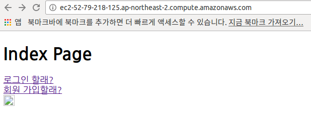 

- 왜 그럴까? 개발자 도구에서 보면, static 파일을 불러오지 못해서 그런 것임.
	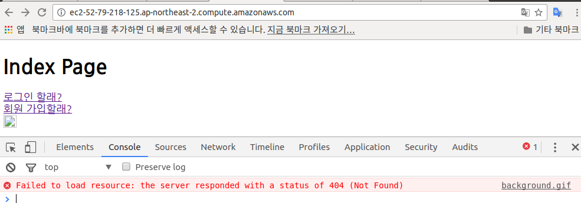 

- 그런데, admin을 접속해보면, 아래 그림과 같이 개발자 도구에 css 경로가 static/admin/css/로 되어 있다. 
	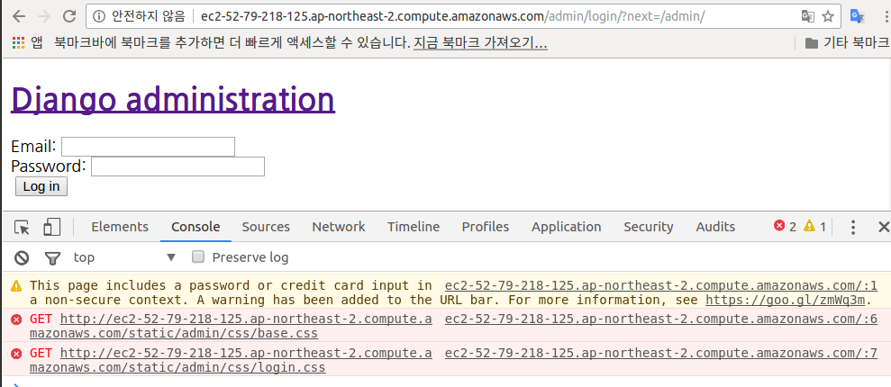 

- 그렇담, admin이란 폴더는 어디에 있는 폴더인가? 아래 그림처럼, External Libraries의 site-packages안에 있다.
	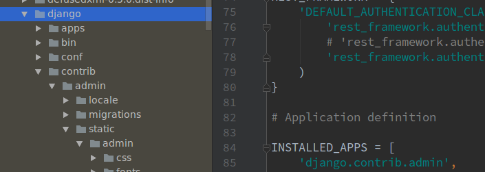
 
### collectstatic이란?
- 한 번 collectstatic 명령을 수행해보자. 수행해보면, 아래와 같이 에러가 발생할 것이다.
	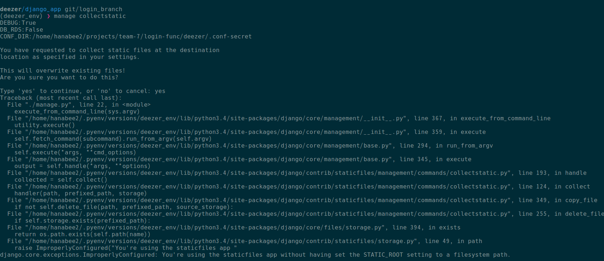 
	
- 이유는 ```You're using the staticfiles app without having set the STATIC_ROOT setting to a filesystem path.```라는 문구때문
- 그래서, ```STATIC_ROOT```를 settings.py에 설정해준다.
- 그 다음에, 다시, collectstatic을 수행하면( ex) ./manage.py collectstatic), django_app 폴더 바깥쪽에 static_root 폴더가 생겼고, 그 안에, 아까 위에서 봤던 admin 폴더와 내가 만들었던 images 폴더가 같이 복사되어 있는 것을 확인할 수 있다.
	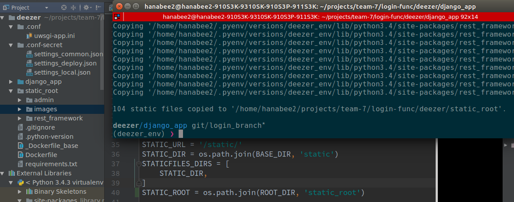 

- 생성된 static_root 폴더는 git에 추가가 되면 안되므로, ```.gitignore에 추가```해줘야 한다.
- 그리고나서, 다시 ```코드를 scp 명령으로 ubuntu 서버로 올려준다.```(~/.zshrc에서 alias로 작성한 deploy_ec2 사용하였음)
- ubuntu 서버로 가서(~/.zshrc에서 alias로 작성한 deploy_ec2 사용하였음) 위와 마찬가지로 , ```collectstatic 실행```(manage.py가 있는 위치에서)
- 그런 다음, uwsgi restart
```
(deezer_env) ➜  static_root git:(login_branch) ✗ sudo systemctl restart uwsgi.service
```
 - 자, 다시 브라우저에서 사진이 보이는지 확인해보자. 어?.. 아직 안보인다..왜지?
 - 이유는 현재, 특정폴더에 static 파일들을 몰아넣었는데, Nginx 한테 static 파일들의 경우, 이 특정폴더를 보게끔 설정을 아직 해주지 않은 상태이기 때문이라고 함.
- 먼저, ubuntu 서버로 들어가서 static_root 관련 location 하기처럼 내용 추가
(/etc/nginx/sites-available/app 파일에서 작성) 
	
	 
- 그런 다음, nginx restart 하면, 그림이 보인다~~
	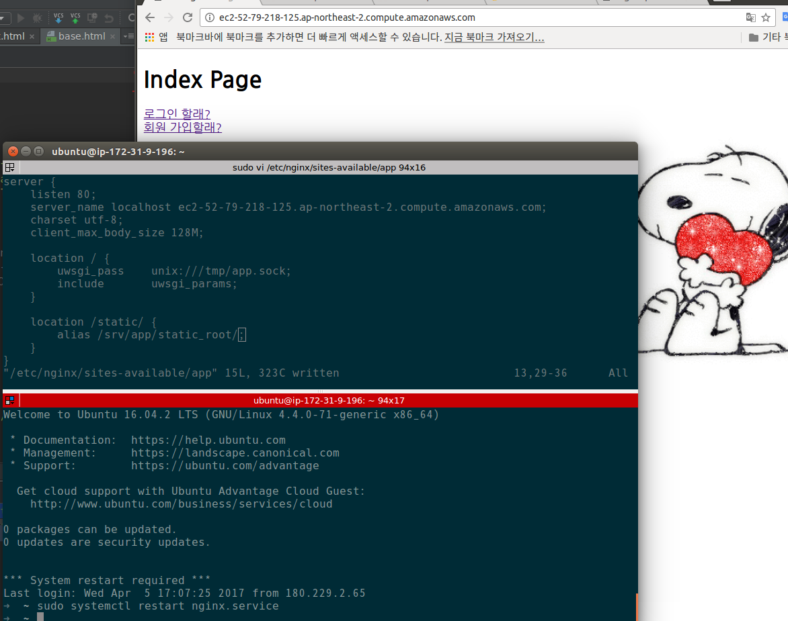 

여기까지가 170308 | EC2 Deploy 12 StaticFiles 강의내용

## Media(MEDIA_ROOT, MEDIA_URL)
- model, admin 에 'img_profile' field 추가하여, migrations 한다.
- settings.py에서 MEDIA_URL, MEDIA_ROOT 설정
	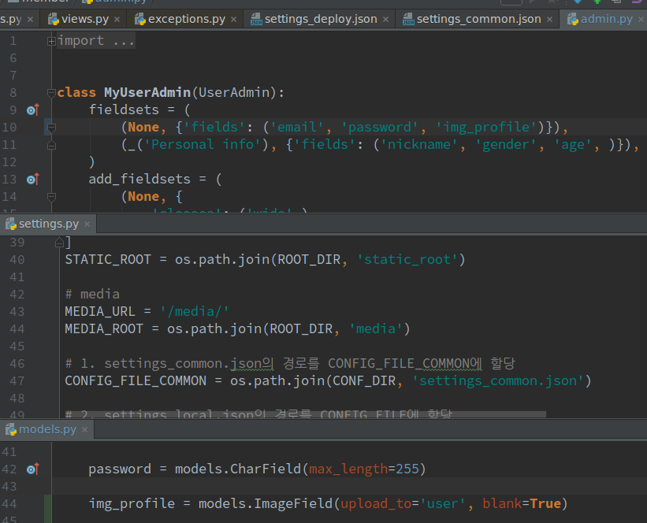 

- 그런 다음, admin site에 생성된 'image profile' field에서 파일을 선택하여 upload 해서, save해본다.
- 그 결과는 ?
	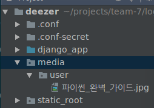 
- 위의 그림처럼, media 폴더가 settings.py에서 설정한 django_app폴더보다 하나 상위 폴더인 ROOT_DIR 안에 생성이 되었고,  그 media 폴더 안에 user 폴더가 생성되었고, 그 안에 아까 admin site에서 업로드한 이미지가 저장되어 있다..와~
 - 그런데, admin site에서 업로드한 이미지(파이썬_완벽_가이드.jpg)를 선택하면, 
	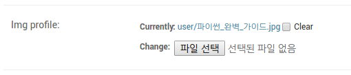 
	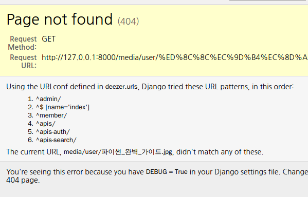 
- 위 그림처럼 에러가 발생한다.
- 그럼, 문제를 해결하려면 무엇을 해야하나?
- 아래 내용을 urls.py에 추가하면 된다. 근데, DEBUG 모드에서만 사용해햐 한다.
```python
if settings.DEBUG:
    urlpatterns += static(
        settings.MEDIA_URL,
        document_root=settings.MEDIA_ROOT
    )
```
**Warning!!** 
git push 할 때, media 폴더는 추가되지 않도록, .gitignore에 설정 반드시 할 것.

- server로 deploy한 후엔, Pillow 패키지가 서버엔 설치가 안되어 있으므로, 설치해준다.
- 아까, 로컬에서 했던 거와 마찬가지로 migrations을 해줘여 하고,
- ec2-~~~/admin으로 접속하여, 아까 로컬에서 했듯이, 이미지를 업로드 해본다.
- media 폴더의 권한을 777로 변경시켜준다.
```
chmod 777 media
```
- 그렇담, 매번 이런 식으로 해야 하는가?

## 서버 설정(MEDIA, STATIC)

### Media
> 본인의 media 폴더 위치

`sudo vi /etc/nginx/sites-available/app에서`
```python
location /media/ {
	alias /srv/app/media/;
}
```
**이미지 업로드시 Permission Denied 발생시**
`sudo chmod 777 mdeia`로 media 폴더의 권한을 변경, 'media' 폴더의 하위 폴더 모두 삭제 후 다시 실행.

### Static
> 본인의 static_root 폴더 위치확인

`sudo vi /etc/nginx/sites-available/app에서`
```python
location /static/ {
	alias /srv/app/static_root/;
}
```

## 데이터베이스
**유저 생성**
`sudo -u postgres createuser -s -P <username>`

**삭제**
`sudo -u postgres dropdb <db name>`

**생성**
`sudo -u postgres createdb <db name> owner=<owner name>`

여기까지가 170308 | EC2 Deploy 13 Media 강의 내용

# S3 란?
- [AWS S3 링크](http://docs.aws.amazon.com/ko_kr/AmazonS3/latest/dev/Welcome.html) 
- [S3 개념도](http://docs.aws.amazon.com/AmazonS3/latest/gsg/GetStartedWithS3.html)

- AWS에서 IAM 등록된 user한테 S3를 사용할 수 있는 권한을 설정해줘야 한다. 현재는 EC2FullAccess 권한만 준 상태.
	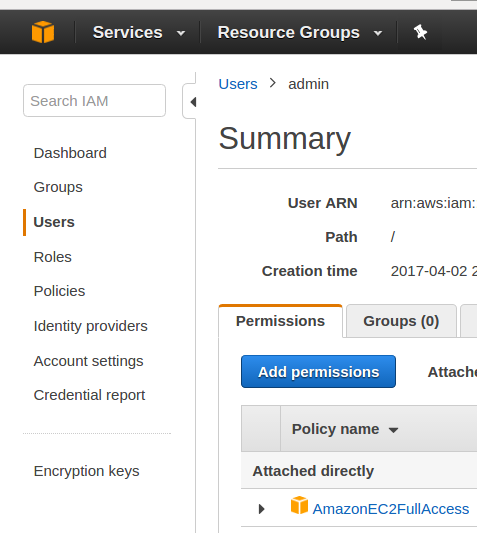 

- `Add permission`클릭 -> `Attach existing policies directly` 선택
- Search 란에서 s3 입력하여 `S3FullAccess` 선택 -> `Next: Review`
	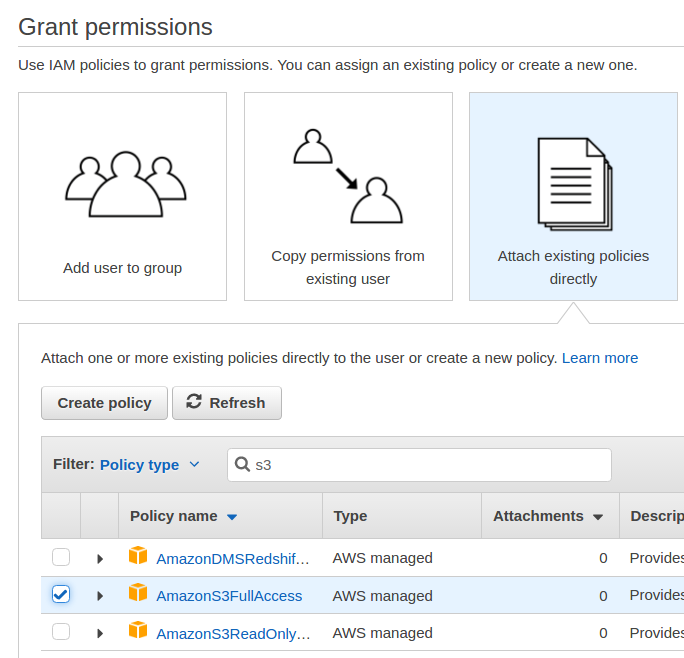 

- 결과
	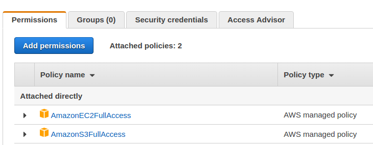 

- 파이썬에서 아마존을 쉽게 쓸 수 있게 porting한 library가 `boto3`
- boto3 설치 `pip install boto3`
- 로컬 pc에서 하기와 같이 boto3 라이브러리를 사용해서 bucket 생성
```
deezer git/login_branch  
(deezer_env) ❯ python
Python 3.4.3 (default, Jan 25 2017, 12:27:03) 
[GCC 5.4.0 20160609] on linux
Type "help", "copyright", "credits" or "license" for more information.
>>> import boto3
>>> session = boto3.Session(profile_name='default')
>>> client=session.client('s3')
>>> client.create_bucket(Bucket='fs-wps-5th', CreateBucketConfiguration={'LocationConstraint': 'ap-northeast-2'})
{'Location': 'http://fs-wps-5th.s3.amazonaws.com/', 'ResponseMetadata': {'HostId': 'zEiQ5Y+7KejE1yw10jWBGrVTHrbdGB2DFVr8CdRHi8vfVPvZfs2BFb1ab762wpXNSV7Jh4iyoEQ=', 'RetryAttempts': 0, 'HTTPStatusCode': 200, 'HTTPHeaders': {'content-length': '0', 'location': 'http://fs-wps-5th.s3.amazonaws.com/', 'x-amz-id-2': 'zEiQ5Y+7KejE1yw10jWBGrVTHrbdGB2DFVr8CdRHi8vfVPvZfs2BFb1ab762wpXNSV7Jh4iyoEQ=', 'x-amz-request-id': 'F315E9880DF15685', 'date': 'Thu, 06 Apr 2017 15:43:05 GMT', 'server': 'AmazonS3'}, 'RequestId': 'F315E9880DF15685'}}
```
- 생성된 것을 확인하는 방법은 AWS S3로 가면 생성된 것을 확인 할 수 있다.
	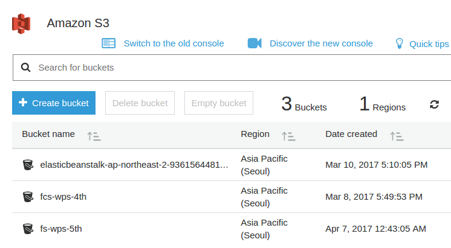 

여기까지가 170308 | EC2 Deploy 14 Create S3 Bucket 강의내용

## StaticFiles S3(2017.03.09)
- `django-storages`[관련 링크](https://django-storages.readthedocs.io/en/latest/backends/amazon-S3.html)

- `django default file storage` 으로 검색하여 django doc 참조

- 하기 링크 참조하여 `settings.py`에 S3관련 내용 반영
	- [boto3 setting](https://django-storages.readthedocs.io/en/latest/backends/amazon-S3.html)

- `pip install django-storages`
- Add `storages` to your settings.py file:
```
INSTALLED_APPS = (
    ...
    'storages',
    ...
)
```
```
STORAGE_S3 = os.environ.get('STORAGE') == 'S3' or DEBUG is False

if STORAGE_S3:
    DEFAULT_FILE_STORAGE = 'storages.backends.s3boto3.S3Boto3Storage'
    STATICFILES_STORAGE = 'storages.backends.s3boto3.S3Boto3Storage'
else:
    STATIC_ROOT = os.path.join(ROOT_DIR, 'static_root')
    STATIC_URL = '/static/'
```
- `MODE='DEBUG' STORAGE='S3' ./manage.py runserver` 실행
- 결과, `S3 bucket`에 폴더 업로드 확인
	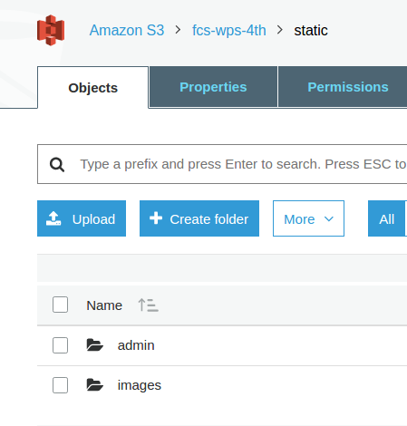 
	 
	
- 그러나, runserver 시, STATIC_URL관련 에러 발생
	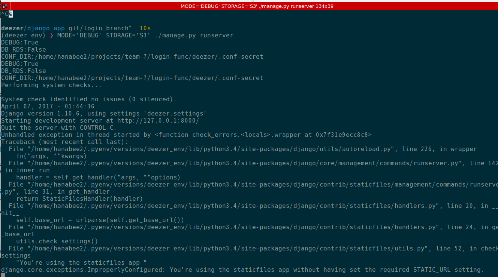 

- 그래서, 하기와 같이 `settings.py` 파일 수정
```
# AWS
AWS_S3_HOST = 's3.{}.amazonaws.com'.format(config['aws']['s3_region'])
AWS_S3_SIGNATURE_VERSION = config['aws']['s3_signature_version']
AWS_STORAGE_BUCKET_NAME = config['aws']['s3_storage_bucket_name']
AWS_S3_CUSTOM_DOMAIN = '{}.s3.amazonaws.com'.format(AWS_STORAGE_BUCKET_NAME)

if STORAGE_S3:
    DEFAULT_FILE_STORAGE = 'storages.backends.s3boto3.S3Boto3Storage'
    STATICFILES_STORAGE = 'storages.backends.s3boto3.S3Boto3Storage'
    STATIC_URL = 's3.{region}.amazonaws.com/{bucket_name}/'.format(
        region=config['aws']['s3_region'],
        bucket_name=config['aws']['s3_storage_bucket_name']
    )
else:
    STATIC_ROOT = os.path.join(ROOT_DIR, 'static_root')
    STATIC_URL = '/static/'
```
- 위의 코드를 반영한 후, 다시 runserver 해보았더니, 강사는 에러가 없이 잘 되었지만, 나를 포함 다른 사람들은 url s3의 위치가 바뀌어서 나오는 바람에 s3 bucket에 있는 이미지를 제대로 로딩하지 못하는 것 같음.
	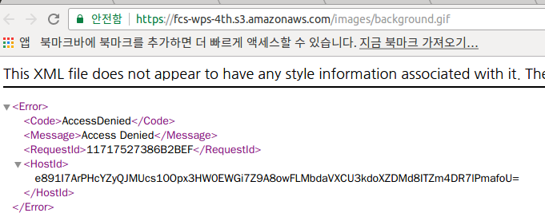 

- 그래서, 코드 다시 수정한다. 
- settings.py
```
if STORAGE_S3:
    DEFAULT_FILE_STORAGE = 'storages.backends.s3boto3.S3Boto3Storage'
    STATICFILES_STORAGE = 'deezer.storages.StaticStorage'
    STATICFILES_LOCATION = 'static'
    STATIC_URL = 'https://{custom_domain}/{staticfiles_location}/'.format(
        custom_domain=AWS_S3_CUSTOM_DOMAIN,
        staticfiles_location=STATICFILES_LOCATION
    )
else:
    STATIC_ROOT = os.path.join(ROOT_DIR, 'static_root')
    STATIC_URL = '/static/'
    # media
    MEDIA_URL = '/media/'
    MEDIA_ROOT = os.path.join(ROOT_DIR, 'media')
```
- urls.py
```
if settings.DEBUG and settings.STORAGE_S3 is False:
    urlpatterns += static(
        settings.MEDIA_URL,
        document_root=settings.MEDIA_ROOT
    )
```
- storages.py 파일 생성(settings.py 파일 있는 위치). 아까 앱에 추가한 `storages`의 라이브러리 오버라이딩
```
from storages.backends.s3boto3 import S3Boto3Storage

from deezer import settings
class StaticStorage(S3Boto3Storage):
    location = settings.STATICFILES_LOCATION
```

- 그 결과, 로컬에서도 이미지가 나오고, 해당 이미지에서 `새탭에서 이미지 열기' 해보면, 해당 이미지가 저장되어 있는 s3 bucket 주소가 보임.
	 

### Media 파일, Static 파일 구분
- 현재 위의 코드로는 media파일과 static 파일이 구분이 안됨. 이에 하기처럼 코드 추가
```
>> settings.py
if STORAGE_S3:
    # static files
    STATICFILES_STORAGE = 'deezer.storages.StaticStorage'
    STATICFILES_LOCATION = 'static'
    STATIC_URL = 'https://{custom_domain}/{staticfiles_location}/'.format(
        custom_domain=AWS_S3_CUSTOM_DOMAIN,
        staticfiles_location=STATICFILES_LOCATION
    )
    # media files
    DEFAULT_FILE_STORAGE = 'deezer.storages.MediaStorage'
    MEDIAFILES_LOCATION = 'media'
    MEDIA_URL = 'https://{custom_domain}/{mediafiles_location}/'.format(
        custom_domain=AWS_S3_CUSTOM_DOMAIN,
        mediafiles_location=MEDIAFILES_LOCATION
    )

>> storages.py

class MediaStorage(S3Boto3Storage):
    location = settings.MEDIAFILES_LOCATION
```

- 코드 수정한 후, s3 bucket 안에 있는 파일들 모두 삭제하고, collectstatic으로 올리고, 코드는 ubuntu 서버로 deploy해서 확인해보기.
- ubuntu 서버로 접속하여, admin site에 생성된 'image profile' field에서 파일을 선택하여 upload 해서, save한다.
- 그럼, 그 이미지는 어디에 저장이 될까?
	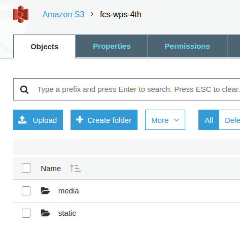 
- 아까는 static 폴더밖에 없었으나, 코그 수정한 대로 `media` 폴더가 생성된 것을 볼 수 있다.
- 즉, user가 업로드한 이미지들은 `s3 bucket의 media/user 폴더`에 저장하여 관리할 수가 있게 되었다.

- 위 코드 중 `STATICFILES_STORAGE`라는게 django에 따로 있다.
[관련 문서](https://docs.djangoproject.com/en/1.10/ref/contrib/staticfiles/)

- `DEFAULT_FILE_STORAGE`과 `STATICFILES_STORAGE`은 하는 일은 같은데,
- `STATICFILES_STORAGE`은 collectstatic을 했을 때, 어떤 storage를 쓰느냐이고,
- `DEFAULT_FILE_STORAGE`은 user가 이미지 필드나 파일 필드를 이용해서 업로드 했을 때, 장고안에서..
- 결국, `STATICFILES_STORAGE`는 우리는 collectstatic 이외에는 쓸 일이 없다. `DEFAULT_FILE_STORAGE`는 그 외 모든 경우에 다 쓰인다.
 
- `코드에 있는 static`이랑 `실제 serving이 되는 static`은 별개
- `코드에 있는 static 폴더`는 우리가 사이트를 만들기 위해 필요한 파일들.즉, 개발용.
- 그러나, `user가 바라보는 static 파일/폴더는` 우리가 가지고 있는 static 폴더/파일을 보는 것이 아니라, `s3에 있는 static 폴더/파일을 참조`하게 하는 것이다.

- 즉, 우리의 static 폴더는 `collectstatic을 하기 위한 원본`으로 이해하면 된다.

- 근데, 현재 코드는 같은 이름의 파일을 올리면(내용은 달라도), 기존 파일을 덮어써버리는 문제가 있다.
- 그걸 해결하는 option이 있다고 함.
```
class StaticStorage(S3Boto3Storage):
    location = settings.STATICFILES_LOCATION
    file_overwrite = True

class MediaStorage(S3Boto3Storage):
    location = settings.MEDIAFILES_LOCATION
    file_overwrite = False
```
- s3를 이용해서 static, media 파일 관리하는 법 끝.
- 내부에 있던 정적 파일, 이미지 파일을 밖으로 빼는 것까지 성공.


