# Docker(2017.03.07)
- [관련문서 링크](https://subicura.com/2017/01/19/docker-guide-for-beginners-1.html)

- docker 설치
```python
curl -s https://get.docker.com/ | sudo sh
```
- docker 설치 위치
```
> which docker
/usr/bin/docker
```

- docker는 기본적으로 root권한이 필요. root가 아닌 사용자가 sudo없이 사용하려면 해당 사용자를 docker그룹에 추가
```
❯ sudo usermod -aG docker $USER # 현재 접속중인 사용자에게 권한주기
```
- 사용자가 로그인 중이라면 다시 로그인 후 권한이 적용됩니다.

- **로컬 pc에 설치** 후, 
```python
❯ docker version
Client:
 Version:      17.03.0-ce
 API version:  1.26
 Go version:   go1.7.5
 Git commit:   60ccb22
 Built:        Thu Feb 23 11:02:43 2017
 OS/Arch:      linux/amd64

Server:
 Version:      17.03.0-ce
 API version:  1.26 (minimum version 1.12)
 Go version:   go1.7.5
 Git commit:   60ccb22
 Built:        Thu Feb 23 11:02:43 2017
 OS/Arch:      linux/amd64
 Experimental: false
 
❯ echo $USER # 환경 변수에 있는 user
hanabee2

❯ env # 환경 변수
```
  

- 만약 `docker images`를 입력해서 `ubuntu` 이미지가 안보이면, `docker pull ubuntu:16.04`
- ubuntu 16.04 이미지로 컨테이너를 하나 생성하고, 그 생성된 컨테이너 내부에 들어가 봅니다.
```python
❯ docker pull ubuntu:16.04
❯ docker run --rm -it ubuntu:16.04 /bin/bash
root@b2d9efd26f67:/# cat /etc/issue
Ubuntu 16.04.2 LTS \n \l

root@b2d9efd26f67:/# ls
bin   dev  home  lib64  mnt  proc  run   srv  tmp  var
boot  etc  lib   media  opt  root  sbin  sys  usr
root@b2d9efd26f67:/# 
```
- root@ 뒤의 숫자는 컨테이너 이름
  

- 그리고, 서버에서 했던 세팅들을 여기 docker안에서도 똑같이 해봅시다.
```
apt-get update
apt-get install python3
apt-get install python3-pip
apt-get install nginx
- 이상이 최소 패키지

cd /srv
mkdir app
cd  app

/srv/app# pip3 install django
/srv/app# pip3 install uwsgi
/srv/app# django-admin startproject eb
/srv/app/eb# python3 manage.py runserver
```

# Docker(2017.03.10)
- **docker 컨테이너로 접속**한 후, root 폴더에서 하기 작업 실행
```
❯ docker run --rm -it ubuntu:16.04
```
- docker 컨테이너 내부에서는 가상환경을 쓸 필요가 없으므로, 설정하지 않음.
- 반드시 ```apt-get update``` 먼저 실행할 것 
```
root@4dba4368e5f1:/# apt-get update
root@4dba4368e5f1:/# apt-get install python3
root@4dba4368e5f1:/# apt-get install python3-pip
root@4dba4368e5f1:/# apt-get install nginx

root@4dba4368e5f1:/# cd /srv
root@4dba4368e5f1:/# mkdir app
root@4dba4368e5f1:/# cd  app

root@4dba4368e5f1:/srv/app# pip3 install django
root@4dba4368e5f1:/srv/app# pip3 install uwsgi

root@4dba4368e5f1:/srv/app/# django-admin startproject eb

root@4dba4368e5f1:/srv/app/eb# python3 manage.py runserver
```
- 여기서 runserver를 실행시켰는데, 문제는 이 runserver한 곳에 접근할 방법이 없다.
-  지금 우리는 컨테이너를 열었는데, 이 컨테이너를 외부 포트랑 연결시켜주지 않으면, 컨테이너는 독립적으로 되어서 아무도 연결을 하지 못한다.
- 따라서, 외부 포트를 연결시켜 준 다음에, runserver를 돌리면 동작 확인을 할 수 있다.
- 현재는 컨테이너 이미지 안에서 runserver가 된다는 것만 확인한 상태임.

## docker 이미지의 특징/ Dockerfile
- 일단, 하기처럼 접속을 끊었다가 다시 접속해 보자.
```
root@4dba4368e5f1:/srv/app/eb# 
root@4dba4368e5f1:/srv/app/eb# exit
exit
                                  
~   1172s
❯ con-docker
root@48de037ae15e:/# python3
bash: python3: command not found
root@48de037ae15e:/# 
```
- 어?.. 분명히 아까 python 설치하지 않았었나?..왜 python 명령이 안되는 거지?
- 이유는 docker를 실행할 때의 이미지는 변하지 않는다. 그러나, 그 안에 무언가를 설치하였을 경우에는 docker를 종료시키는 동시에 사라져 버린다.
- 그럼, 해결 방안은?
	- 아까 했던 명령들을 매번 입력할 수 없으므로, ```Dockerfile```이라는 파일을 만드어서 필요 설정들을 저장한다.

# Dockerfile이 있는 위치에서 하기 command(로컬 PC PyCharm에서 작성해보자)
- Dockerfile은 확장자 없음. PyCharm에서 `File Type`에 docker 파일 등록한다. 파이참에다 `docker integrations plug-in` 설치
	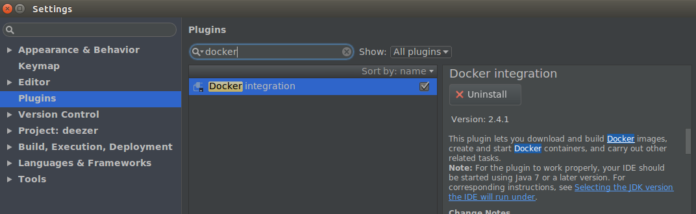 

- 그런 다음, 하기 명령을 수행해 보자.
- 여기서 eb는 `docker images`했을 때, REPOSITORY의 이름이다.
	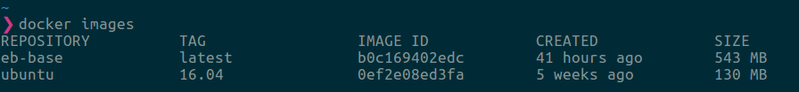 
```
> docker images

> docker build . -t eb-base -f _Dockerfile_base # _Dockerfile_base을 기준으로 해서 eb-base docker 파일을 만들어 준다.

> docker build . -t eb # eb라는 이미지로 build하겠다는 의미

> docker run --rm -it eb /bin/bash # eb라는 docker 이미지 실행

> docker run -p 4040:8080 eb # local port 4040과 docker 내부 port 8080을 연결해서 docker를 실행하겠다는 의미
```

```
> docker run --rm -it eb /bin/bash # eb라는 docker 이미지 실행
```
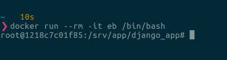 

# docker 삭제

- Delete all docker containers
```
docker rm $(docker ps -a -q)
```

- Delete all docker images
```
docker rmi $(docker images -q)
```
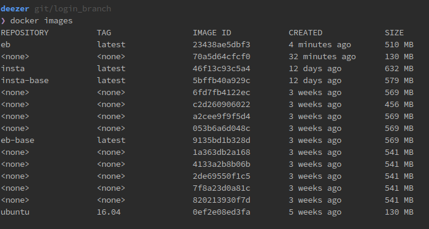  

- delete <none> images( -f는 force option)
```
1. docker rmi -f $(docker images | grep "^<none>" | awk "{print $3}") or
2. docker rmi -f $(docker images --filter "dangling=true" -q)
```
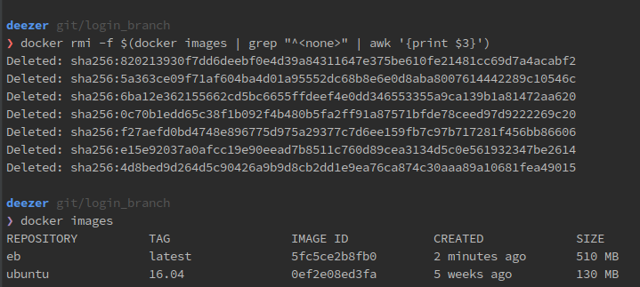  

- delete <none> images( -f는 force option)
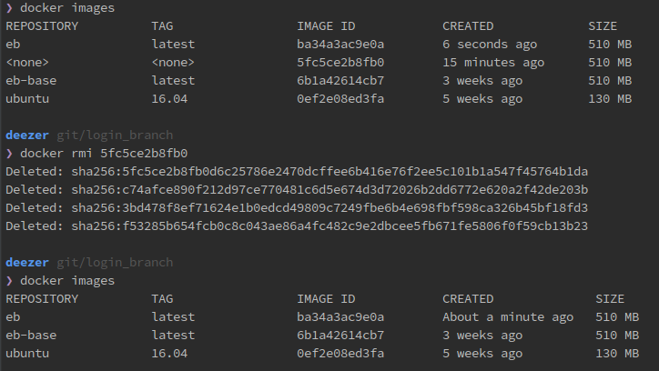  
```
docker rmi -f <IAMGE ID>
```

## docker 이미지로 localhost 연결해보기
1. '_Dockerfile_base' 파일을 생성하여 하기 그림과 같이 작성
	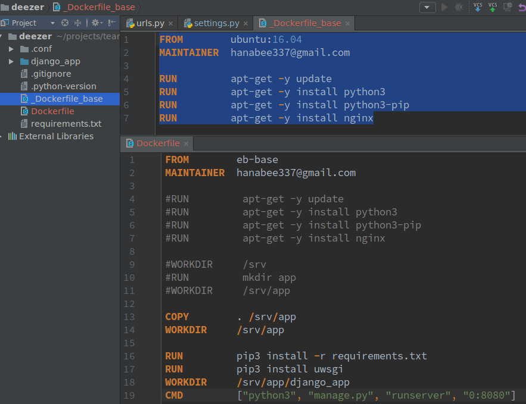  

2. 작성 후, 이미지 build
	```
	> docker build . -t eb-base -f _Dockerfile_base
	```
3. Dockerfile은 하기그림과 같이 작성
	  

4. eb-base 위에 이미지 쌓기 위해, eb 이미지 build
	```
	docker build . -t eb
	```
5. docker 포트 연결(-p : port )
	```
	docker run -p 4567:8080 eb
	```
- 4567은 `local 포트`(브라우저에서 사용할 포트와 동일한 값이면 됨)
- 8080은 `Dockerfile`파일에서 설정한 값으로 맞춰준다. `docker 포트`

6. 결과가 다음그림과 같이 나왔다.
	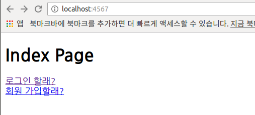  

**위 결과에 대한 전제 조건** 
	1. settings.py에서 DEBUG=True
	2. settings.py에서 DB가 'sqlite3'이어야 한다.
	3. localhost로 연결했으므로.
 
- docker 실행 예
```
1. docker run --rm -it ubuntu:16.04
2. docker run --rm -it eb-base
3. docker run --rm -it eb
```
- 3번의 경우는 실제 브라우저상에선 연결되지 않음.
	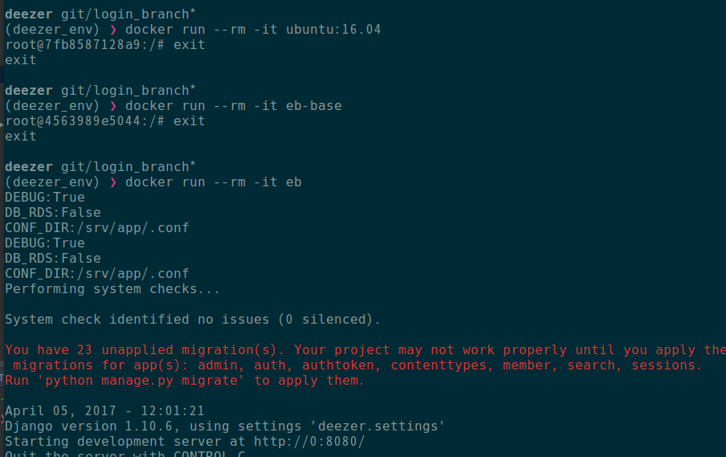  

여기까지가 170310 | Docker 2 강의


# 2017.03.10 Docker3(docker에 적용할 uwsgi 세팅)
	컨테이너 위에 있는 ubuntu에다가 uwsgi를 설치한 다음에, 컨테이너에 있는 설정파일에 uwsgi, nginx등의 설정들을 맞게 해놓고, uwsgi service를 실행하여 8080 포트를 열어놓으면, 결과를 확인할 수 있다.

1. uwsgi-app.ini 설정 파일을 하기 그림처럼 작성
	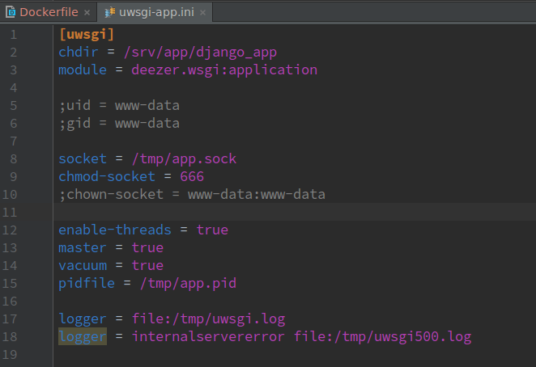
	
2. _Dockerfile_base 파일을 하기와 같이 작성하고, docker 이미지(eb-base) build
	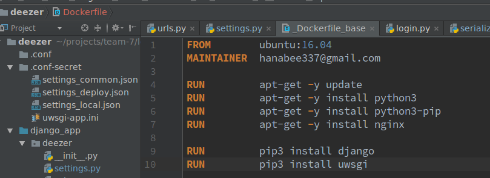
	```
	로컬 PC에서
	(deezer_env) ❯ docker build . -t eb-base -f _Dockerfile_base
	```

3. Dockerfile을 하기와 같이 작성하고, docker 이미지(eb) build
	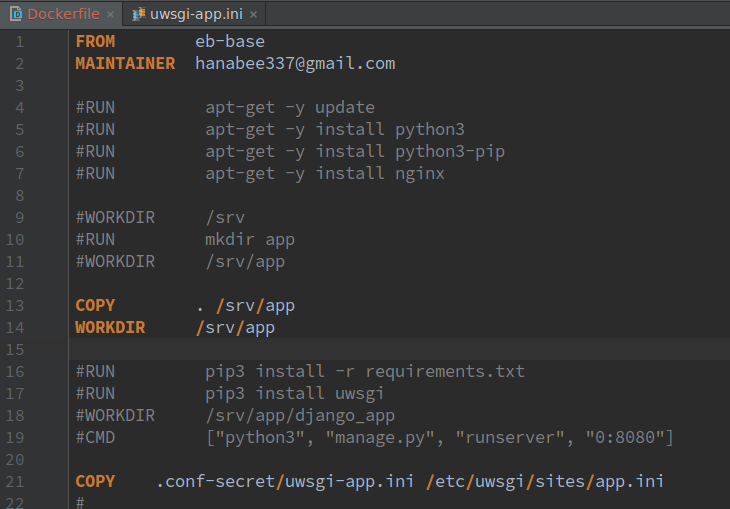

	```
(deezer_env) ❯ docker build . -t eb
	```

4. 하기와 같이 ```uwsgi를 이용하여 server를 켠다``` 
```
(deezer_env) ❯ docker run --rm -it -p 4040:8080 eb

root@8f9466775c75:/srv/app# uwsgi --http :8080 --chdir /srv/app/django_app/ -w deezer.wsgi
```
- 여기서 4040은 localhost 포트, 8080은 docker 포트

```
(deploy_eb_docker) 
root@8f9466775c75:/srv/app# uwsgi --http :8080 --chdir /srv/app/django_app -w config.wsgi

(여기서 config는 deploy_eb_docker 프로젝트의 프로젝트 명: /home/hanabee2/projects/django/deploy_eb_docker/django_app/config)
```
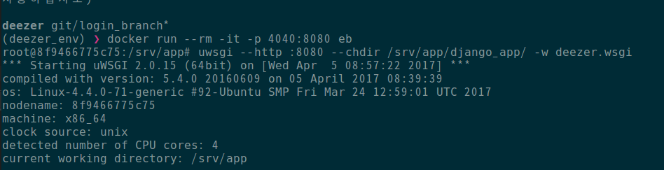 

5. 서버를 킨 다음에, local 포트 4040 포트로 열면, 브라우저에서도 하기 그림과 같이  localhost:4040으로 접속하면 연결이 될 것이다.
 	- 안됐다. Internal Server Error 발생
 	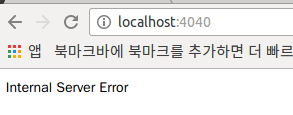 

	- 원인을 찾아보니, 하기 그림과 같이 import 에러가 났다. pip 패키지가 반영이 안되어 있어 그런 것. 그래서, Dockerfile에서 pip3 install -r requirementes.txt 주석 해제하고, 다시 docker 이미지(eb) build
	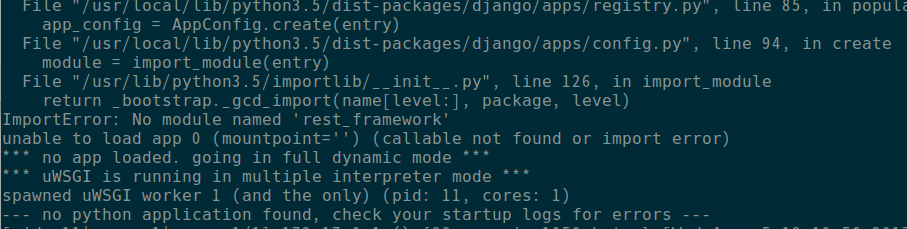 

	- 3, 4번 과정 다시 반복하였더니, 위의 그림과 같은 module import 에러 해결되었고, 브라우저에서 localhost:4040으로 정상연결 확인.
	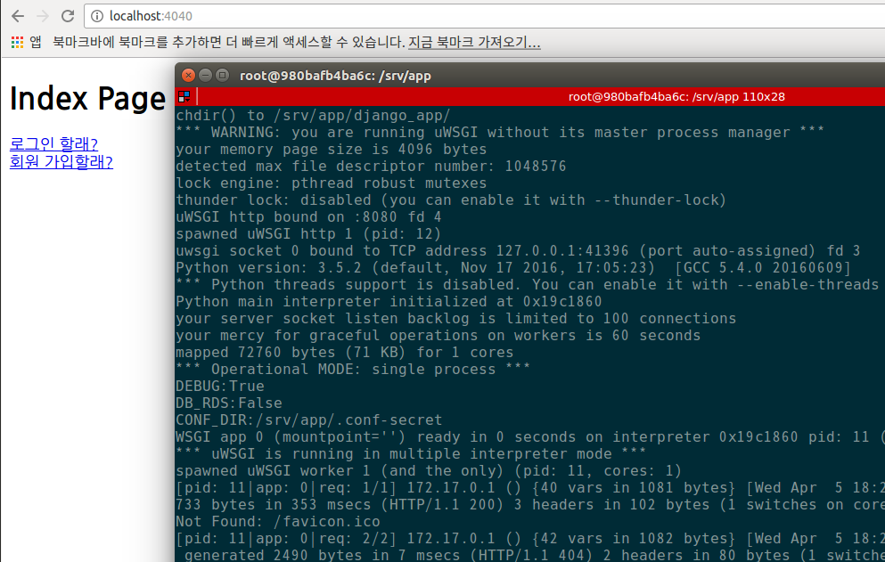 

6. 하기와 같이 입력을 하고, 브라우저상에서 정상 연결 다시 확인
	```
	root@63f1c1d9065a:/srv/app# uwsgi --http :8080 -i /etc/uwsgi/sites/app.ini
	```
	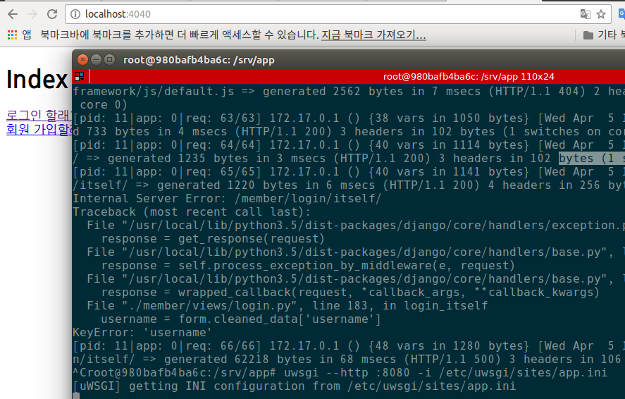 

- 로컬 PC에서 하기 그림과 같은 명령을 주면, 현재 실행되고 있는 docker container를 알 수 있는데, 포트가 연결된 해당 CONTAINER ID(IMAGE ID 아님)를 입력하면, container로 접속할 수 있다.
 
- `CONTAINER ID`는 `docker ps`를 입력하면 확인 할 수 있다.
	```
	(deploy_eb_docker) ❯ docker exec -it 63f1c1d9065a /bin/bash
	```
	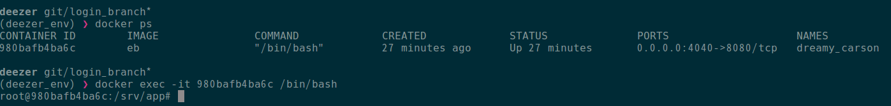 

- tmp 폴더로 이동하여 uwsgi.log를 확인
	- 확인 방법은 하기 명령을 한 후, 마지막 로그의 시간 확인 한 후, 현재 4040으로 연결한 브라우저 새로고침 한 후, 다시 하기 명령을 해서 마지막 로그의 시간을 보면 로그들이 추가된 것을 알 수 있다.
```
root@980bafb4ba6c:/tmp# cat uwsgi.log 
```

여기까지가 170310 | Docker 3 강의

# 2017.03.10 Docker4(docker에 적용할 uwsgi 세팅, nginx.conf, supervisor)
- 자, 이번엔 `nginx 세팅`을 해보자. `ubuntu 서버`에 있는 `nginx.conf` 파일을 복사해오자. 위치는 `/etc/nginx/nginx.conf`
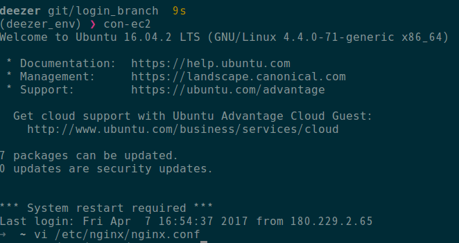 

```
user www-data; # ubuntu 서버에선 `user www-data;`로 되어 있지만, 여기선, `user root;`로 변경해서 사용함.
worker_processes auto;
pid /run/nginx.pid;
include /etc/nginx/modules-enabled/*.conf;

events {
        worker_connections 768;
        # multi_accept on;
}

http {

        ##
        # Basic Settings
        ##

        sendfile on;
        tcp_nopush on;
        tcp_nodelay on;
        keepalive_timeout 65;
        types_hash_max_size 2048;
        # server_tokens off;

        server_names_hash_bucket_size 512;
        # server_name_in_redirect off;

        include /etc/nginx/mime.types;
        default_type application/octet-stream;

        ##
        # SSL Settings
        ##

        ssl_protocols TLSv1 TLSv1.1 TLSv1.2; # Dropping SSLv3, ref: POODLE
        ssl_prefer_server_ciphers on;

        ##
        # Logging Settings
        ##

        access_log /var/log/nginx/access.log;
        error_log /var/log/nginx/error.log;

        ##
        # Gzip Settings
        ##

        gzip on;
        gzip_disable "msie6";

        # gzip_vary on;
        # gzip_proxied any;
        # gzip_comp_level 6;
        # gzip_buffers 16 8k;
        # gzip_http_version 1.1;
        # gzip_types text/plain text/css application/json application/javascript text/xml application/xml application/xml+rss text/javascript;

        ##
        # Virtual Host Configs
        ##

        include /etc/nginx/conf.d/*.conf;
        include /etc/nginx/sites-enabled/*;
}


#mail {
#       # See sample authentication script at:
#       # http://wiki.nginx.org/ImapAuthenticateWithApachePhpScript
#
#       # auth_http localhost/auth.php;
#       # pop3_capabilities "TOP" "USER";
#       # imap_capabilities "IMAP4rev1" "UIDPLUS";
#
#       server {
#               listen     localhost:110;
#               protocol   pop3;
#               proxy      on;
#       }
#
#       server {
#               listen     localhost:143;
#               protocol   imap;
#               proxy      on;
#       }
#}
```
- 그 다음엔, `ubuntu 서버`에 있는 `app` 파일도 복사해 온다. 위치는 `/etc/nginx/sites-available/app`
- `app`파일을 `nginx-app.conf`라고 renaming

```
server {
    listen 4040;
    server_name localhost ec2-52-79-218-125.ap-northeast-2.compute.amazonaws.com;
    charset utf-8;
    client_max_body_size 128M;

    location / {
        uwsgi_pass    unix:///tmp/app.sock;
        include       uwsgi_params;

        proxy_connect_timeout 300;
        proxy_send_timeout 300;
        proxy_read_timeout 300;
        send_timeout 300;
    }

    location /static/ {
        alias /srv/app/static_root/;
    }

    location /media/ {
        alias /srv/app/media/;
    }
}
```
- ubuntu 서버에서 가져온 app 파일 내용 중 /static/과 /media/는 여기서 serving하지 않고, AWS 쓸 것이므로, 여기선 필요없다.

- 자. 이제 그러면, 저 두 파일을 우리가 원하는 위치에 저장을 해주면 될 것이다.(밑의 연결 Flow 참조)

- PyCharm에서 `Dockerfile` 파일의 내용을 하기와 같이 수정한다.
```
FROM        eb-base
MAINTAINER  hanabee337@gmail.com

COPY      	. /srv/app
WORKDIR	/srv/app

RUN         pip3 install -r requirements.txt
RUN         pip3 install uwsgi

COPY        .conf/uwsgi-app.ini         /etc/uwsgi/sites/app.ini
COPY        .conf/nginx.conf            /etc/nginx/nginx.conf
COPY        .conf/nginx-app.conf        /etc/nginx/sites-available/app.conf
RUN         ln -s /etc/nginx/sites-available/app.conf /etc/nginx/sites-enabled/app.conf
```

- 수정한 다음, docker 이미지 빌드한다.
```
> docker build . -t eb
```
- 우리가 그전엔 `systemctl`이라고 해서 서비스형태로 프로그램을 실행하였으나, docker 안에서는 그렇게 실행하는 것이 불가능하다. 그래서, 다른 방식을 사용해야 함.

- 그 다른 방식이 다음과 같다.
```
django/deploy_eb_docker git/master*
(deploy_eb_docker) ❯ docker run --rm -it -p 5050:4040 eb #1
root@277ba9cb4569:/srv/app# nginx	#2
root@277ba9cb4569:/srv/app# uwsgi --ini /etc/uwsgi/sites/app.ini #3 
[uWSGI] getting INI configuration from /etc/uwsgi/sites/app.ini
```
- \#1에 대한 설명
	- 여기서 5050은 local port(임의로 정할 수 있음. 브라우저에서 같은 값으로 접속하기만 하면 된다.), 4040은 docker 내부용 port(`nginx-app.conf`에서 설정한 값), eb는 docker REPOSITORY
	- 즉, 로컬 브라우저에서 5050 포트로 접속하면, docker 내부의 4040 포트로 접속하게 되고, 그렇게 되면, 4040 포트로 들어온 접속 요청을 nginx(nginx.conf)가 받아서 처리하게 됨.

- \#2는 nginx 실행
- \#3을 수행하면, 로컬 브라우저에서 localhost:5050으로 접속이 가능하게 됨.
 

### 연결 Flow
`localhost:5050 포트로 접속 -> docker 4040 포트로 연결 -> 연결된 포트로 nginx가 연결 요청을 받음 -> nginx가 app.sock을 통해 uwsgi에 요청 -> 요청을 받은 uwsgi가 django app 구동`

- 그런데, nginx나 uwsgi가 어떤 오류로 인해서 죽었다. 그러면, 서버가 살아있어도 정상동작이 불가함. 이들을 관리하기 위해 `supervisor`라는 것을 사용한다.
	- [supervisor 링크](https://jwkcp.github.io/2016/11/07/how-to-use-supervisor-in-one-minute/)

- `supervisor`를 사용하기 위해 다음과 같이한다.

	1. `supervisor-app.conf` 파일 생성하여 하기 내용 추가
	```
	[program:uwsgi]
	command = uwsgi --ini /etc/uwsgi/sites/app.ini
	[program:nginx]
	command = nginx
	```

	2. `_Dockerfile_base`에서 `supervisor` install 시켜주는 구문 추가
	```
	FROM        ubuntu:16.04
	MAINTAINER  hanabee337@gmail.com
	RUN         apt-get -y update
	RUN         apt-get -y install python3
	RUN         apt-get -y install python3-pip
	RUN         apt-get -y install nginx
	RUN         apt-get -y install supervisor
	RUN         pip3 install django
	RUN         pip3 install uwsgi
	```

	3.  `_Dockerfile_base`파일이 수정되었으므로, build 다시 한다.
	`docker build . -t eb-base -f _Dockerfile_base `

	4. 그리고, 생성한 `supervisor-app.conf`가 동작할 수 있게, `Dockerfile`에서 설정해 준다.
	```
	중략
	COPY        .conf/uwsgi-app.ini         	/etc/uwsgi/sites/app.ini
	COPY        .conf/nginx.conf            		/etc/nginx/nginx.conf
	COPY        .conf/nginx-app.conf        	/etc/nginx/sites-available/app.conf
	COPY        .conf/supervisor-app.conf   /etc/supervisor/conf.d/		# 추가된 부분 
	RUN         ln -s /etc/nginx/sites-available/app.conf /etc/nginx/sites-enabled/app.conf
	EXPOSE      4040
	CMD         supervisord -n
	```

	5. `Dockerfile` 파일도 수정했으므로, build 다시한다.
	`docker build . -t eb`
	
	6. 그런데, `supervisord`는 daemond 형태로 돌아가는 것을 감지를 못한다고 함. 

	7. 그래서, daemon을 off 시켜줘야 함.
		- `nginx.conf` 파일에 daemon off 추가. 
		- 그러면, nginx가 backgroud로 돌지 않고, foreground로 돌게 되어 supervisord가 nginx를 인식할 수 있게 됨.
		- supervisord가 어떤 프로세스를 관리할려면, 해당 프로세스는 background로 돌면 supervisord는 인지하지 못함.
		- 그래서, `daemon off`를 추가하게 되면, nginx가 돌아가는 모드를 daemon이 아니라, 실제 shell prompt 상에서 돌아가게 해준다. 그러면, supervisord가 nginx를 인식할 수 있게 된다.
		- 만약, nginx나 uwsgi가 죽으면, supervisord가 다시 살려준다.
	
	8.  그런 다음, docker run 실행한다.
	`docker run --rm -it -p 5050:4040 eb`
		
	9. 정상적으로 동작한다면, 아래 그림과 같은 부분에서 프린트 문이 멈춰져 있어야 한다.
	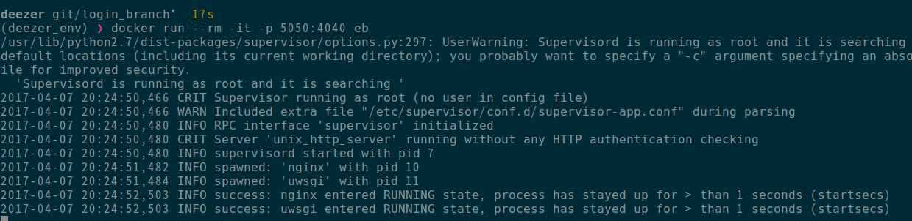 
		- 그림의 내용대로 supervisor가 실행된 다음에, nginx와 uwsgi를 만들고, success되서 실행되고 있고, supervisor는 running state 상태이므로, 그 이후에 아무 일도 안일어나므로, 프린트 문은 멈쳐져 있어야 한다. 
		- 근데, 만약 여기서, nginx나 uwsgi가 죽는 상황이 발생하면, supervisor가 다시 살려준다.
		- 이 상태가 되어야 한다. 이 상태에서 외부에서 5050으로 접속했을 때, 사이트가 아까처럼 계속 잘 나와야 한다.


여기까지가 170310 | Docker 4 강의 내용

 ---
 
# Elastic Beanstalk
 - `Dockerfile`을 하기와 같이 수정하여, 하나의 독립적인 파일로 만들었다.(_Dockerfile_base 없이 동작 가능하게)
```
 FROM        ubuntu:16.04
MAINTAINER  hanabee337@gmail.com

COPY        . /srv/app
WORKDIR     /srv/app

RUN         apt-get -y update
RUN         apt-get -y install python3
RUN         apt-get -y install python3-pip
RUN         apt-get -y install nginx
RUN         apt-get -y install supervisor

RUN         pip3 install -r requirements.txt
RUN         pip3 install uwsgi

COPY        .conf/uwsgi-app.ini         /etc/uwsgi/sites/app.ini
COPY        .conf/nginx.conf            /etc/nginx/nginx.conf
COPY        .conf/nginx-app.conf        /etc/nginx/sites-available/app.conf
COPY        .conf/supervisor-app.conf   /etc/supervisor/conf.d/
RUN         ln -s /etc/nginx/sites-available/app.conf /etc/nginx/sites-enabled/app.conf

EXPOSE      4040
CMD         supervisord -n
```
 
- 지금까지의 docker 이미지는 내 로컬 pc에 가상 환경에 저장되어 있으며, localhost로만 연결해서 테스트 하였다.
- 이제, docker 이미지를  EB에 올려 서버를 구동시켜 보자.
- docker 이미지를 이용해서 ec2로 배포할 수 있지만, 지금은 AWS EB에 올리는 것을 해보겠다.

- elastic beanstalk 참고 문서
	- [Deploying Elastic Beanstalk Applications from Docker Containers](http://docs.aws.amazon.com/ko_kr/elasticbeanstalk/latest/dg/create_deploy_docker.html)
	- [Getting Started Using Elastic Beanstalk](http://docs.aws.amazon.com/ko_kr/elasticbeanstalk/latest/dg/GettingStarted.html)
 
 
###  AWS EB CLI(command line interface)
- awsebcli를 설치한다. 
 `pip install awsebcli`
 - 그 다음, `eb init` 이라고 입력한다.
	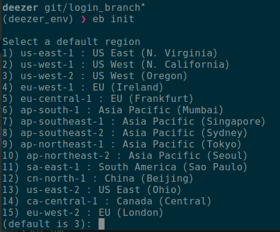 
	
- 10번 `ap-northeast-2`를 선택
- 어?..그런데, 다음과 같은 에러가 발생하였다. 왜 그럴까?..
	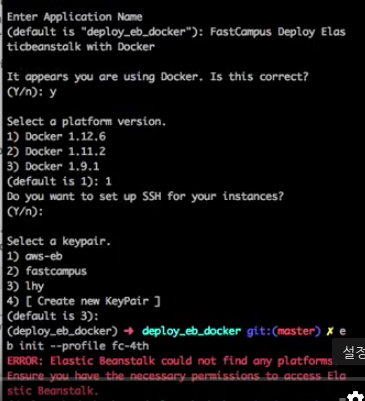 
- elastic beanstalk에 대한 권한을 user한테 주지 않아서 당연히 에러가 나는 거라고 함.

- 근데, 나는 기존 수업시간에 한 번 만들었었는데, 하기처럼 aws access key가 안맞는지 에러가 난다. 왜 그런지...
	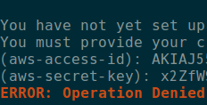 

- 권한을 주기 위해, `AWS IAM`으로 진입
	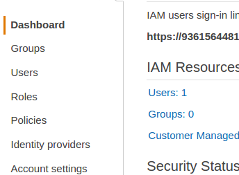 

- `User`항목 클릭하여 해당 user로 진입
	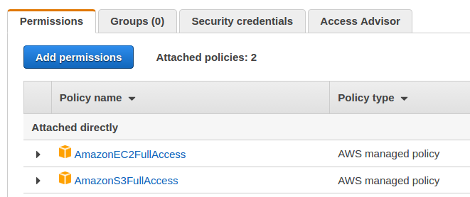 

- 여기서 `Add permission` 버튼 클릭한 다음, `Attach exsiting policies directly` 선택하고, 검색 창에 `elasticbeanstalk` 이라고 검색한다.
- 그런 다음, `AWSElasticBeanstalkFullAccess`을 선택
	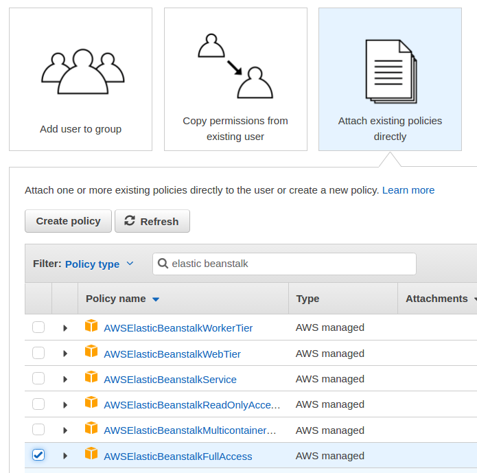 

- 최종 permission들은 다음과 같이 3개가 될 것이다.
	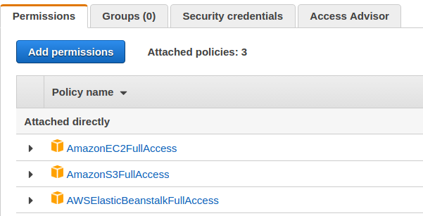 

- 그래도, 나는 에러가 계속 발생함. `aws-access-id`와 `aws-secret-key`가 안맞는다고 함.
	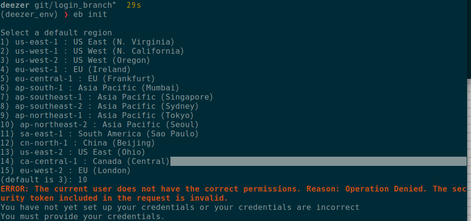

- 이전에 AWS로부터 다운받은 `credentials.crv` 파일에서 `aws-access-id` 와 `aws-secret-key` 입력. 
- `credentials.crv` 파일은 폴더 `.aws` 에서 저장하여 관리하고 있다.

- 그리고, 추가 항목 입력하면, 기본 세팅 완료
	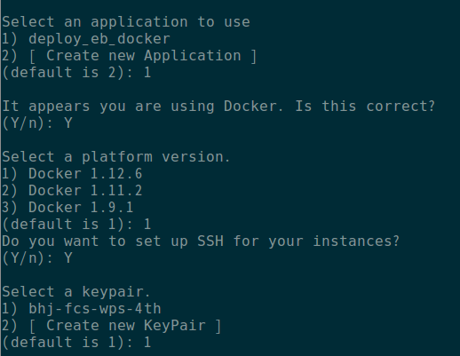

- 세팅이 완료되면, 방금 설정한 세팅들이 폴더 `.elasticbeanstalk` 밑에 파일에 생성/저장되어 있는 것을 볼 수 있다.
	 

- 만약 문제 발생시, `.aws` 폴더 밑에 `credential`과 `config` 파일을 확인해볼 것.

- [Getting Started Using Elastic Beanstalk](http://docs.aws.amazon.com/ko_kr/elasticbeanstalk/latest/dg/GettingStarted.html#GettingStarted.Walkthrough.CreateApp)
 
- [The Elastic Beanstalk Command Line Interface (EB CLI)](http://docs.aws.amazon.com/ko_kr/elasticbeanstalk/latest/dg/eb-cli3.html)

- [Managing Elastic Beanstalk Environments with the EB CLI](http://docs.aws.amazon.com/ko_kr/elasticbeanstalk/latest/dg/eb-cli3-getting-started.html)

- `eb init`이 완료되면, `eb create`를 한 다음, 그림과 같이 진행하면 된다.
	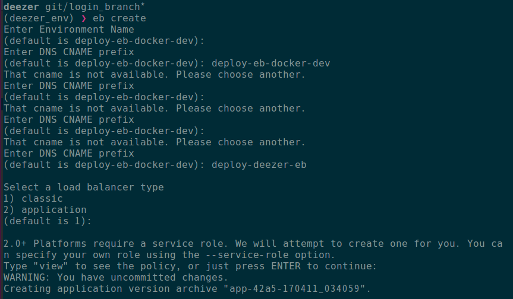

- 진행이 완료되면, `AWS Elastic Beanstalk`로 이동
	- 성공해야 되는데...실패함.
	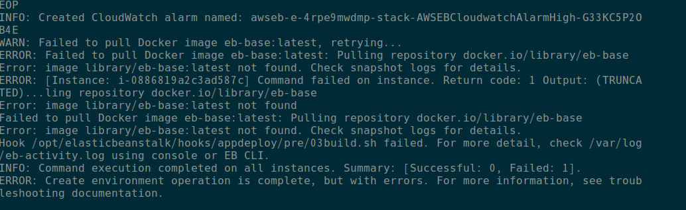
	
	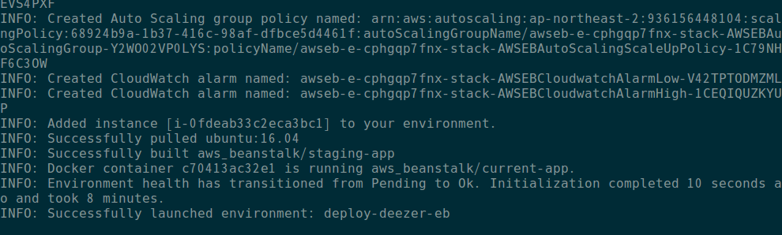
	
	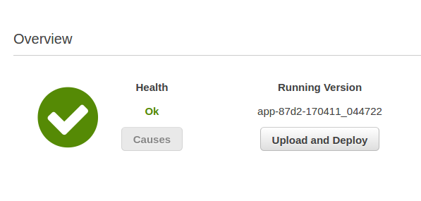
	
- `Dockerfile.aws.json` 파일 생성.
	- 우리 docker 파일에 의해 생성된 container에 대해 AWS에서 어떤 식으로 사용할 건지에 대한 설정을 하고자 한다.

- 완료되었으면, git commit 완료하고, `eb deploy`를 한다.
	- `Dockerfile.aws.json`에서 설정한 path인 `/var/app/current/django_app`으로 deploy하는 것.

- `eb ssh`라고 입력하면, 현재 돌아가고 있는 `elastic beanstalk instance`에 들어 갈 수 있다.
	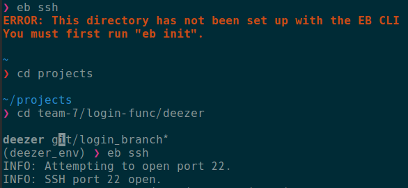

	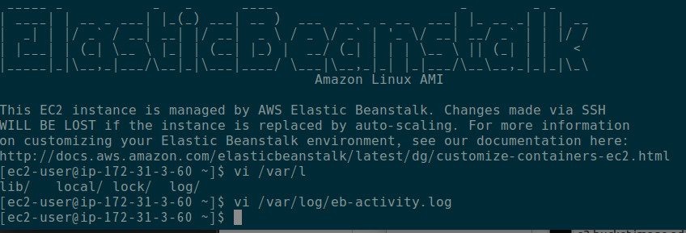

- 위 그림과 같이 `elastic beanstalk instance`로 들어온 다음에, 하기와 같은 command를 내리면, `elastic beanstalk`에서 `docker로 진입`할 수 있다.
```
sudo docker exec -it `sudo docker ps --no-trunc -q | head -n 1` /bin/bash
```
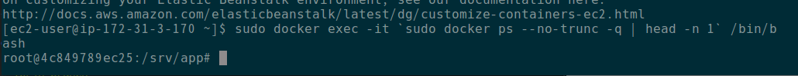 
