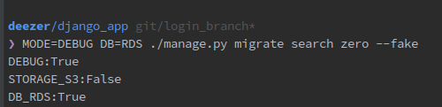
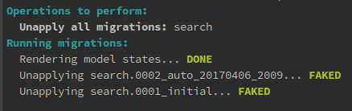
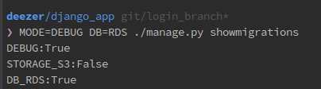
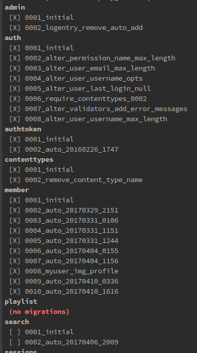
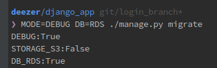
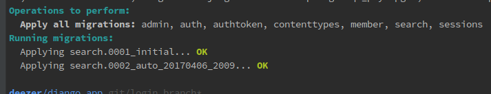

# Migrations 오류 발생시,

- 문제 시나리오) db를 직접 건드려서, db의 table을 삭제를 해버렸다. 로컬에서 makemigrations을 해도, db에 table이 생성되지 않는다. 그럴 경우, 다음과 같이 작업해서 해결

- `search`라는 앱을 fake로 migrations 취소한다.
	
	 
	

- `search` 앱을 fake로 zero migrations 한 결과
	
		
	

- 'search`앱을 이제 migrate하면, DB에 반영된다. 
	
	
	
