# Docker Nginx Node Proxy
## Dockerfile 설정
- docker 에서 nginx를 킨 다음에, reverse proxy로 node를 연결하는 실습
- 같은 서버안에, 프런트를 같이 올리는 것을 가정으로 진행함.
- 가능하면, 프런트와 백엔드를 분리해서 관리하는 게 좋음.
- DB, S3는 사용하는 것을 추천.
- django runserver가 되는 거랑 node를 이용한 서버가 runserver되는 거를 확인하는  실습
- node 설치하는 시간이 오래 걸림.
- 로컬에서는 되는데, 서버에서는 안되는 경우, `settings.py`의 `ALLOWED_HOSTS`를 한 번 확인해 볼 것.

- `nginx.conf` 파일은 `server_names_hash_bucket_size 512` 이 이슈 때문에 필요.
- `ngix-app.conf` 파일은 사이트 켜는 설정 파일. django_app을 가져다 사용한다는 설정과 

```python
server {
    listen                  4567;
    server_name             localhost;
    charset                 utf-8;
    client_max_body_size    128M;

    location /media/  {
        alias /srv/app/django_app/media/;
    }
    location /static/ {
        alias /srv/app/static_root/;
    }
    location / {
        uwsgi_pass  unix:///tmp/app.sock;
        include     uwsgi_params;
    }
}
```

- `uwsgi_pass  unix:///tmp/app.sock`의 의미
	- 4567 포트로 들어오는 요청은 unix 소켓을 통해서, app.sock을 이용해서 django와 통신하는데, django랑 통신하는 중간 매개체는 uwsgi이란 의미.

- `uwsgi-app.ini` 파일은 
	- `chdir = /srv/app/django_app` 실행 디렉토리와
	- `socket`, `pidfile` 위치 설정
- `supervisor-app.ini` 파일에서는 uwsgi 실행하는 command와 `nginx` 실행하는 command 설정
- .conf 폴더안의 docker 폴더안의 파일들
	- Dockerfile 하나의 파일에서 이미지 build하려면, 시간이 너무 오래 걸리므로, 나누어서 이미지 빌드 할 수 있게 분리.

## Dockerfile 생성을 위한 script 파일 생성
- `build.py` 파이썬안에서 이 파일안의 인자들을 사용할 수 있게 편집.  이를 위해 `import argparse` 내장 라이브러리 사용
- docker를 만들때, 자주 사용하는 것을 base로 만들어 놓구, 이걸 `FROM`을 써서, import해와서 그 위에다 새로운 이미지 build 했었는데, 그러면, docker 이미지 build하기 위해, 빌드 명령어를 따로 쳐서 만들어야 되는데..그 반복이 많아지게 되면, 귀찮으니.. `build.py`라는 script(?)로 작성.
- 그리고, `MODE`별로 생성 방법(base, debug, production..)을 달리 할 수 있게 작성.

```python
MODE_BASE = 'base'
MODE_BASE2 = 'base2'
MODE_DEBUG = 'debug'
MODE_PRODUCTION = 'production'

IMAGE_BASE = 'front-base'
IMAGE_BASE2 = 'front-base2'
IMAGE_DEBUG = 'front-debug'
IMAGE_PRODUCTION = 'front'
```

- apt-get update하고, nginx 설치하고, uwsgi 설치하고, pyhon3 설치하는 것들을 `front-base`라는 이름으로 이미지를 만들 것이고,
- 위의 이미지를 바탕으로 만들 실행 이미지는 `IMAGE_PRODUCTION = 'front'`, 이 이름으로 하겠다.
- Dockerfile을 이제 동적으로 만들고, 빌드도 동적으로 만들어 보겠다.
- 로컬에서 테스트 할때는 `MODE_BASE`를 이용해서, `front-base`라는 이미지를 만들고,
- 배포 시에는 `MODE_PRODUCTION`을 이용해서, `front`라는 이미지를 만들어 주겠다.

- build.py 파일 내용은 하기와 같다.

```python
import argparse
import os

# Const
import sys

MODE_BASE = 'base'
MODE_DEBUG = 'debug'
MODE_PRODUCTION = 'production'
IMAGE_BASE = 'front-base'
IMAGE_DEBUG = 'front-debug'
IMAGE_PRODUCTION = 'front'
MAINTAINER = 'hanabee337@gmail.com'

# ArgumentParser
parser = argparse.ArgumentParser(description='Build command')
parser.add_argument('-m', '--mode', type=str, default=MODE_DEBUG)
args = parser.parse_args()

# Paths
ROOT_DIR = os.path.dirname(__file__)
CONF_DIR = os.path.join(ROOT_DIR, '.conf')
CONF_DOCKER_DIR = os.path.join(CONF_DIR, 'docker')

# Docker conf files
dockerfile_template = open(os.path.join(CONF_DOCKER_DIR, '00_template.docker')).read()
dockerfile_base = open(os.path.join(CONF_DOCKER_DIR, '01_base.docker')).read()
dockerfile_extra = open(os.path.join(CONF_DOCKER_DIR, '02_extra.docker')).read()

if args.mode == MODE_BASE:
    dockerfile = dockerfile_template.format(
        from_image='ubuntu:16.04',
        maintainer=MAINTAINER,
        base=dockerfile_base,
        extra=''
    )
elif args.mode == MODE_DEBUG:
    dockerfile = dockerfile_template.format(
        from_image=IMAGE_BASE,
        maintainer=MAINTAINER,
        base='',
        extra=dockerfile_extra
    )
elif args.mode == MODE_PRODUCTION:
    dockerfile = dockerfile_template.format(
        from_image='ubuntu:16.04',
        maintainer=MAINTAINER,
        base=dockerfile_base,
        extra=dockerfile_extra
    )
else:
    sys.exit('Mode invalid')

print(dockerfile)
```

- 위의 파일을 실행해 보자. 아래와 같은 결과가 출력됨을 알 수 있다.(default가 debug)

```
❯ python build.py

FROM        front-base
MAINTAINER  hanabee337@gmail.com

COPY        .conf/uwsgi-app.ini /etc/uwsgi/sites/app.ini
COPY        .conf/nginx-app.conf /etc/nginx/sites-available/app
COPY        .conf/nginx.conf /etc/nginx/nginx.conf
COPY        .conf/supervisor-app.conf /etc/supervisor/conf.d/
RUN         ln -s /etc/nginx/sites-available/app /etc/nginx/sites-enabled/app

WORKDIR     /srv/app/django_app
EXPOSE      4567
CMD ["supervisord", "-n"]
```

- mode를 base로 했을 경우, 

```python
❯ python build.py -m=base

FROM        ubuntu:16.04
MAINTAINER  hanabee337@gmail.com

COPY        . /srv/app
RUN         apt-get -y update && \
            apt-get -y install python3 && \
            apt-get -y install python3-pip && \
            apt-get -y install nginx && \
            apt-get -y install supervisor

WORKDIR     /srv/app
RUN         pip3 install -r requirements.txt && \
            pip3 install uwsgi
```

- `build.py`파일에서 파일이름을 기준으로 dockerfile을 생성해주는 루틴 추가

```python
import argparse
import os

# Const
import sys

MODE_BASE = 'base'
MODE_DEBUG = 'debug'
MODE_PRODUCTION = 'production'
IMAGE_BASE = 'front-base'
IMAGE_DEBUG = 'front-debug'
IMAGE_PRODUCTION = 'front'
MAINTAINER = 'hanabee337@gmail.com'

DOCKERFILE_BASE = 'Dockerfile.base'
DOCKERFILE_DEBUG = 'Dockerfile.debug'
DOCKERFILE_PRODUCTION = 'Dockerfile'

# ArgumentParser
parser = argparse.ArgumentParser(description='Build command')
parser.add_argument('-m', '--mode', type=str, default=MODE_DEBUG)
args = parser.parse_args()

# Paths
ROOT_DIR = os.path.dirname(__file__)
CONF_DIR = os.path.join(ROOT_DIR, '.conf')
CONF_DOCKER_DIR = os.path.join(CONF_DIR, 'docker')

# Docker conf files
dockerfile_template = open(os.path.join(CONF_DOCKER_DIR, '00_template.docker')).read()
dockerfile_base = open(os.path.join(CONF_DOCKER_DIR, '01_base.docker')).read()
dockerfile_extra = open(os.path.join(CONF_DOCKER_DIR, '02_extra.docker')).read()

if args.mode == MODE_BASE:
    dockerfile = dockerfile_template.format(
        from_image='ubuntu:16.04',
        maintainer=MAINTAINER,
        base=dockerfile_base,
        extra=''
    )
    filename = DOCKERFILE_BASE
elif args.mode == MODE_DEBUG:
    dockerfile = dockerfile_template.format(
        from_image=IMAGE_BASE,
        maintainer=MAINTAINER,
        base='',
        extra=dockerfile_extra
    )
    filename = DOCKERFILE_DEBUG
elif args.mode == MODE_PRODUCTION:
    dockerfile = dockerfile_template.format(
        from_image='ubuntu:16.04',
        maintainer=MAINTAINER,
        base=dockerfile_base,
        extra=dockerfile_extra
    )
    filename = DOCKERFILE_PRODUCTION
else:
    sys.exit('Mode invalid')

print(dockerfile)

with open(os.path.join(ROOT_DIR, filename), 'wt') as f:
    f.write(dockerfile)
```

- f.write에 의해 MODE별로 dockerfile에 설정된 이름으로 dockerfile 생성
- 생성된 dockerfile은 .gitignore에 추가(Dockerfile.*)
- 결국, docker 이미지를 빌드 해 줄 수 있는 script 파일(Dockerfile.base, Dockerfile.debug 등)을 생성해주는 script 파일(build.py)을 만들었다.
- `build.py` 파일은 `.conf/docker/` 폴더안에 있는 파일들을 이용해서 `Dockerfile.base, Dockerfile.debug` 등을 만들어 준다.
- 그런 다음, `build.py` 파일은 하기 `subprocess.run`을 통해, 생성된 dockerfile(Dockerfile.base, Dockerfile.debug)로 docker 이미지를 빌드한다.

- build.py에 추가된 내용
```
build_command = 'docker build . -t {imagename} -f {filename}'.format(
    imagename=imagename,
    filename=filename
)
print('Docker build command: {}'.format(build_command))
subprocess.run(build_command, shell=True)
```

- `shell=True` 옵션 설정으로 인해, `build_command`가 바깥쪽 shell에서 실행이 된다.

- `python build.py -m=base` 입력하고, `front-base`라는 이미지 생성되었는지, docker images로 확인
	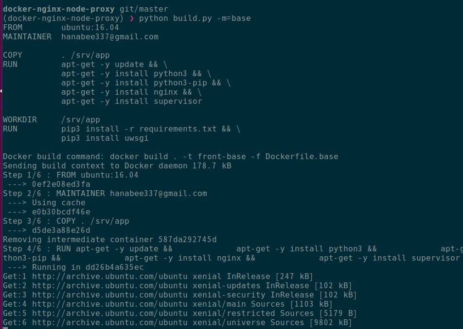 

- `python build.py -m=debug` 입력하고, `front-debug`라는 이미지 생성되었는지, docker images로 확인
	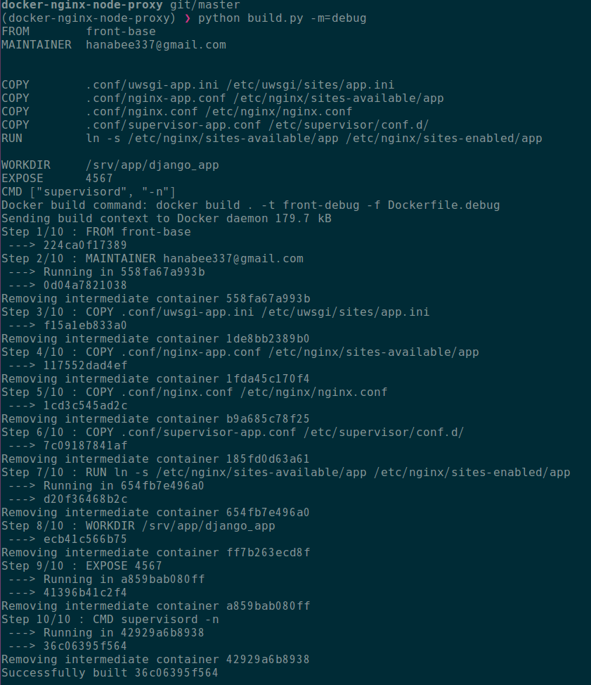 

- 그런 다음, `docker run -p 8080:4567 front-debug` 실행하고, 브라우저에서 localhost:8080으로 접속이 잘 되는지 확인 
	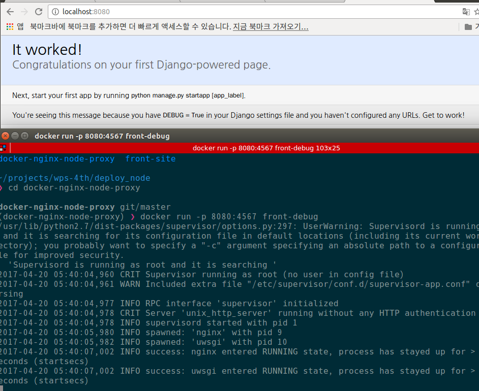

## Vue.js
- [NUXT 링크](https://nuxtjs.org/guide/installation)
- [Vue.js 시작하기 링크](https://kr.vuejs.org/v2/guide/)
- npm install
`sudo npm install --global vue-cli`
	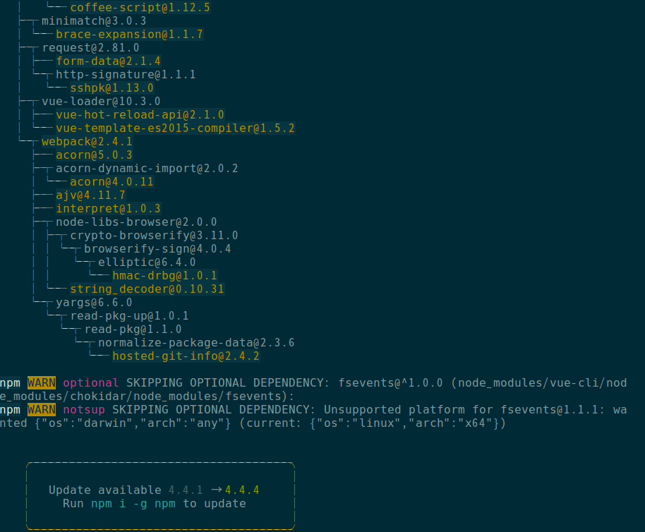 

- 설치가 다 되고나면, `vue init nuxt/starter <project-name>` 입력, 나머지는 엔터 처리
	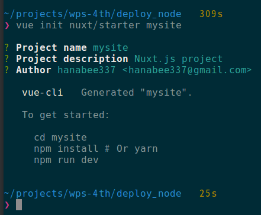
  
- 그러면, 입력했던 mysite로 폴더가 생성된 것을 확인
- `mv mysite -> front-site`로 이름 변경
	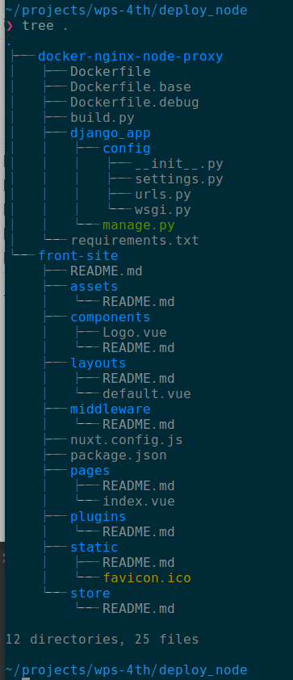

- [git repository 생성](https://github.com/hanabee337/FrontSite)
	- `READ.md` 참조

- `front-site` 폴더로 이동한 후, `$ sudo npm install`
	

- `npm run dev` 입력하고, 브라우저에서 `localhost:3000`으로 접속하면, 접속되는 사이트가 하나 보일 것임. 
	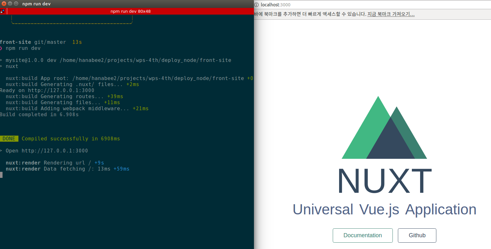

- `npm run build` 입력한 후,
	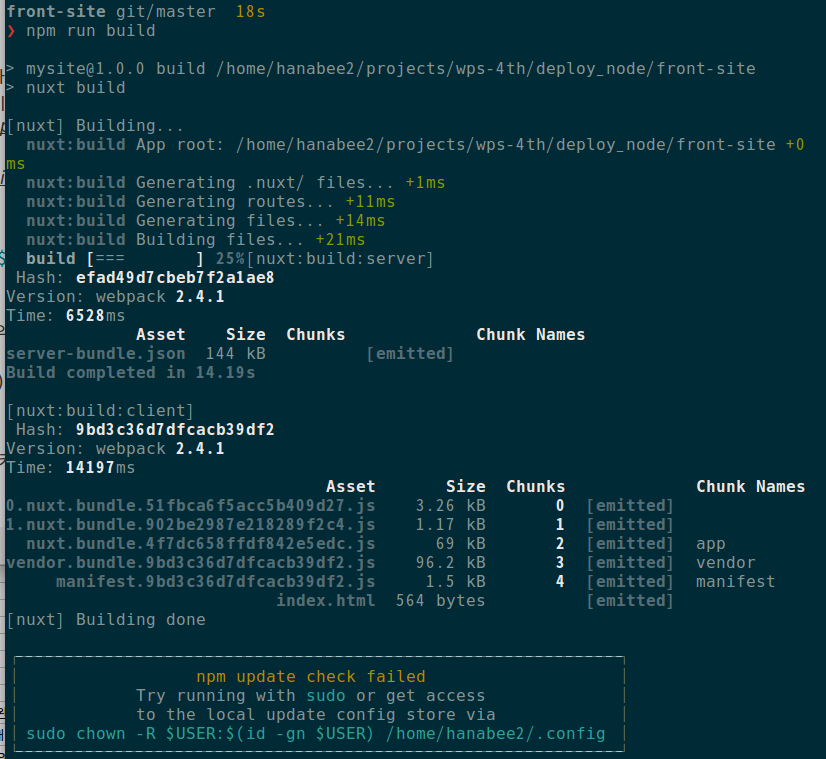

- `npm start`만 입력하면 서버를 키게 된다.
	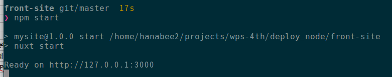
	- 아까 `npm run dev`입력했을 때처럼, `localhost:3000`으로 접속할 수 있는데, 
	다른 점은 지금은 production 환경에서 돌아가고 있다는 것이다.

- 그렇담,  우리가 github에 front-site를 올린 것처럼,
 프런트에서도 자기 코드를 github에 올려놓은 상태에서, 
 npm run build, npm start만 하면 실행이 될거다라고 알려준다면?
  
- 우리는 그 다음에 뭘 해야 되나?. 일단, 의존성 패키지도 다 설치를 해줘서 전달해줬다라는 가정임.

### Reverse Proxy
-  그러면, 우리 서버 안에다 node.js랑 npm만 설치하고, 해당 프로젝트를 clone하고서, 
clone 받은 프로젝트를 서버에서 실행시키고, 실행시켰을 때, 연결된 포트(우리는 3000번 포트)를 `reverse proxy` 라는 scheme(?)을 사용하여 연결한다.

- `Proxy Server` 자체는 request를 받으면, 이 해당 request를 다른 서버로 전달해 준다. 
그리고, 이에 대한 Response를 받아서 다시 전달해주는 것. 그러면, 원격 서버에 직접 접속한 것 같아 보이겠지..
	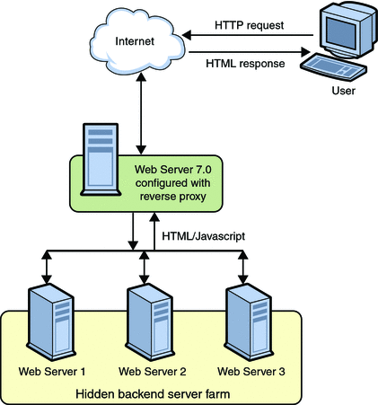 
- 위의 그림의 Reverse Proxy에서 어떤 request는 web server 1(예: 프런트)로 response를 전달해주고, 어떤 request는 web server 2(예: 백엔드)로 response를 전달해주는 것을 결정할 수 가 있다.

- 그래서, 우리는 그렇게 하기 위해 reverse proxy 서버(가상 서버)를 2개로 설정하려고 한다.
 - `nginx-app.conf`에서 서버를 하나 추가.
```
server {
    listen                  4567;
    server_name             front.localhost;
    charset                 utf-8;
    client_max_body_size    128M;

    location /  {
        proxy_set_header X-Real-IP $remote_addr;
        proxy_set_header X-Forwarded-For $proxy_add_x_forwarded_for;
        proxy_set_header Host $http_host;
        proxy_set_header X-NginX-Proxy true;
        proxy_pass http://127.0.0.1:3000/;
        proxy_redirect off;
    }

    gzip on;
    gzip_comp_level 2;
    gzip_proxied any;
    gzip_min_length 1000;
    gzip_disable "MSIE [1-6]\." gzip_types text/plain text/css application/json application/x-javascript text/xml application/xml application/xml+rss text/javascript;
}
```
-  `front.localhost, 4567번 포트`로 온 요청은 `3000번 포트`로 돌리겠다는 설정(?)
- node로 실행되고 있는 서버로 돌리겠다는 설정.
- 이제, node를 실행하는 명령을 추가해보자.
- 먼저, `01_base2.docker`파일을 생성하여 하기 내용(node를 설치) 추가
```python
RUN         apt-get -y install curl && \
            curl -sL https://deb.nodesource.com/setup_6.x | bash - && \
            apt-get -y install node.js
```

- base2.docker 파일 추가로 인해, build 파일 수정 불가피.
```
MODE_BASE2 = 'base2'
중략...
```
- 그리고, `02_extra.docker` 파일에서 `WORKDIR     /srv/app/front` 추가하였음.
이로 인해, `front-site`라고 만들었던 폴더를 front라는 이름으로 git clone해옴.
`git clone https://github.com/hanabee337/FrontSite.git front`

```
docker-nginx-node-proxy git/master  410s
❯ lst 
합계 60
drwxrwxr-x  7 hanabee2 hanabee2 4096  4월 20 17:47 .
-rw-rw-r--  1 hanabee2 hanabee2  210  4월 20 17:47 Dockerfile.base2
drwxrwxr-x  8 hanabee2 hanabee2 4096  4월 20 17:42 .git
-rw-rw-r--  1 hanabee2 hanabee2 3321  4월 20 17:41 .gitignore
drwxrwxr-x 11 hanabee2 hanabee2 4096  4월 20 17:39 front
-rw-rw-r--  1 hanabee2 hanabee2 2501  4월 20 17:20 build.py
drwxrwxr-x  3 hanabee2 hanabee2 4096  4월 20 15:39 .conf
-rw-rw-r--  1 hanabee2 hanabee2  445  4월 20 14:31 Dockerfile.debug
-rw-rw-r--  1 hanabee2 hanabee2  396  4월 20 14:23 Dockerfile.base
drwxrwxr-x  5 hanabee2 hanabee2 4096  4월 20 00:03 ..
drwxrwxr-x  2 hanabee2 hanabee2 4096  4월 19 21:19 .idea
-rw-rw-r--  1 hanabee2 hanabee2  783  4월 19 18:04 Dockerfile
drwxrwxr-x  3 hanabee2 hanabee2 4096  4월  6 16:18 django_app
-rw-rw-r--  1 hanabee2 hanabee2   26  4월  6 15:31 requirements.txt
-rw-rw-r--  1 hanabee2 hanabee2   24  4월  6 15:25 .python-version
```
- `front` 폴더는 .gitignore에 추가가 되어야 한다.
- `02_extra.docker`파일에 있는 `WORKDIR     /srv/app/front`에 의해, `supervisor-app.conf` 파일에 하기 내용 추가
```
[program:node]
command = npm start --prefix /srv/app/front
```
- 이로 인해, `Dockerfile.debug` 다시 빌드
```
python build.py -m=debug
```
- 위의 command로 인해, `Dockerfile.debug`파일이 생성되었고, `front-debug`라는 docker image 생성되었는지 확인해 본다.
-  그런 다음, `docker run -p 8080:4567 front-debug` 실행시키고, 브라우저 `localhost:8080`으로 접속하면 django가 나와야 하고, `front.localhost:8080`으로 접근하면, Vue.js가 따로따로 떠야 정상.
	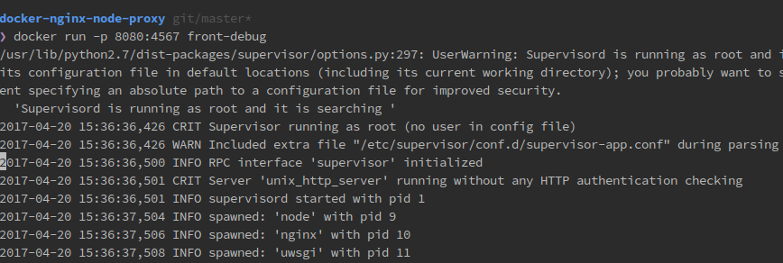

- 위 그림을 보면, node, nginx, uwsgi가 실행하고 있는 것을 볼 수 있다.
	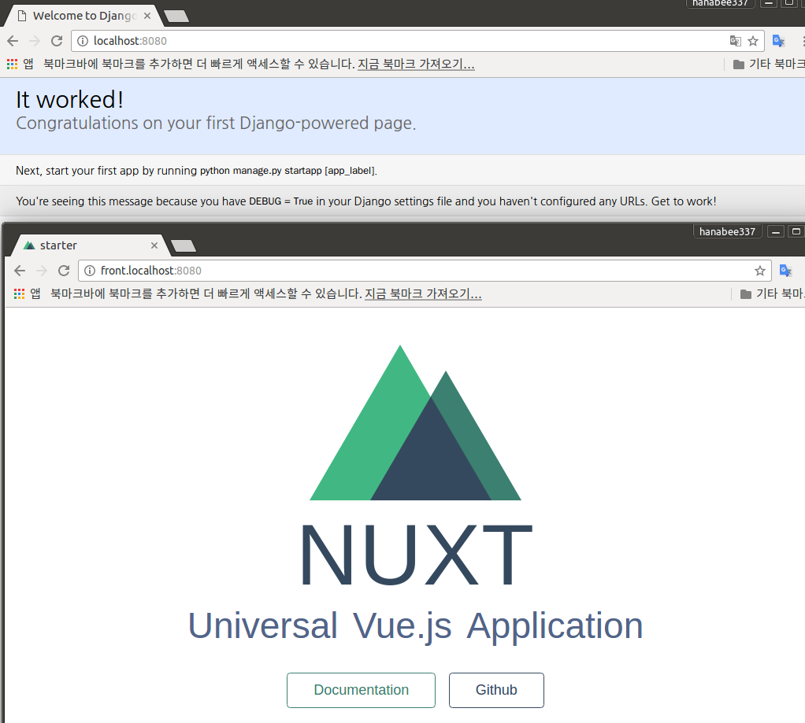
	
- localhost:8080 포트로 들어온 거랑 front.localhost:8080 포트로 들어온 거랑 둘 다 4567 포트로 받는데, 어디서(localhost, front.localhost) 들어온 것이냐에 따라 바뀌는 것.
- Django 서비스를 api. 으로 만들면 되고, 프런트는 그냥 http나 www 로 지정해주면 된다고 함.

- AWS에서 docker를 두 개 실행시키는 것도 가능. 지금은 한 docker안에 nginx랑 uwsgi가 같이 들어있는데, docker를 두 개 실행시키는 것도 가능.
- 프런트와 백엔드를 같이 하나의 docker 안에서 실행시키면, 어디서 과부하가 걸리는지 알 수 없으므로, 분산시켜서 실행시키는 것이 좋다고 함. ELB도 따로. 근데, 어떻게(?)

- 여기까지가 170406 | DockerNginxProxy 2 강의 내용

---

### DockerHub
- github처럼 docker 이미지를 관리해주는 사이트
[DockerHub 링크](https://hub.docker.com/)
- dockerhub에 올릴 production docker 이미지를 만들어 보자.
- `docker login` 우리 CLI client에서 push를 할 수 있어야 하는데, 자기 계정에..그런데, docker login을 하면, 아이디랑 패스워드(docker hub에 가입할 때 설정한)를 받아서 자동으로 기록을 해준다고 함.
	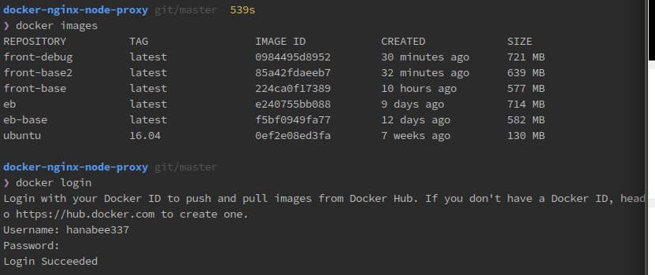

- docker 이미지 tag 달기
	- `docker tag front-debug hanabee337/front:latest`라고 입력한다.
	- 여기서, hanabee337/front는 user name(hanabee337로 가입)/저장소 이름(front라고 사이트에서 생성하였음)을 의미한다.
	- 그러면, 같은 물리적으로 한 개의 이미지에 대해 tag를 단 이미지가 생성. 
	- 원래 front-debug이미지와 hanabee337/front라는 이미지는 같은 물리적 이미지를 가리키고 있다. 
	

- 그런 다음, docker 이미지 push 하기
	- `docker push hanabee337/front`
	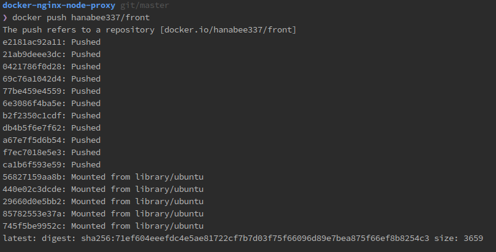
	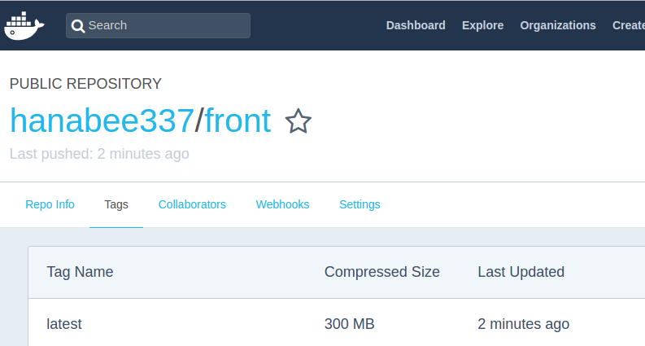
- `03_extra_dockerhug.docker`파일 생성하여, 하기 내용 추가
```
WORKDIR     /srv/app/django_app
EXPOSE      4567
CMD ["supervisord", "-n"]
```
- `build.py`도 dockerhub 관련 내용 추가 반영
- 해당 dockerhub용 docker 이미지 빌드
	- `python build.py -m=dockerhub`
	- `Dockerfile`도 여기 설정대로 생성된 것을 확인할 수 있다.
	- dockerhub용 docker 이미지 이름을 front로 지었다.
- 그런다음, 생성된 dockerhub용 이미지를 실행시켜 보자
	- `docker run -p 8080:4567 front`
	- 아까처럼 같은 결과를 얻었다.
	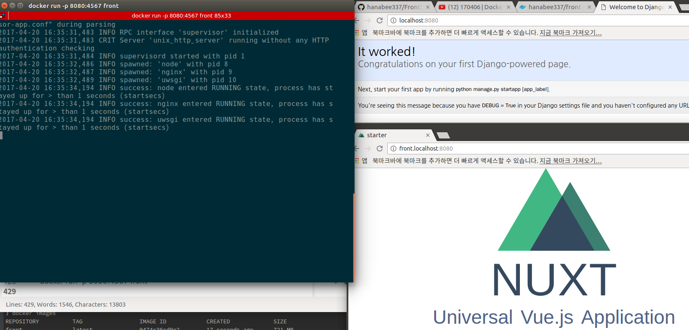

- 여기까지가 170406 | DockerNginxProxy 3 DockerHub 강의내용

---

### Setting
