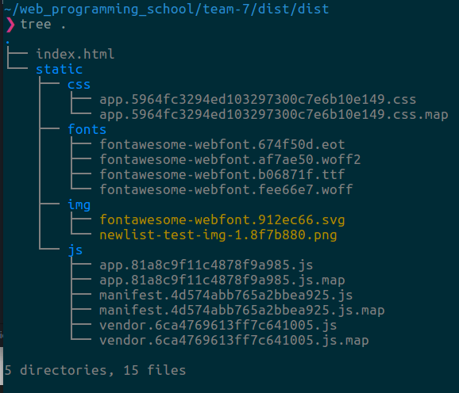
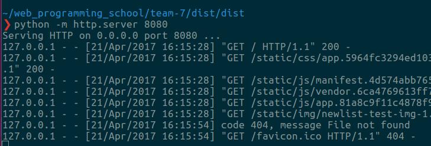
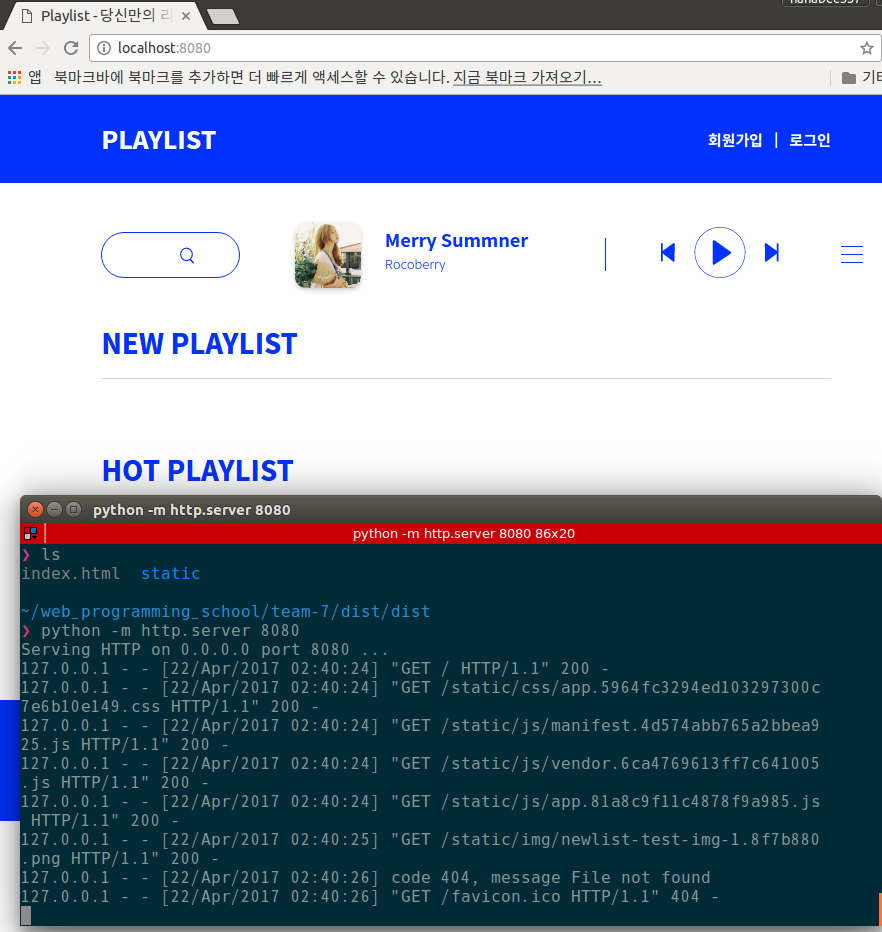
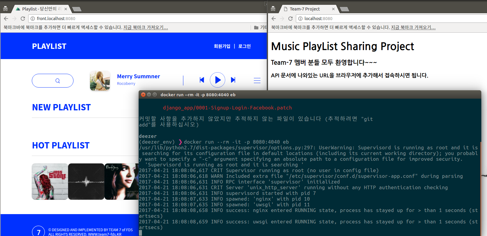
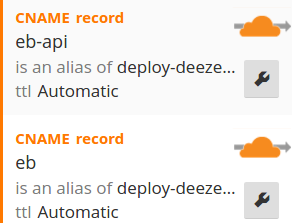
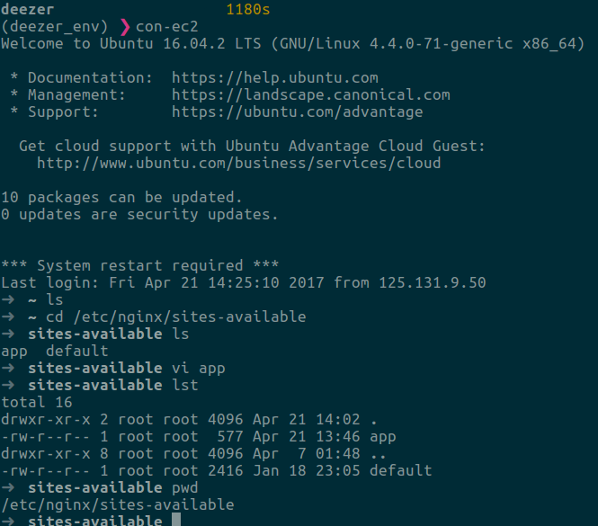
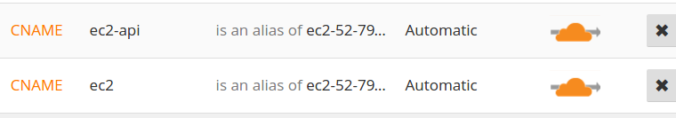
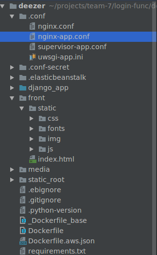

# 프런트 엔드 코드를 서버에 올리기(static file의 경우)

- 프런트 엔드에서 코드를 Vue로 주지 않고, static file로 전달해 주었다.
- 원래 Vue.js로 줄 걸로 예상하고, reverse proxy를 사용하여 node를 연결하는 수업을 받았었다.
- static file로 전달해 주었으므로, s3 bucket으로 굳이 올리지 않고, 하나의 Nginx 서버 안에서 프런트에서 전달해준 static file에 대한 location만 별도로 설정해줘도 무방하다고 강사는 가이드 해주었다.
- 프런트에서 전달해 준 코드를 강사는 바로 브라우저로 띄우는 걸 보여 주었는데, 방법은 다음과 같다.
- 일단, 그 코드는 다음과 같은 구성으로 되어 있는데,
	
	
- 강사는 다음과 같은 command로 프런트 코드를 실행시켰다.
	 

- 로컬호스트로 접속 확인
	 

- 그런 다음, front 코드용 별도의 server 설정

---

## front 코드용 server 설정
- 기존 Docker용 `nginx-app.conf`파일을 보면, 하기와 같은데,
```python
server {
    listen 4040;
    server_name localhost eb.hanabee337.com ec2-52-79-218-125.ap-northeast-2.compute.amazonaws.com;
    charset utf-8;
    client_max_body_size 128M;

    location / {
        uwsgi_pass    unix:///tmp/app.sock;
        include       uwsgi_params;
    }

    location /static/ {
        alias /srv/app/static_root/;
    }

    location /media/ {
        alias /srv/app/media/;
    }
}
```
- 여기에다 추가로 front용으로 서버를 설정하였다.
```python
server {
    listen 4040;
    server_name front.localhost eb-api.hanabee337.com;
    charset utf-8;
    client_max_body_size 128M;

    location / {
        alias /srv/app/front/;
    }
}
```
- docker 내부 포트는 4040으로 하겠다는 의미고,

- server_name은 `front.localhost`이나 `eb-api.hanabee337.com`으로 들어오는 요청들은 location에서 설정한 `/srv/app/front/` 이 쪽으로 연결을 시켜주겠다는 의미

- 이와 마찬가지로, 만약에 `localhost`나 `eb.hanabee337.com` `ec2-52-79-218-125.ap-northeast-2.compute.amazonaws.com`로 들어오는 요청들은 장고(rest framework) 로 연결시켜주겠다는 의미이다.

---

### Docker 상에서의 server_name과 nginx-app.conf 설정
- 그럼, docker 상에서 `localhost`나 `front.localhost` 테스트는?
	- 위 수정된 내용을 가지고 docker 이미지를 build한다.
	`docker build . -t eb`
	- 그리고, docker run 시키고, 두 개의 url로 접속 시도하였다.
	 

	- 수정된 코드대로, 장고로 접속하거나 front 코드로 접속이 분기가 되었다.

- 그렇담, 대체 `eb.hanabee337.com`와 `eb-api.hanabee337.com`은 어디서 온 주소인가?
	- `cloudflare.com`에서 CNAME을 다음과 같이 등록하였다.
	
	 
	
	- cloudflare에 추가 등록할 때, CNAME의 name란에는 eb-api.hanabee337.com랑 eb.hanabee337.com를 입력. Domain name란에는 둘 다 elasticbeanstalks 주소를 입력하였다. CNAME의 의미를 알면, 이해가 될 것이다.
		- [CANME이란?](http://june.meson.kr/2014/10/dns-service-its-basic-and-application.html)
		- [A레코드와 CNAME 의 차이](https://www.xetown.com/qna/111581)

- 위치 `/srv/app/front/`는 Dockerfile을 보면, `COPY        . /srv/app` 이 부분에서 지정해 준 것이다.

---

### EC2 상에서의 server_name과 nginx-app.conf
- docker EB의 경우는 nginx-app.conf 파일을 직접 수정한 후, docker를 빌드해서 로컬로 확인하였고, 아니면, eb deploy를 통해 코드를 그냥 eb로 보내면 되었다.
- 그러면, ec2의 경우는 어떻게 수정하면 되는가?
- 우선, 프런트 엔드 코드용 서버를 추가 적용한 파일인 `nginx-app.conf`이 어디 있는지 찾아보자. 
- ec2 서버인 ubunt 서버로 접속(con-ec2)하여, 하기 경로로 이동. `app` 파일을 찾는다.

	

- 위의 docker와 마찬가지로 `localhost`, `ec2.hanabee337.com`, `ec2-52-79-218-125.ap-northeast-2.compute.amazonaws.com`로 들어온 요청들은 장고쪽으로 연결하고,
 
```python
server {
    listen 80;
    server_name localhost ec2.hanabee337.com ec2-52-79-218-125.ap-northeast-2.compute.amazonaws.com;
    charset utf-8;
    client_max_body_size 128M;

    location / {
        uwsgi_pass    unix:///tmp/app.sock;
        include       uwsgi_params;
    }

    location /static/ {
        alias /srv/app/static_root/;
    }

    location /media/ {
        alias /srv/app/media/;
    }
}
```

---

- `front.localhost`, `ec2-api.hanabee337.com`로 들어온 요청들은 프런트 코드쪽으로 연결하게끔 설정하면 된다.
- 위의 주소들도 EB와 마찬가지로 cloudflare에서, 추가 등록하였다.

	
	
```python
server {
    listen 80;
    server_name front.localhost ec2-api.hanabee337.com;

    charset utf-8;
    client_max_body_size 128M;

    location / {
        alias /srv/app/front/;
    }
}
```

- 그러면, 프런트 엔드 코드는 어느 위치에 놓아야 할까?
	- 아래 그림과 같이 django 폴더와 같은 위치에 복사하였다.
	

- 위치 `/srv/app/front/`는 `deploy-ec2`할 때, ubuntu 서버에 코드를 copy하는 destination 위치가 `/srv/app/` 으로 설정되어 있어서 그런 것임.
 	- 해당 alias는 `.zshrc`에 있음.
