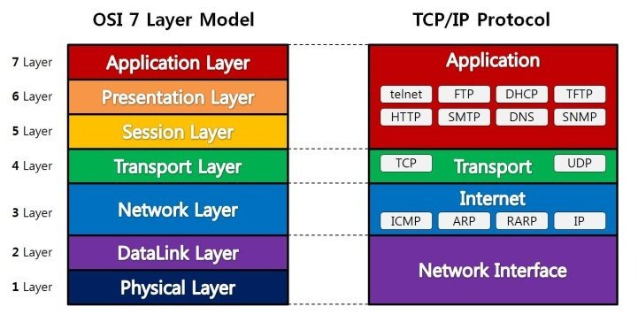

#네트워크

### LAN
Local Area Network

### WAN
Wide Area Network

### Server

### Client

###TCP(Transmission Control Protocol)
전송 제어 규약

###IP(Internet Protocol)
인터넷 규약

###Internet
TCP/IP를 통해 정보를 주고받는 컴퓨터 네트워크

###WWW
World Wide Web : 문서들이 있는 정보의 저장소

### URL
Uniform Resourse Locator
인터넷에 접속할 때, 네트워크 상에서 해당 자원이 어디 있는지를 알려주는 문자열.  
접속하려면 해당 URL에 맞는 프로토콜을 알아야 하고, 그와 동일한 프로토콜로 접속해야 한다.  
[Protocol]://[Host]/[port]/[path]  

### Protocol
통신규약, 통신할 뗴 정해진 메세지 규약.

### HTTP
1.GET
>	보낼 수 있는 정보의 양이 정해져 있다.(caching된 데이터를 가져올 수 있다)  

2.PUT
3.POST
4.DELETE
### FTP

### TELNET
Terminal Network : 원격을 위한 프로토콜

###SMTP
Simple Mail Transfer Protocol
전자메일 전송 프로토콜

### SSH
Secure Shell
네트워크상의 다른 컴퓨터에 로그인하거나 원격시스템에서 명령을 실행하고 다른 시스템으로 파일을 복사하는 응용프로그램, 프로토콜  

###SSL
Secured Socket Layer
웹서버와 브라우저 사이의 보안을 위한 프로토콜

### Host
네트워크에 연결된 장치

### Port
데이터들이 들어와서 정박하는 곳
가상의 논리적 통신 연결단
번호로 구분

### IP
인터넷상의 식별자, 네트워크상의 장치들이 서로를 인식하고 통신을 하기위해 사용하는 번호.

###Domain Address
네트워크상 컴퓨터를 식별하는 호스트 이름.  
사람이 알아볼 수 있는 주소이기 때문에 컴퓨터는 알아볼 수 없다.  
따라서, 변환 장치가 필요하다.

### DNS
호스트의 도메인 이름을 호스트의 네트워크 주소로 바구거나 그 반대의 변환을 수행

### MAC Address
Media Access Control Address.  
네트워크 어댑터에 부착된 식별자.  
제작시 하드웨어에 직접 부착되어서 나오는 번호이기 때문에 동일한 MAC Address를 가진 다른 장비는 없다.

#OSI 7 Layer

TCP/IP는 Transport layer와 network layer에 해당된다.

#암호화
1. 대칭키 암호화 
암호화와 복호화에 같은 암호키를 쓰는 알고리즘.
DES, AES, SEED등
2. 비대칭키 암호화
공개키로 암호화된 데이터를 비밀키를 사용하여 혹호화 할 수 있는 알고리즘.

3. 암호화 해시 함수
임의의 데이터(암호)를 고정된 길이의 데이터로 mapping하여 원래의 입력갑과의 관계를 찾기 어렵게 만든 것.
SHA, MD5등.
